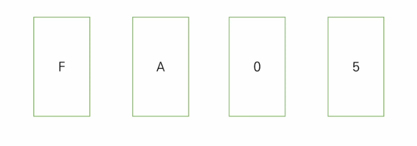
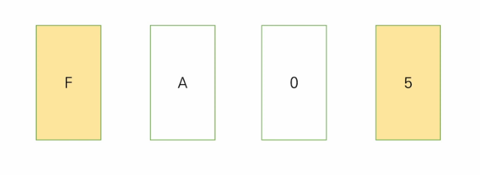

# 1. 코드 리뷰 (220728)

## (1) 쉽게 푸는 문제

- https://www.acmicpc.net/problem/1292

- 여기까진 작성했어

  ```python
  수열 = list()
  for i in range(숫자):
      수열.append(숫자)
  숫자 += 1
  ```

- 그럼 수열의 길이를 어떻게 해야 할까?

  - B번째 숫자까지의 합을 구하면 되기 때문에
  - **수열의 길이는 B보다 크기만 하면 된다.**
  - 수열의 길이가 B보다 작을 때만 반복을 한다.

- 수열 팁💡

  - 수열 문제는 시간 초과가 많이 날 수 있다.
  - **while을 적극 활용**하자!
  - for를 사용할 경우, 조건을 명확하게

- 【답안 예시 1】 while

  ```python
  seq = list()
  N = 1
  A, B = map(int, input().split())
  
  # 수열에 얼만큼 숫자를 추가해야 하나?
  # 수열의 길이가 B보다 작을 때만 숫자를 추가
  while len(seq) < B:
      for _ in range(N):
          seq.append(N)
  ```

- 【답안 예시 2】 for

  ```python
  for i in range(B + 1):
      for _ in range(N):
          seq.append(N)
          if len(seq) > B:
              break
      if len(seq) > B:
          break
      
      N += 1
  ```


## (2) 회사에 있는 사람

- https://www.acmicpc.net/problem/7785

  ```python
  출근기록['철수'] = 출근
  출근기록['영희'] = 출근
  출근기록['철수'] = 퇴근	# 값이 수정됨.
  ```

- 마지막 출근기록이 '출근'인 사람의 key(= name)만 뽑아내면 돼

- 【답안 예시】

  ```python
  N = int(input())
  
  logs = dict()
  for i in range(N):
      key, value = input().split()
      logs[key] = value
  
  lst = list()	# 회사에 남아있는 사람들
  for key in logs:
      if logs[key] == 'enter':
          lst.append(key)
          
  # 사전 역순 출력
  lst.sort(reverse=True)
  for name in lst:
      print(name)
  ```

- 번외

  - `.sort(reverse=True)` vs `.sort().[::-1]`
  - 전자는 원본이 내림차순 정렬이 되어 바뀜
  - 후자는 원본이 오름차순 정렬이 되고, 그게 역순으로 출력만 됨.


## (3) 다이얼

- https://www.acmicpc.net/problem/5622

- 시간 = 다이얼 숫자 + 2

- dict['A'] = 3    dict['B'] = 3    dict['C'] = 3

  dict['D'] = 4    dict['E'] = 4    dict['F'] = 4

  dict['G'] = 5    dict['H'] = 5    dict['I'] = 5 …

- 【답안 예시】

  ```python
  dial = {
      'A': 2, 'B': 2, 'C': 2,
      'D': 3, 'E': 3, 'F': 3,
      'G': 4, 'H': 4, 'I': 4,
      'J': 5, 'K': 5, 'L': 5,
      'M': 6, 'N': 6, 'O': 6,
      'P': 7, 'Q': 7, 'R': 7, 'S': 7,
      'T': 8, 'U': 8, 'V': 8,
      'W': 9, 'X': 9, 'Y': 9, 'Z': 9
  }
  
  string = input()
  t = 0	# 시간을 저장할 변수
  
  for key in dial:
      # 딕셔너리 변수에 key로 접근
      num = dial[key]
      t += num + 1
      
  print(t)
  ```


## (4) 듣보잡

- 듣도 못한 사람의 딕셔너리를 생성

- 듣도 못한 사람의 key(= name)와  보도 못한 사람의 name이 동일할 때 → 듣보잡

- 【답안 예시】

  ```python
  N, M = map(int, input().split())
  
  nh = dict()	# 듣도 못한 사람
  
  # N의 크기만큼 듣도 못한 사람 입력
  for i in range(N):
      name = input()
      nh[name] = 'Never Heard'	# 사실 value는 아무거나 넣어도 상관 X
  
  lst = list()	# 듣보잡 리스트
  # M의 크기만큼 보도 못한 사람 입력
  for i in range(M):
      name = input()
      # 보도 못한 사람이 듣도 못한 사람에 있는가?
      if name in nh:
          lst.append(name)
  
  lst.sort()	# 이름 사전순으로 정렬
  ```


# 2. 알고리즘 특강

## (1) 논리

> 우리는 지금까지 논리가 아닌 직관을 활용하였다.

1. 【문제】

    - 모든 카드의 한 쪽에는 알파벳, 다른 쪽에는 숫자가 있다.

    - "만약 한 쪽이 F면, 반대쪽은 0이다."

    - 위 주장이 사실인지 확인하기 위해서 반드시 뒤집어야 하는 카드는 몇 개일까?

      

    - 정답은 F와 5 2장

      

      - F를 뒤집어서 반대편이 0인지 확인해야 하고,
      - 5를 뒤집어서 반대편이 F가 아닌지 확인해야 한다.


2. 위 문제는 다음과 같은 예시로 치환하여 생각할 수 있다.

     - 미성년자는 술을 마실 수 X

     - 아래 중 무엇을 확인해야 할까? → 12살, 맥주 2개

         | 12살 | 35살 | 콜라 | 맥주 |
         | :--: | :--: | :--: | :--: |


## (2) Computational Thinking

1. [Solving Problems at Google Using Computational Thinking](https://youtu.be/SVVB5RQfYxk)

   - 문제를 작은 문제로 분해

   - 패턴 인식

   - 알고리즘 설계 → 단계적 전략


2. Computational Thinking

   - 문제 인식

   - 접근 방법

   - Sudo 코드 & 주석

   - 코드 구현

   - 디버깅


3. 어떻게 CT를 몸에 익힐 수 있을까?

   - 문제를 읽는다.

   - 제약 조건을 확인한다.

   - 파이썬의 자료형과 문법을 고려하여 논리 코드를 작성한다.
   - 이때 **반드시 시각적으로 정리**해야 한다.

   - **input** (test case)을 해석하고, 출력을 확인한다.


4. QnA
   - 안 풀리는 문제?
     - 30분 ~ 1시간 정도는 혼자 고민해보는 시간이 필요하다.
     - 단계별로 다른 모습이 있으니, 무엇이 힘든지 보자.
   - 문제가 이해가 안 될 때 어떻게?
     - 제약 조건을 만들어야 한다. (논리)
     - 그 후 input을 살펴보고, 손으로 실행해서 결과를 확인한다.
   - 고민 vs 구글링
     - 확답은 X. 그래도 정답을 찾지 않고 힌트만 참고하는 구글링은 좋다!
     - 잘 안 될 때는 구글링을 통해 먼저 알아보고, 그 다음 질문하는 습관을 기르자.
     - 그리고 질문에 답을 할 때는 정답을 바로 알려주는 것 보다는, 엣지 케이스 알려주고, 접근 방법을 검증해주는 게 좋다.
   - 하나의 문제를 다양한 방법으로?
     - 현재 시점에서는 문제를 풀고 다른 방법도 있구나~만 본 뒤 무조건 다음 단계로 넘어가자.
     - 다양한 문제를 경험해보는 것이 중요하다!
   - 논리 오류가 발생해 값이 다르게 출력되는 경우, 디버깅은 어떻게?
     - 내가 가진 변수의 상황을 먼저 확인한다.
     - 그 후 조건문과 반복문을 확인한다.
     - 제대로 된 흐름으로 진행되는지 확인한다.


## (3) 코딩 테스트 플랫폼

> 문제가 영어로 제공된다.😮
>
> Test Case가 제공되지 않는다.😨
>
> 점수(메모리, 시간 등)가 즉각적으로 보여지지 않는다.😱

1. LeetCode

   - https://leetcode.com/

   - **경력직** 개발자 코딩 테스트 준비의 정석
   - 개인용 문제 풀이 서비스 (Easy / Medium / Hard)
   - 유료 서비스를 결제하면 실제 기업들의 인터뷰, 과제 등을 볼 수 있다.


2. HackerRank / Codility

   - https://www.hackerrank.com/

   - https://www.codility.com/

   - 카카오 경력 채용, 네이버 계열사 채용 등에서 적극 활용

   - 프로그래머스와 유사

   - 한국 기업에서 한다고 한국어로 출제되는 게 아니다...

   - 신입과 유사하게 정리 가능