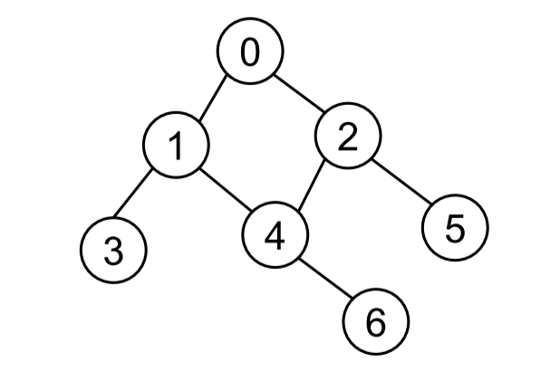

# 1. 코드 리뷰

## (1) 가장 많은 글자

- https://www.acmicpc.net/problem/1371
- 입력이 몇 번 들어오는지 알 수 없음
  - `while True:`로 입력을 받고
  - 입력이 받을 게 없는데 입력하려 하면` EOFERROR`가 난다.
  - 예외 처리를 통해 이 문제를 풀 수 있다.
- 딕셔너리를 사용하여, 문자를 key로, 등장 횟수를 value로 넣어준다.


- 【코드】

  ```python
  dic = dict()
  
  while True:
      # 에러가 없는 경우
      try:
          s = input().replace(' ', '')
          
          for ch in s:
              dic[ch] = dic.get(ch, 0) + 1
      # EOFERROR를 만났을 경우
      except:
          break
  
  # key는 정렬 기준,
  # x는 dic.items()에 의해 만들어진 각 튜플
  # -x[1]: 튜플의 두 번째 값(value)을 기준으로 내림차순 정렬
  # x[0]: -x[1]으로 정렬한 후, 튜플의 첫 번째 값(key)을 기준으로 오름차순 정렬
  sorted_dic = sorted(dic.items(), key=lambda x: (-x[1], x[0]))
  
  # 가장 많은 글자가 여러 개라면,
  # 첫 번째 인덱스의 value와 같은 값인 글자를 출력하면 된다.
  max_val = sorted_dic[0][1]
  for k, v in sorted_dic:
      if v == max_val:
          print(k, end='')
      else:
          break
  ```


## (2) 가장 큰 금민수

- https://www.acmicpc.net/problem/1526
- N보다 작고, 4 또는 7로만 이루어진 가장 큰 수를 찾아야 한다.
  - 자릿수를 탐색하며, 4와 7로만 이루어져 있는지 확인한다.


- 【코드】

  ```python
  N = int(input())
  
  # 초기 가장 큰 값 N은 4 이상
  max_ = 4
  
  for num in range(N + 1):
      # 숫자를 문자열로 변환
      s_num = str(num)
      
      # 각 숫자의 자릿수 확인
      for digit in s_num:
          # 각 자릿수가 4 또는 7로만 이루어져 있지 않으면, break
          if not (digit == '4' or digit == '7'):
              break
          else:
              # 최댓값을 갱신
              # 숫자는 계속해서 커지기 때문에, 비교할 필요 X
              max_ = int(s_num)
              
  print(s_num)
  ```


## (3) 몬스터 트럭

- https://www.acmicpc.net/problem/2897

- 차를 0대, 1대 … 4대를 부숴서 주차할 수 있는 자리를 담는 배열을 만든다.

- 델타 탐색을 어떻게 해야 할까?

  - **현재 좌표를 기준으로, `→ ↘ ↓` 로 탐색**해야 한다. 왜냐면, 배열을 아래와 오른쪽으로 탐색하는 과정에서, 이미 탐색한 곳과 중복이 발생할 가능성이 없는 방향이기 때문이다.

  - 델타 배열

    ```python
    # 우, 우하, 하
    dy = [0, 1, 1]
    dx = [1, 1, 0]
    ```


- **시작 조건**

  1. 빌딩(`#`)이 있는 위치에서는 탐색할 수 X → **`continue`**

     ```python
     if lst[y][x] == '#':
         continue
     ```

  2. 기준 좌표가 차(`X`)라면, 부순 차의 개수 +1

     ```python
     break_cnt = 0
     
     if lst[y][x] == 'X':
         break_cnt += 1
     ```

- **델타 탐색 조건**

  1. 인덱스 범위를 벗어나면 X (for 문을 통해서도 할 수 O)

     ```python
     if not (0 <= ny < R and 0 <= nx < C):
         break
     ```

  2. 탐색 범위에 빌딩이 있으면 X → break

     ```python
     if lst[ny][nx] == '#':
         break
     ```

  3. 탐색 범위에 차가 있으면, 부순 차의 개수 +1

     ```python
     if lst[ny][nx] == 'X':
         break_cnt += 1
     ```


- 【코드】

  ```python
  R, C = map(int, input().split())
  
  lst = [list(input()) for _ in range(R)]
  
  # 0개, 1개, 2개, 3개, 4개
  break_cnt_list = [0] * 5
  
  dy = [0, 1, 1]
  dx = [1, 1, 0]
  
  # 델타 탐색 조건 1. 범위를 벗어나면 안 된다.
  for y in range(R - 1):
      for x in range(C - 1):
          # 차를 부순 횟수는, 탐색할 때마다 0으로 초기화
          break_cnt = 0
          
          # 조건 1. 기준 좌표가 빌딩(#)이면 안 된다.
          if lst[y][x] == '#':
              # 조건이 많을 때는, 여기서 continue가 걸리면
              # 그 뒤의 조건은 검사하지 X
              continue
              
          # 조건 2. 기준 좌표가 차라면, 부순 횟수 +1
          if lst[y][x] == 'X':
              break_cnt += 1
          
          '''델타 탐색'''
          for d in range(3):
              ny = y + dy[y]
              nx = x + dx[x]
              
              # 델타 탐색 조건 2. 탐색 좌표에 빌딩이 있으면 안 된다.
              if lst[ny][nx] == '#':
                  break
              # 델타 탐색 조건 3. 탐색 좌표에 차가 있으면, 부순 횟수를 + 1
              if lst[ny][nx] == 'X':
                  break_cnt += 1
          
          # for-else
          # break를 만나지 않고 반복문이 끝났다면,
          # 정상적으로 주차를 했다는 의미
          else:
  			break_cnt_list[break_cnt] += 1
  ```


# 2. 그래프 탐색 알고리즘

> 시작 정점에서, 간선을 타고 이동할 수 있는 모든 정점을 찾는 알고리즘

- **깊이 우선 탐색**과 **너비 우선 탐색**이 있다.
- 스택 + 그래프 + 큐


## (1) DFS vs. BFS

_DFS.assets/image-20220810104911782.png)

- 깊이 우선 탐색

  - Depth First Search
  - 그래프의 깊이를 우선으로 탐색하기 위해, 스택의 개념을 활용

- 너비 우선 탐색

  - Breadth First Search

  - 그래프의 너비를 우선으로 탐색하기 위해, 큐의 개념을 활용
  - 최단 거리 문제에 주로 활용


# 3. 깊이 우선 탐색 (DFS)

## (1) 개념

- 시작 정점으로부터 갈 수 있는 하위 정점까지 가장 깊게 탐색
  - 더 이상 갈 곳이 없다면, 마지막 갈림길로 돌아와서 다른 정점을 탐색
  - 결국 모든 정점을 방문하는 순회 방법
- 미로 탈출로 생각하면 이해하기 쉽다.
  - 어느 한 쪽 길로 가장 깊게 들어갔다가 막히면, 다시 돌아와서 다른 길을 탐색한다.


## (2) 특징

- **모든 정점을 방문**할 때 유리하다. 따라서 **경우의 수**, **순열과 조합** 문제에서 많이 사용한다.
- BFS에 비해 코드 구현이 간단하다.
- 단, 모든 정점을 방문할 필요가 없거나 최단 거리를 구하는 경우에는 BFS가 유리하다.


## (3) 동작 과정

- DFS를 하기 전에, 일단 **탐색을 진행할 그래프**가 필요하다.

     - 그래프는 인접 행렬, 혹은 인접 리스트 방식으로 표현할 수 있다.

     - 인접 노드를 탐색해야 하기 때문에, **인접 리스트** 방식이 좀 더 많이 쓰인다.

- **각 정점을 방문했는지의 여부를 판별**할 방문 체크 리스트가 필요하다.
  - 사람과 달리, 컴퓨터는 강 정점에 방문했는지 여부를 알 수 X
  - 따라서, `visited` 리스트를 따로 선언하여, 각 정점을 방문했는지 체크한다.
    - 인덱스는 각 정점의 번호
    - 방문한 정점은 True, 방문하지 않은 정점은 False
- DFS의 사이클
  1. 현재 정점 방문 처리
  2. 인접한 모든 정점 확인
  3. 방문하지 않은 인접 정점 이동


## (4) 구현 방식



1. 인접 리스트로 그래프 표현

   ```python
   graph = [
       [1, 2],
       [0, 3, 4],
       [0, 4, 5],
       [1],
       [1, 2, 6],
       [2],
       [4]
   ]
   ```

   

2. 반복문을 이용한 DFS

   ```python
   visited = [False] * n
   
   def dfs(start):
       stack = [start]	# 돌아갈 곳을 기록
       visited[start] = True	# 시작 정점 방문 처리
       
       # 스택이 빌 때까지 (= 돌아갈 곳이 없을 때까지)
       while stack:
           curr = stack.pop()	# 현재 방문한 정점 (후입선출)
           
           for adj in graph[cur]:	# 인접한 모든 정점에 대해
               if not visited[adj]:	# 아직 방문하지 않았다면
               	visited[adj] = True	# 방문 처리
                   stack.append(adj)	# 스택에 넣기
                   
   dfs(0)	# 0번 정점에서 시작
   ```
