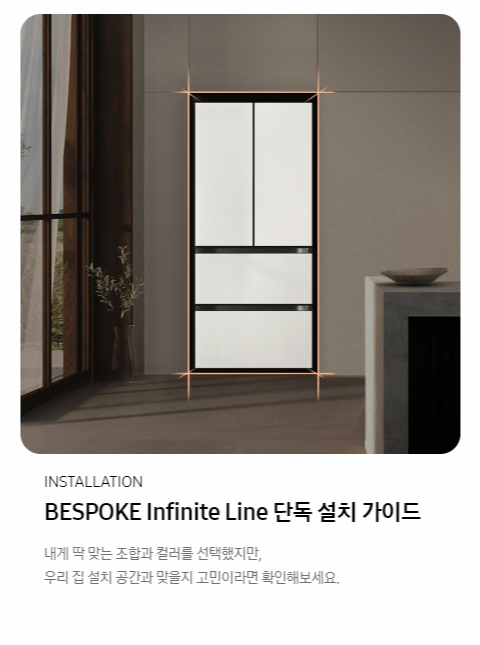

# 1. 실습 1 해설

## (1) 맨 위의 제목

.assets/1.PNG)

- html

  ```html
  <h2 class="title">
      <span class="subtext">All ABOUT</span>
      BESPOKE 김치플러스 Infinite Line
  </h2>
  ```

- css

  ```css
  .title {
      text-align: center;
  }
  
  .subtext {
      display: block;	/* 줄 바꿈이 생긴다. */
      font-size: 16px;
  }
  ```


## (2) 개별 아이템



- html

  ```html
  <div class="item-list">
      <!-- 아이템 1 -->
      <div class="item">
          
          <p>class="item-subtitle">INSTALLATION</p>
          <h3>BESPOKE Infinite Line 단독 설치 가이드</h3>
          <p>내게 딱 맞는 조합과 컬러를 ...</p>
      </div>
  </div>
  ```

- css

  ```css
  .item-list {
      width: 900px;
  }
  
  .item {
      width: 300px;
      display: inline-block;	/* 아이템들을 가로로 정렬 */
  }
  
  .item-img {
      /* 이미지 너비가 아이템 너비인 300px을 넘기 때문에,
       * 부모(클래스가 item인 div 요소)의 콘텐트 박스의 너비의 크기에 맞춰준다. */
      width: 100%:
  }
  
  .item-subtitle {
      color: grey;
      font-weight: bold;
  }
  ```


## (3) 아이템이 3개면?

- 마지막 아이템이 아래 줄로 넘어가 버린다.
  - 총 900px에 아이템 하나가 300px인데도?
- 이유는 `display: inline-block;` 때문
  - inline-block은 기본적으로 4px의 공백이 존재한다.
- margin 상쇄


# 2. CSS Position

- 이제까지는 Normal Flow
  - 모두 네모인 세상 속에서 인라인과 블록, 각자의 흐름에 따라 배치되었었다.
  - 이제는 그 흐름에서 벗어나 볼 때!


## (1) CSS Position

- 문서 상에서 요소의 위치를 지정

- **static**: 모든 태그의 기본 값 (기준 위치)
  - 일반적인 요소의 배치 순서에 따른다. (좌측 상단)
  - 부모 요소 내에서 배치될 때는, 부모 요소의 위치를 기준으로 배치된다.

- 아래는 좌표 프로퍼티(top, bottom, left, right)를 사용하여 이동이 가능하다.

  1. **relative**: 상대 위치✨
     - 자기 자신의 static 위치를 기준으로 이동한다. (normal flow를 유지)
     - 레이아웃에서 요소가 차지하는 공간은 static일 때와 같다. (normal position 대비 offset)

  2. **absolute**: 절대 위치✨
     - 요소를 일반적인 문서 흐름에서 제거한 후, 레이아웃에서 공간을 차지하지 않도록 한다. (**normal flow에서 벗어남**)
     - **static이 아닌, 가장 가까이 있는 부모/조상 요소를 기준**으로 이동한다.
       - 없는 경우, 브라우저 화면 기준으로 이동한다.
       - 따라서 **부모 요소의 position을 relative로 주로 설정**하게 된다.
     - 주로 특정 영역 위에 박스가 존재하는 경우 주로 쓴다.

  3. **fixed**: 고정 위치
     - 요소를 일반적인 문서 흐름에서 제거한 후, 레이아웃에서 공간을 차지하지 않도록 한다. (**normal flow에서 벗어남**)
     - 부모 요소와 관계 없이, viewport를 기준으로 이동한다.
       - 스크롤 시에도 항상 같은 곳에 위치한다.
     - 브라우저를 기준으로 위치하기 때문에, 문서 상단으로 이동하는 버튼 등에 주로 쓴다.
  
  4. **sticky**: 스크롤에 따라 static → fixed로 변경
  
     - static: 처음에는 자리를 차지하다가
     - fixed: 자리가 없어져
  
     - 속성을 적용한 박스는 문서 안에서 position: static; 상태와 같이 normal flow를 따르지만,
     - 스크롤 위치가 임계점에 이르면 position: fixed;와 같이 박스를 화면에 고정한다.


## (2) absolute vs. relative

- 형에게 top: 100px;을 적용했을 때의 차이?
- absolute
  - absolute는 normal flow에서 벗어난다.
  - 즉, 다음 블록 요소(동생)가 좌측 상단으로 붙는다.
- relative
  - relative는 normal flow를 유지한다.
  - 실제 위치는 그대로, 사람 눈에만 이동한 것이다.
- absolute는 결혼 relative는 입대...?


## (3) CSS 원칙

- CSS 원칙 Ⅰ, Ⅱ: Normal Flow
  - 모든 요소는 네모(박스모델), 좌측 상단에 배치
  - display에 따라 크기와 배치가 달라진다.
- CSS 원칙 Ⅲ: **position으로 위치의 기준을 변경**
  - relative: 본인의 원래 위치
  - absolute: 특정 부모의 위치
  - fixed: 화면의 위치
  - sticky: 기본적으로 static이나 스크롤 이동에 따라 fixed로 변경


# 3. CSS Layout

## (1) History of CSS Layout techniques

- Display
- Position
- Float (CSS1, 1996)
- Flexbox (2012)
- Grid (2017)
- 기타
  - Responsive Web Design (2010)
  - Media Queries (2012)


## (2) Float

- 박스를 왼쪽 혹은 오른쪽으로 이동시켜, 텍스트를 포함한 인라인 요소들이 주변을 Wrapping 하도록 한다.
- 요소가 Normal flow를 벗어나도록 한다.
- 한글의 사진 어울림 배침 느낌
- 그냥 float가 존재하는구나 하는 정도로만 생각하기


# 3. Flexbox❣️

## (1) CSS Flexible Box Layout

- 행과 열 형태로 아이템을 배치하는 1차원 레이아웃 모델
- 축
  - main axis (메인 축)
  - cross axis (교차 축)
  - flex-direction: row
- 구성 요소
  - Flex Container (부모 요소)
  - Flex Item (자식 요소)
  - 부모를 Flex Container로 지정하면, 자식은 자동으로 Flex Item이 된다.


## (2) Flexbox 구성 요소

- Flex Container (부모 요소)
  - flexbox 레이아웃을 형성하는 가장 기본적인 모델
  - Flex Item들이 놓여있는 영역
  - display 속성을 `flex` 혹은 `inline-flex`로 지정
- Flex Item (자식 요소)
  - 컨테이너에 속해 있는 콘텐츠 (박스)


## (3) Flexbox를 사용해야 하는 이유

- 이전까지 Normal Flow를 벗어나는 수단은?

  - Float
  - Position

- 위의 수단으로는 하기 어려웠던 것을 할 수 있다.

  - 수동적인 값 부여를 하지 않고도,

    1. 수직 정렬

    2. 아이템의 너비와 높이, 혹은 간격을 동일하게 배치


## (4) Flex 속성

- 배치 설정
  - **flex-direction**: Main axis 기준 방향 설정
    - `row`, `row-reverse`, `column`, `column-reverse`
  - flex-wrap: 아이템이 컨테이너를 벗어나는 경우, 해당 영역 내에 배치되도록 설정
    - `nowrap`(기본 값): 요소들을 강제로 한 줄에 배치
    - `wrap`: 넘치면 그 다음 줄로 배치
  - flex-flow
    - flex-direction과 flex-wrap의 shorthand
    - flex-direction과 flex-wrap에 대한 설정 값을 차례로 작성
    - ex) flex-flow: row nowrap;


- 공간 나누기
  - **justify-content**: Main axis를 기준으로 공간 배분
    - `flex-start`, `flex-end`, `center`, `space-between`, `space-around`, `space-evenly`
  - align-content: Cross axis를 기준으로 공간 배분
    - `flex-start`, `flex-end`, `center`, `space-between`, `space-around`, `space-evenly`


- 정렬
  - **align-items**: 모든 아이템을 Cross axis 기준으로 정렬
    - `stretch`, `flex-start`, `flex-end`, `center`(**수직 정렬**), `baseline`
  - align-self: 개별 아이템을 Cross axis 기준으로 정렬
    - **주의!** 해당 속성은 컨테이너에 적용하는 것이 아닌, 개별 아이템에 적용하는 것
    - `stretch`, `flex-start`, `flex-end`, `center`


- 기타 속성
  - flex-grow: 남은 영역을 아이템에 분배
    - 약간 안드로이드 xml에서 android:layout_weight="1" 같은 느낌
  - order: 배치 순서


# 4. 기타

- [Flexbox (Dev)](https://web.dev/learn/css/flexbox/)
- [Flexbox의 기본 개념 (MDN)](https://developer.mozilla.org/ko/docs/Web/CSS/CSS_Flexible_Box_Layout/Basic_Concepts_of_Flexbox)
- [Flexbox (MDN)](https://developer.mozilla.org/ko/docs/Learn/CSS/CSS_layout/Flexbox)

