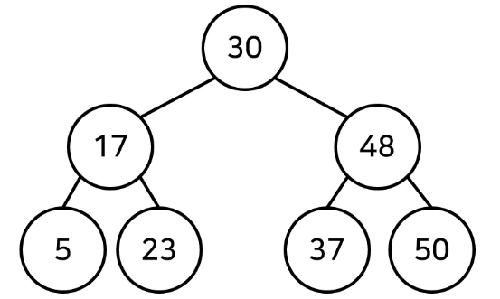
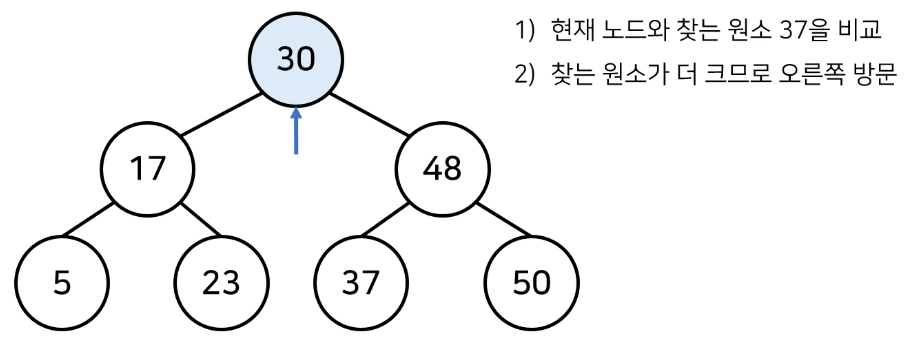
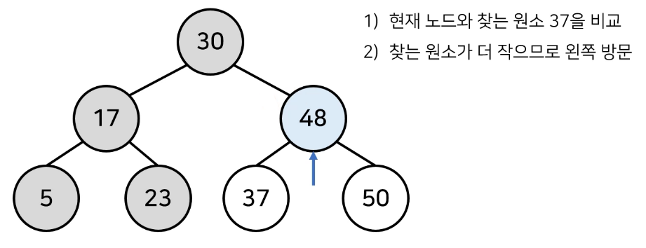
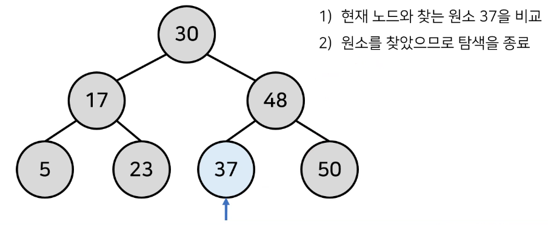
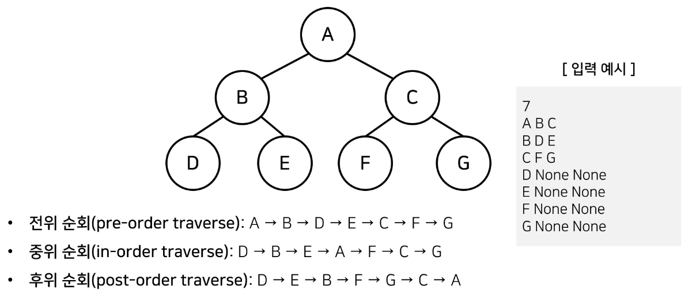

# 1. 트리 (Tree)

- 가계도와 같이, **계층적 구조**를 표현할 때 사용하는 자료구조

- 트리 관련 용어❣️

  - 기본적으로 트리의 크기가 N일 때, 전체 간선의 개수는 N - 1개이다.

  | 용어                  | 설명                            |
  | --------------------- | ------------------------------- |
  | 루트 노드 (Root Node) | 부모가 없는 최상위 노드         |
  | 단말 노드 (Leaf Node) | 자식이 없는 노드                |
  | 크기 (Size)           | 트리에 포함된 모든 노드의 개수  |
  | 깊이 (Depth)          | 루트 노드부터의 거리            |
  | 높이 (Height)         | 깊이 중 최댓값                  |
  | 차수 (Degree)         | 각 노드의 (자식 방향) 간선 개수 |


# 2. 이진 탐색 트리 (Binary Search Tree, BST)

- 이진 탐색이 동작할 수 있도록 고안된, 효율적 탐색이 가능한 자료구조

- 이상적인 경우, **O(logN)**에 비례하는 시간 복잡도

- 특징: **왼쪽 자식 노드 < 부모 노드 < 오른쪽 자식 노드**

  


## (1) BST의 데이터 조회 과정

- 찾고자 하는 원소: 37

- 【Step 1】 루트 노드부터 방문

  


- 【Step 2】 현재 노드와 값을 비교

  


- 【Step 3】 현재 노드와 값을 비교

  


# 3. 트리 순회 (Tree Traversal)

- 트리에 포함된 노드를 한 번씩 방문하는 방법

  - 트리의 정보를 시각적으로 확인할 수 있다.

- 대표적인 트리 순회 방법

  | 트리 순회 방법         | 설명                                 |
  | ---------------------- | ------------------------------------ |
  | 전위 순회 (Pre-order)  | 루트를 먼저 방문                     |
  | 중위 순회 (In-order)   | 왼쪽 자식을 방문한 후, 루트를 방문   |
  | 후위 순회 (Post-order) | 오른쪽 자식을 방문한 후, 루트를 방문 |

  


## (1) 트리 순회 구현 예제

1. Node 클래스 선언

   ```python
   class Node:
       def __init__(self, data, left_node, right_node):
           self.data = data
           self.left_node = left_node
           self.right_node = right_node
   ```


2. 전위 순회

   ```python
   def pre_order(node):
       print(node.data, end=' ')
       
       if node.left_node != None:
           pre_order(tree[node.left_node])
           
       if node.right_node != None:
           pre_order(tree[node.right_node])
   ```


3. 중위 순회

   ```python
   def in_order(node):
       if node.left_node != None:
           in_order(tree[node.left_node])
           
       print(node.data, end=' ')
       
       if node.right_node != None:
           in_order(tree[node.right_node])
   ```

   

4. 후위 순회

   ```python
   def post_order(node):
       if node.left_node != None:
           post_order(tree[node.left_node])
           
       if node.right_node != None:
           post_order(tree[node.right_node])
           
       print(node.data, end=' ')
   ```


5. 메인

   ```python
   n = int(input())	# Tree Size
   tree = dict()
   
   for i in range(n):
       data, left_node, right_node = input().split()
       
       if left_node == 'None':
           left_node = None
       if right_node == 'None':
           right_node = None
           
       # 각 노드는 자신, 왼쪽 자식, 오른쪽 자식의 정보를 담는다.
       tree[data] = Node(data, left_node, right_node)
       
   pre_order(tree['A'])
   print()
   in_order(tree['A'])
   print()
   post_order(tree['A'])
   ```

   

6. 입력 예시

   ```
   7
   A B C
   B D E
   C F G
   D None None
   E None None
   F None None
   G None None
   ```


7. 출력 예시

   ```
   A B D E C F G
   D B E A F C G
   D E B F G C A
   ```