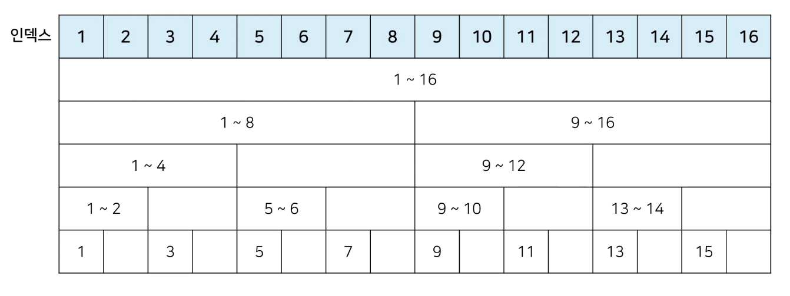
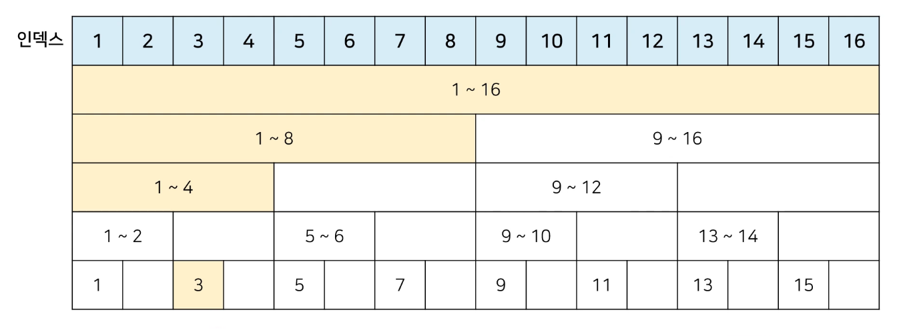
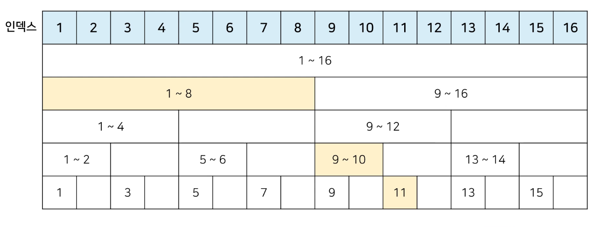

# 1. 바이너리 인덱스 트리 (Binary Indexed Tree)⭐⭐⭐⭐⭐

- 특수 목적의 자료구조
- https://visualgo.net/en/fenwicktree


## (1) 바이너리 인덱스 트리

- **2진법 인덱스** 구조

- 펜윅 트리(Fenwick Tree)라고도 한다.

- 정수에 따른 2진수 표기 → [2의 보수 구하기, 왜 2의 보수는 음수인가?](https://life-with-coding.tistory.com/298)

  - -7 : 7의 모든 비트를 Flip한 후, 마지막에 1을 더함.

  | 정수 | 2진수 표기                         |
  | ---- | ---------------------------------- |
  | 7    | 00000000 00000000 00000000 0000111 |
  | -7   | 11111111 11111111 11111111 1111001 |


## (2) 0이 아닌 마지막 비트

- 0이 아닌 마지막 비트를 찾는 방법❣️

  - 특정한 숫자 K의 0이 아닌 마지막 비트를 찾기 위해서, **`K & -K`**를 계산


- **`K & -K`**계산 결과 예시

  - 0이 아닌 가장 마지막 비트 자릿수 → 10진수로

    | 정수 K | 2진수 표기   | K & -K |
    | ------ | ------------ | ------ |
    | 0      | 00000000     | 0      |
    | 1      | 0000000**1** | 1      |
    | 2      | 000000**1**0 | 2      |
    | 3      | 0000001**1** | 1      |
    | 4      | 00000**1**00 | 4      |
    | 5      | 0000010**1** | 1      |
    | 6      | 000001**1**0 | 2      |
    | 7      | 0000011**1** | 1      |
    | 8      | 0000**1**000 | 8      |


- 양의 정수를 2의 보수법을 통해 음의 정수로 만든 후, 비트 단위 and 연산을 하고, 0이 아닌 마지막 비트를 가져오려면 어떻게 해야 해?

  - 파이썬에서는 그냥 하면 돼

  - 예시

    ```python
    n = 8
    
    for i in range(n + 1):
        print(f'{i}의 마지막 비트: {i & -i}')
    ```

    ```
    0의 마지막 비트: 0
    1의 마지막 비트: 1
    2의 마지막 비트: 2
    3의 마지막 비트: 1
    4의 마지막 비트: 4
    5의 마지막 비트: 1
    6의 마지막 비트: 2
    7의 마지막 비트: 1
    8의 마지막 비트: 8
    ```


# 2. 데이터 업데이트가 가능한 상황에서의 구간 합 (Interval Sum) 문제💙

- [백준 '구간 합 구하기' 문제](https://www.acmicpc.net/problem/2042)
- 어떤 N개의 수가 주어져 있다. 그런데 중간에 수의 변경이 빈번히 일어나고 그 중간에 어떤 부분의 합을 구하려 한다. 만약에 1,2,3,4,5 라는 수가 있고, 3번째 수를 6으로 바꾸고 2번째부터 5번째까지 합을 구하라고 한다면 17을 출력하면 되는 것이다. 그리고 그 상태에서 다섯 번째 수를 2로 바꾸고 3번째부터 5번째까지 합을 구하라고 한다면 12가 될 것이다.
- 데이터 개수: N (1 ≤ N ≤ **1,000,000**)
- 데이터 변경 횟수: M (1 ≤ M ≤ **10,000**)
- 구간 합 계산 횟수: K (1 ≤ K ≤ **10,000**)
- 이 문제를 어떻게 해결할 수 있을까?
  - 만약 선형적으로 한다면, N × K 만큼의 연산이 필요
  - 더 효율적으로 하려면 바이너리 인덱스 트리를 활용!
  - 최악의 경우에도, **O(logN)**의 복잡도를 보장


## (1) 바이너리 인덱스 트리 구조 만들기❤️

1. 트리 구조 만들기

   

   - N개의 데이터, N개의 인덱스
   - 인덱스의 0이 아닌 마지막 비트 = 내가 저장하고 있는 값들의 개수
     - 인덱스는 더해지는 수가 아니라, **데이터의 i 번째 수**를 의미
     - 해당 인덱스에는 1 ~ i 까지의 데이터들의 합이 담김

   - 인덱스 16
     - 0이 아닌 마지막 비트가 16
     - 1 ~ 16까지의, 값들의 합을 담겠다는 의미


2. 특정 값을 변경할 때❤️

   - 0이 아닌 마지막 비트만큼 더하면서 구간들의 값을 변경
   - 예시 (3rd)
     - 3번째 값이 변경됨.
     - 인덱스 3의 0이 아닌 마지막 비트는 1.
     - 뒤로 1칸 이동, 인덱스 4에 대한 값(1 ~ 4번째 데이터들의 합)을 바꿈.
     - 인덱스 4에서 뒤로 4칸 이동, 인덱스 8에 대한 값(1 ~ 8번째 데이터들의 합)을 바꿈.
     - 인덱스 8에서 뒤로 8칸 이동, 인덱스 16에 대한 값(1 ~ 16번째 데이터들의 합)을 바꿈.
     - 총 4번의 값 업데이트

   


## (2) 바이너리 인덱스 트리: 누적 합 (Prefix Sum)💛

1. 1부터 N까지의 합 (누적 합) 구하기

   - 0이 아닌 마지막 비트만큼 빼면서 구간들의 값의 합 계산
   - 예시 (11th)
     - 11부터 출발
     - 11의 마지막 비트 수인 1만큼 왼쪽으로 이동 → 10
     - 10은 9 ~ 10번째 수들의 합을 담고 있음. 그걸 11번째 수와 더함.
     - 10의 마지막 비트 수인 2만큼 왼쪽으로 이동 → 8
     - 8은 1 ~ 8번째 수들의 합을 담고 있음. 그걸 아까 더한 것에 더함.

   


## (3) 바이너리 인덱스 트리 구현

1. 전역 변수 선언

   ```python
   import sys
   input = sys.stdin.readline
   
   # 데이터 개수(n), 변경 횟수(m), 구간 합 계산 횟수(k)
   n, m, k = map(int, input().split())
   
   # 전체 데이터 개수는 최대 1,000,000개
   # 0으로 초기화된 리스트 생성
   # n + 1인 이유는, 인덱스를 1부터 n까지 쓰기 위함
   arr = [0] * (n + 1)
   tree = [0] * (n + 1)
   ```


2. i 번째 수까지의 누적 합을 계산하는 함수💛

   ```python
   def prefix_sum(i):
       result = 0
       
       while i > 0:
           result += tree[i]
           
           # 0이 아닌 마지막 비트만큼 왼쪽으로 이동
           i -= (i & -i)
           
       return result
   ```


3. i 번째 수를 diff 만큼 더하는 함수❤️

   ```python
   def update(i, diff):
       while i <= n:
           tree[i] += diff
           
           # 0이 아닌 마지막 비트만큼 오른쪽으로 이동
           i += (i & -i)
   ```


4. start부터 end까지의 구간 합을 계산하는 함수💙

   ```python
   def interval_sum(start, end):
       return prefix_sum(end) - prefix_sum(start)
   ```


5. 메인

   ```python
   for i in range(1, n + 1):
       x = int(input())
       arr[i] = x
       update(i, x)	# 처음 트리 초기화
       
   for i in range(m + k):
       a, b, c = map(int, input().split())
       
       # 업데이트 연산인 경우
       if a == 1:
           update(b, c - arr[b])	# 바뀐 크기(diff)만큼 적용
           arr[b] = c
           
       # 구간 합 연산인 경우
       else:
           print(interval_sum(b, c))
   ```

