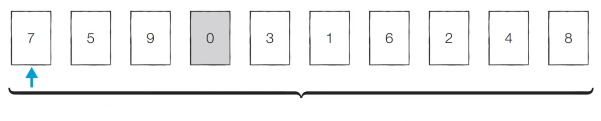
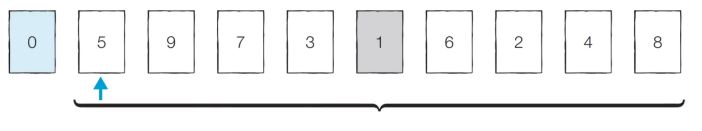
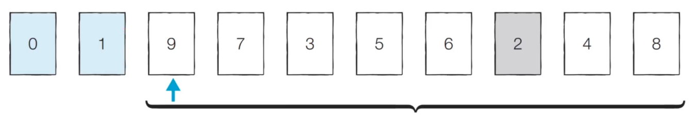
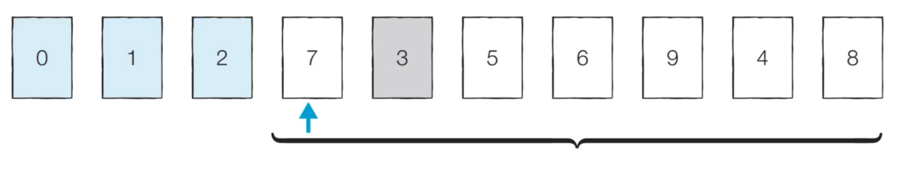
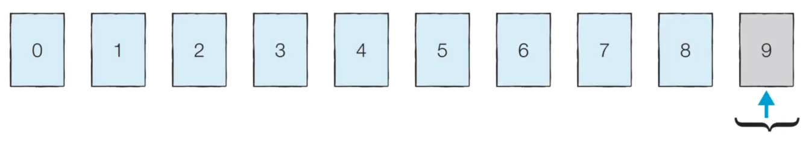

# 5. 선택 정렬 (Selection Sort)

- 정렬: 데이터를 특정 기준에 따라 순서대로 나열하는 것
- https://visualgo.net/en/sorting


## (1) 알고리즘

- 처리되지 않은 데이터 중 **가장 작은 데이터를 선택**해, **맨 앞에 있는 데이터와 바꾸는 것**을 반복


- 【Step 0】 처리되지 않은 데이터 중 가장 작은 0을 선택해, 가장 앞의 7과 바꾼다.

  

- 【Step 1】 처리되지 않은 데이터 중 가장 작은 1을 선택해, 가장 앞의 5와 바꾼다.

  

- 【Step 2】 처리되지 않은 데이터 중 가장 작은 2를 선택해, 가장 앞의 9와 바꾼다.

  

- 【Step 3】 처리되지 않은 데이터 중 가장 작은 3을 선택해, 가장 앞의 7과 바꾼다.

  

- 이러한 과정을 반복하면, 다음과 같이 정렬이 완료된다.

  - 이때 마지막 원소의 경우, 앞으로 보내봤자이기 때문에, 처리하지 않아도 된다.

  


## (2) 선택 정렬 소스 코드

> 이중 for문을 통한 선형 탐색

```python
arr = [7, 5, 9, 0, 3, 1, 6, 2, 4, 8]

for i in range(len(arr)):
    min_index = i	# 가장 작은 원소의 인덱스
    
    # 처리되지 않은 데이터 중에서
    for j in range(i + 1, len(arr)):
        # 현재 원소보다 더 작은 원소 발견
        if arr[min_index] > arr[j]:
            min_index = j
    
    # 가장 작은 원소, 가장 앞의 원소 자리 Swap
    arr[i], arr[min_index] = arr[min_index], arr[i]

print(arr)
```


## (3) 선택 정렬의 시간 복잡도

- N번 만큼 가장 작은 수를 찾아서, 맨 앞으로 보내야 한다.
- 구현 방식에 따라 사소한 오차는 있을 수 있지만, 전체 연산 횟수는 다음과 같다.
  - N + (N - 1) + (N - 2) + … + 2
- 이는 (N² + N - 2) / 2 로 표현할 수 있는데, 빅오 표기법에 따라 **O(N²)**이라 작성한다.