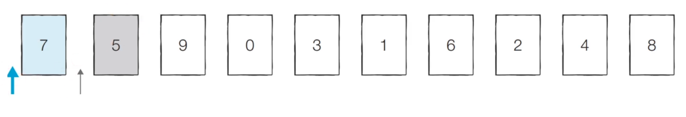
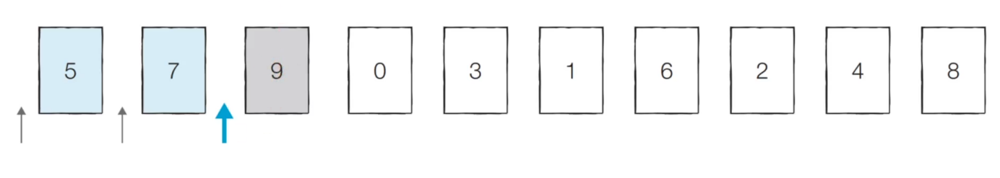
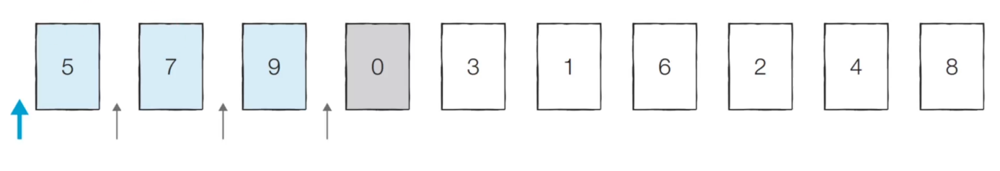
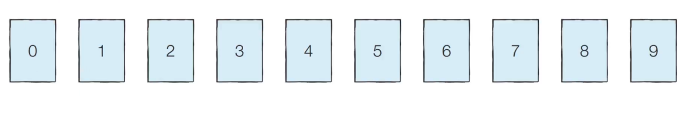

# 1. 삽입 정렬 (Insertion Sort)

## (1) 동작 과정

- 처리되지 않은 데이터 중 하나씩 골라 **적절한 위치에 삽입**한다.

- 선택 정렬에 비해 구현 난이도가 높지만, 일반적으로 더 효율적이다.


- 【Step 0】

  - 첫 번째 데이터 7은 그 자체로 정렬되어 있다 판단하고,

  - 두 번째 데이터인 5가 어떤 위치로 들어갈지 판단한다.

  - 7의 왼쪽으로 들어가거나, 오른쪽으로 들어가거나의 두 경우만 존재한다.

  

- 【Step 1】 이어서 9가 어떤 위치로 들어갈지 판단한다.

  - 아래 3개의 선택지 중 하나를 선택
  - 현재 위치 유지

  

- 【Step 2】 이어서 0이 어떤 위치로 들어갈지 판단한다.

  

- 【Step 3】 이러한 과정을 반복하면, 다음과 같이 정렬이 완료된다.

  


## (2) 구현 방법

> 이중 for문을 통한 탐색

```python
arr = [7, 5, 9, 0, 3, 1, 6, 2, 4, 8]

# 두 번째 원소부터 탐색
for i in range(1, len(arr)):
    # j는 삽입하고자 하는 위치
    # 인덱스 i부터 1까지, 1씩 감소하며 반복
    for j in range(i, 0, -1):
        # 한 칸씩 왼쪽으로 이동
        if arr[j] < arr[j - 1]:
            arr[j], arr[j - 1] = arr[j - 1], arr[j]
        
        # 왼쪽의 데이터가 자기보다 작으면, 그 위치에서 멈춤
    	else:
            break

print(arr)
```


## (3) 시간 복잡도

- 삽입 정렬의 시간 복잡도는 **O(N²)**이며, 선택 정렬과 마찬가지로 반복문이 두 번 중첩되어 사용된다.

- 현재 리스트의 데이터가 **거의 정렬되어 있는 상태라면** 매우 빠르게 동작한다.

  - 최선의 경우, **O(N)**의 시간 복잡도를 가진다.

  - 이미 정렬된 상태에서 다시 삽입 정렬을 수행하면? 

    → 자리를 안 고르고 바로 멈추면 되기 때문에, O(N)의 시간 복잡도를 갖는다.