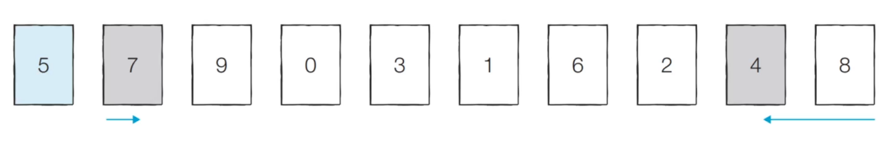
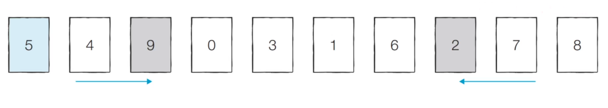
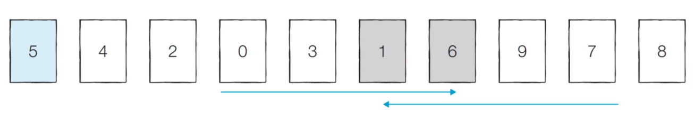
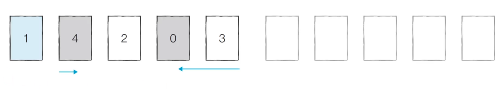
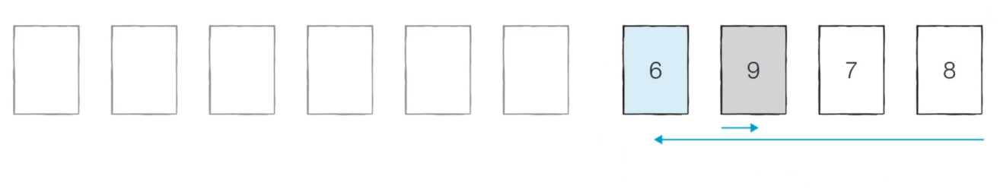
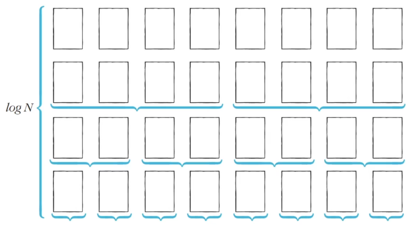

# 7. 퀵 정렬 (Quick Sort)

## (1) 알고리즘

- **기준 데이터를 설정**하고, **그 기준보다 큰 데이터와 작은 데이터의 위치를 바꾸는 방법**

- 일반적 상황에서 가장 많이 사용되는 정렬 알고리즘 중 하나

- 병합 정렬과 더불어, 대부분의 프로그래밍 언어의 정렬 라이브러리의 근간이 되는 알고리즘

- 가장 기본적 퀵 정렬은, **첫 번째 데이터를 기준 데이터(Pivot)**로 설정한다.


- 【Step 0】

  - 현재 피벗의 값은 5

  - 왼쪽에서부터 5보다 큰 데이터를 선택하므로 7이 선택된다.

  - 오른쪽에서부터 5보다 작은 데이터를 선택하므로 4가 선택된다.

  - 이제 두 데이터의 위치를 서로 변경한다.

  

- 【Step 1】

  - 현재 피벗의 값은 5
  - 왼쪽에서부터 5보다 큰 데이터를 선택하므로 9가 선택된다.

  - 오른쪽에서부터 5보다 작은 데이터를 선택하므로 2가 선택된다.

  - 이제 두 데이터의 위치를 서로 변경한다.

  

- 【Step 2】 이어서 0이 어떤 위치로 들어갈지 판단한다.

  - 현재 피벗의 값은 5
  - 왼쪽에서부터 5보다 큰 데이터를 선택하므로 6이 선택된다.

  - 오른쪽에서부터 5보다 작은 데이터를 선택하므로 1이 선택된다.

  - 단, 이처럼 **위치가 엇갈리는 경우, '피벗'과 '작은 데이터'의 위치를 서로 변경**한다.

  

- 【분할 완료】

  - 이제 5 왼쪽에 있는 데이터들은 모두 5보다 작고,
  - 오른쪽에 있는 데이터들은 모두 5보다 크다.
  - 이렇게 피벗을 기준으로 데이터 묶음을 나누는 작업을 **분할(Divide)**라 한다.

  

- 【왼쪽 데이터 묶음 정렬】

  - 왼쪽에 있는 데이터에 대해서, 마찬가지로 정렬을 수행한다.

  

- 【오른쪽 데이터 묶음 정렬】

  - 오른쪽에 있는 데이터에 대해서, 마찬가지로 정렬을 수행한다.
  - 이러한 재귀적 과정을 반복하면, 전체 데이터에 대해 정렬이 수행된다.

  


## (2) 퀵 정렬이 빠른 이유: 직관적인 이해

- 이상적인 경우, 분할이 절반씩 일어난다면, 전체 연산 횟수로 **O(NlogN)**를 기대할 수 있다.

  - 너비 × 높이 = N × logN = NlogN

  


## (3) 퀵 정렬 소스 코드 1

```python
arr = [5, 7, 9, 0, 3, 1, 6, 2, 4, 8]

def quick_sort(arr, start, end):
    # 원소가 1개인 경우 종료
    if start >= end:
        return
    
    pivot = start	# pivot은 첫 번째 원소
    left = start + 1
    right = end
    
    while left <= right:
        # pivot 보다 큰 데이터를 찾을 때까지 left 한 칸씩 증가
        while left <= end and arr[left] <= arr[pivot]:
            left += 1
        # pivot 보다 작은 데이터를 찾을 때까지 right 한 칸씩 감소
        while right > start and arr[right] >= arr[pivot]:
            right -= 1
        
        # 엇갈렸다면, 작은 데이터(엇갈려서 right)와 pivot을 Swap
        if left > right:
            arr[right], arr[pivot] = arr[pivot], arr[right]
        # 엇갈리지 않았다면, 작은 데이터와 큰 데이터를 교체
    	else:
            arr[left], arr[right] = arr[right], arr[left]
            
	# 분할 이후, 왼쪽 부분과 오른쪽 부분에서 각각 정렬 수행
    quick_sort(arr, start, right - 1)	# 왼쪽
    quick_sort(arr, right + 1, end)	# 오른쪽
    
quick_sort(arr, 0, len(arr) - 1)
print(arr)
```


## (4) 퀵 정렬 소스코드 2❣️

> Python의 장점을 살린 방식

```python
arr = [5, 7, 9, 0, 3, 1, 6, 2, 4, 8]

def quick_sort(arr):
    # 리스트가 하나 이하의 원소만을 담고 있다면 종료
    if len(arr) <= 1:
        return arr
    
    pivot = arr[0]	# pivot은 첫 번째 원소
    tail - arr[1:]	# pivot을 제외한 리스트
    
    # List Comprehension
    left_side = [x for x in tail if x <= pivot]	# 분할된 왼쪽 부분
    right_side = [x for x in tail if x > pivot]	# 분할된 오른쪽 부분
    
    # 분할 이후, 왼쪽 부분과 오른쪽 부분에서 각각 정렬 수행하고, 전체 리스트 반환
    return quick_sort(left_side) + [pivot] + quick_sort(right_side)

print(quick_sort(arr))
```


## (5) 퀵 정렬의 시간 복잡도

- 퀵 정렬은 평균의 경우 **O(NlogN)**의 시간 복잡도를 가진다.
- 하지만, 최악의 경우 **O(N²)**의 시간 복잡도를 가진다.
  - **첫 번째 원소를 피벗으로 삼을 때**, 이미 정렬된 배열**에 대해 퀵 정렬을 수행하면?
  - 피벗에 대해 오른쪽만 남는 형태로 분할이 이루어진다.
  - 이 분할이 N과 비례하고, 분할을 하기 위해 선형탐색을 하기 때문에 O(N²)의 시간 복잡도가 나올 수 있다.
  - 하지만 표준 라이브러리는 최악의 경우에도 O(NlogN)의 복잡도를 제공한다.

