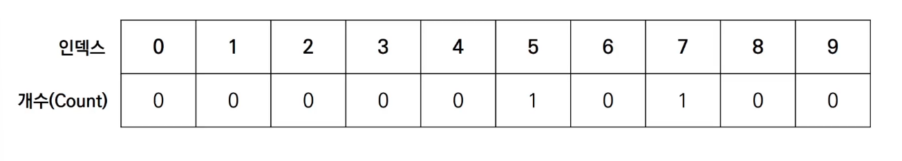
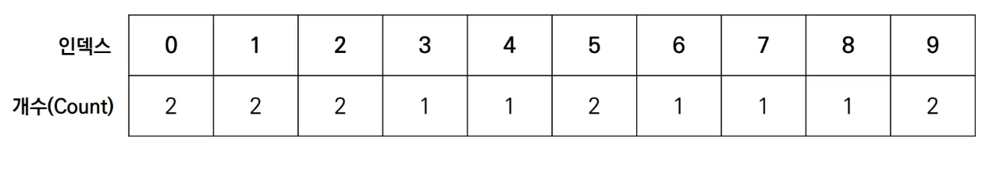

# 1. 계수 정렬 (Counting Sort)

## (1) 동작 과정

- 특정 조건이 부합할 때만 사용할 수 있지만, **매우 빠르게 동작**한다.
  - 계수 정렬은 **데이터의 크기 범위가 제한**되어, **정수 형태로 표현할 수 있을 때** 사용한다.

  - 데이터의 개수가 N, 데이터(양수) 중 최댓값이 K일 때, 최악의 경우에도 수행시간 **O(N + K)**를 보장한다.

  - 가장 작은 데이터부터, 가장 큰 데이터까지의 범위가 모두 담길 수 있도록 리스트를 생성해야 하기 때문에, 상대적으로 공간 복잡도가 높다.


- 【Step 0】

  - 가장 작은 데이터부터, 가장 큰 데이터까지의 범위가 모두 담길 수 있도록 리스트를 생성한다.

  - 정렬할 데이터: 7 5 9 0 3 1 6 2 9 1 4 8 0 5 2

  - 각 데이터가 리스트의 인덱스가 되어, 총 몇 번 등장했는지 개수를 세는 것.

  

- 【Step 1】

  - 데이터를 하나씩 확인하며, 데이터의 값과 동일한 인덱스의 데이터를 1씩 증가시킨다.

  - 정렬할 데이터: **7** 5 9 0 3 1 6 2 9 1 4 8 0 5 2

  

- 【Step 2】

  - 데이터를 하나씩 확인하며, 데이터의 값과 동일한 인덱스의 데이터를 1씩 증가시킨다.

  - 정렬할 데이터: 7 **5** 9 0 3 1 6 2 9 1 4 8 0 5 2

  

- 【Step 15】

  - 결과적으로, 최종 리스트에는 각 데이터가 몇 번씩 등장했는지 그 횟수가 기록된다.

  - 정렬할 데이터: 7 5 9 0 3 1 6 2 9 1 4 8 0 5 **2**

  

- 결과를 확인할 때에는, 리스트의 첫 번째 데이터부터 하나씩 그 값만큼 반복하여 인덱스 값을 출력한다.

  - 출력 결과: 0 0 1 1 2 2 3 4 5 5 6 7 8 9 9


## (2) 구현 방법

```python
# 모든 원소의 값이 0보다 크거나 같다고 가정
arr = [7, 5, 9, 0, 3, 1, 6, 2, 9, 1, 4, 8, 0, 5, 2]

# 모든 범위를 포함하는 리스트 선언 (모든 값은 0으로 초기화)
cnt = [0] * (max(arr) + 1)

for i in range(len(arr)):
    cnt[arr[i]] += 1	# 각 데이터에 해당하는 인덱스의 값 증가
    
# 리스트에 기록된 정렬 정보 확인
for i in range(len(cnt)):
    for j in range(cnt[j]):
        print(i, end=' ')	# 등장 횟수만큼 cnt 배열의 인덱스 출력
```


## (3) 시간, 공간 복잡도

- 시간 복잡도, 공간 복잡도 모두 **O(N + K)**
- 때에 따라 심각한 비효율성을 초래할 수 있다.
  - 데이터가 0과 999,999로 단 2개만 존재하는 상황을 예로 들 수 있다.
- **동일한 값을 가지는 데이터가 여러 개 등장**할 때 효과적이다.
