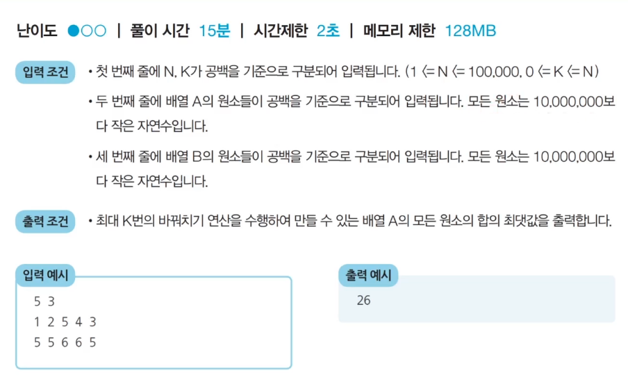

# 1. 정렬 알고리즘 비교

- 대부분의 프로그래밍 언어에서 지원하는 표준 정렬 라이브러리는 최악의 경우에도 O(NlogN)을 보장하도록 설계되어 있다.


## (1) 네 가지 정렬 알고리즘 비교

| 정렬 알고리즘 | 평균 시간 복잡도 | 공간 복잡도 | 특징                                                        |
| ------------- | ---------------- | ----------- | ----------------------------------------------------------- |
| 선택 정렬     | O(N²)            | O(N)        | 아이디어가 매우 간단함.                                     |
| 삽입 정렬     | O(N²)            | O(N)        | 데이터가 거의 정렬돼 있을 때 가장 빠름.                     |
| 퀵 정렬       | O(NlogN)         | O(N)        | 대부분의 경우에 가장 적합, 충분히 빠름.                     |
| 계수 정렬     | O(N + K)         | O(N + K)    | 데이터의 크기가 한정된 경우에만 사용 가능하지만, 매우 빠름. |


## (2) 선택 정렬 vs 기본 라이브러리 정렬 수행시간 비교

```python
from random import randint
import ime

# 배열에 10,000개의 정수 삽입
arr = list()
for _ in range(10000):
    arr.append(randint(1, 100))	# 1부터 100 사이의 랜덤 정수    
```

```python
# 선택 정렬 프로그램 성능 측정
start_time = time.time()

# 선택 정렬 프로그램
for i in range(len(arr)):
    min_index = i	# 가장 작은 원소의 인덱스
    
    for j in range(i + 1, len(arr)):
        if arr[min_index] > arr[j]:
            min_index = j
    
    arr[i], arr[min_index] = arr[min_index], arr[i]
    
# 측정 종료
end_time = time.time()
print('선택 정렬 성능 측정:', end_time - start.time)
```

```python
# 배열을 다시 무작위 데이터로 초기화
arr = list()
for _ in range(10000):
    arr.append(randint(1, 100))
    
# 기본 정렬 라이브러리 성능 측정
start_time = time.time()

# 기본 정렬 라이브러리 사용
arr.sort()

# 측정 종료
end_time = time.time()
print('선택 정렬 성능 측정:', end_time - start.time)
```


# 2. 【문제】 두 배열의 원소 교체

- 철수는 두 개의 배열 A와 B를 가지고 있다. 두 배열은 N개의 원소로 구성되어 있으며, 배열의 원소는 모두 자연수이다.
- 철수는 **최대 K번의 바꿔치기** 연산을 수행할 수 있는데, 바꿔치기 연산이란 배열 A에 있는 원소 하나와 배열 B에 있는 원소 하나를 골라, 두 원소를 서로 바꾸는 것을 말한다.
- 철수의 최종 목표는 배열 A의 모든 원소의 합이 최대가 되도록 하는 것이다.
- N, K, 배열 A와 B의 정보가 주어졌을 때, 최대 K번의 바꿔치기 연산을 수행하여 만들 수 있는 **배열 A의 모든 원소의 합의 최댓값**을 출력하는 프로그램을 작성하자.


- 예를 들어 N = 5, K = 3이고, 배열 A와 B가 다음과 같다고 가정.
  - A = [1, 2, 5, 4, 3]
  - B = [5, 5, 6, 6, 5]
- 이 경우, 다음과 같이 세 번의 연산을 수행할 수 있다.
  - 【연산 1】 배열 A의 원소 1과, 배열 B의 원소 6을 바꾸기
  - 【연산 2】 배열 A의 원소 2와, 배열 B의 원소 6을 바꾸기
  - 【연산 3】 배열 A의 원소 3과, 배열 B의 원소 5를 바꾸기
- 세 번의 연산 이후 배열 A와 B의 상태는 다음과 같은 구성이 된다.
  - A = [6, 6, 5, 4, 5]
  - B = [3, 5, 1, 2, 5]
- 이때 배열 A의 모든 원소의 합은 26이 되고, 이보다 합을 더 크게 만들 수는 없다.




## (1) 내가 짠 코드

```python
import sys
input = sys.stdin.readline

n, k = map(int, input().split())

a = list(map(int, input().split()))
b = list(map(int, input().split()))

a.sort()
b.sort(reverse=True)

for i in range(k):
    if a[i] < b[i]:
        a[i], b[i] = b[i], a[i]
    # else:	break 추가하기

total = 0
for num in a:
    total += num

print(total)
```


## (2) 문제 해결 아이디어

- **핵심 아이디어:** 매번 배열 A에서 가장 작은 원소를 골라, 배열 B에서 가장 큰 원소와 교체한다.

- 가장 먼저 배열 A와 B가 주어지면 A에 대해 오름차순 정렬, B에 대해 내림차순 정렬한다.

- 이후 두 배열의 원소를 첫 번째 인덱스부터 차례로 확인하면서, A의 원소가 B의 원소보다 작을 때에만 교체를 수행한다.

- 이 문제에서는 두 배열의 원소가 최대 100,000개까지 입력될 수 있으므로, 최악의 경우 **O(NlongN)**을 보장하는 정렬 알고리즘을 이용해야 한다.

  → 정렬 라이브러리 활용


## (3) 답안 예시

```python
n, k = map(int, input().split())

a = list(map(int, input().split()))
b = list(map(int, input().split()))

a.sort()
b.sort(reverse=True)

for i in range(k):
    if a[i] < b[i]:
        a[i], b[i] = b[i], a[i]
    # A의 원소가 B의 원소보다 크거나 같을 때, 반복문 탈출
    else:
        break

print(sum(a))
```

