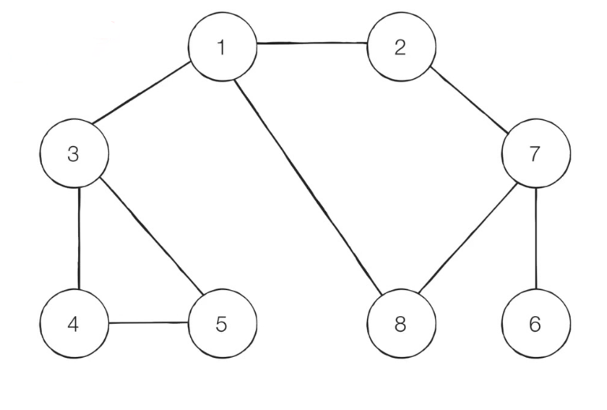
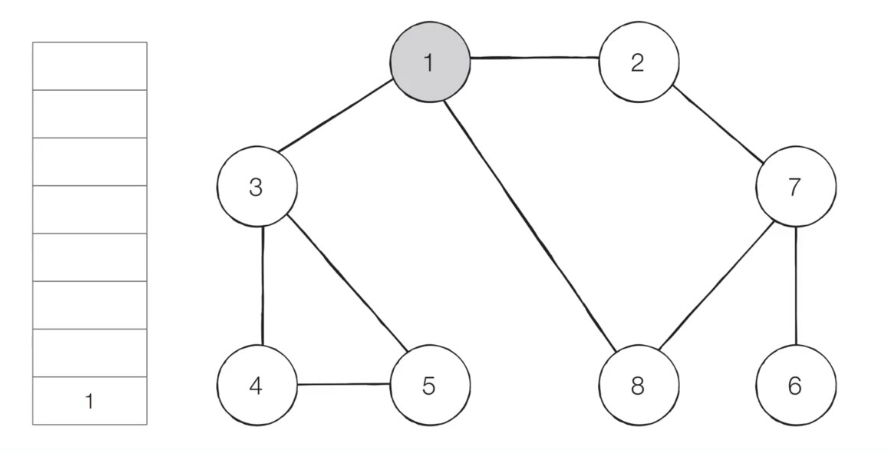
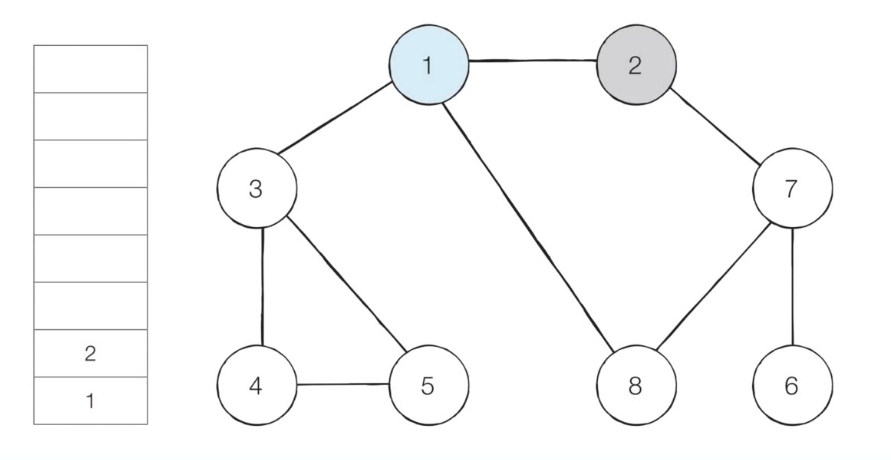
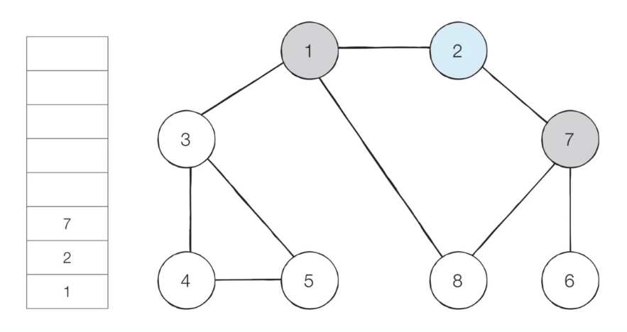
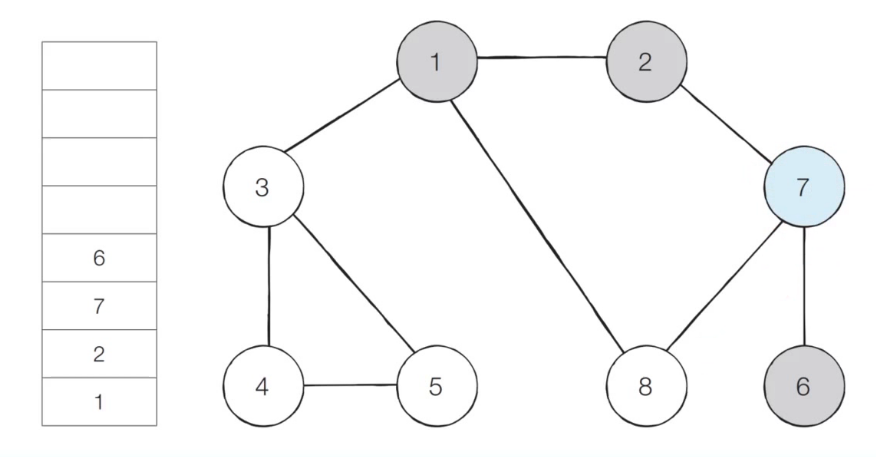
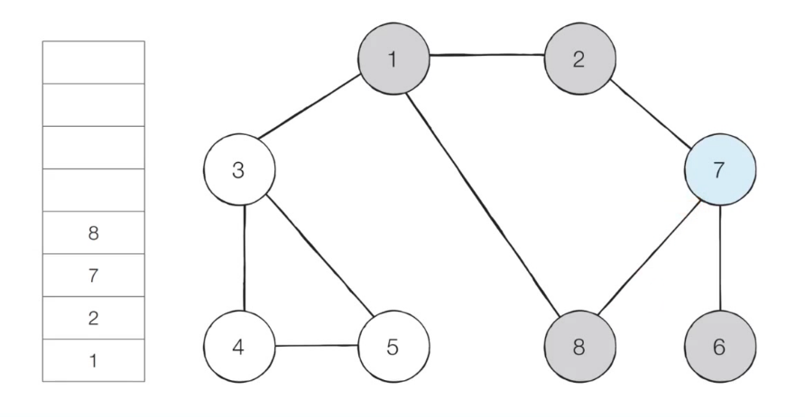
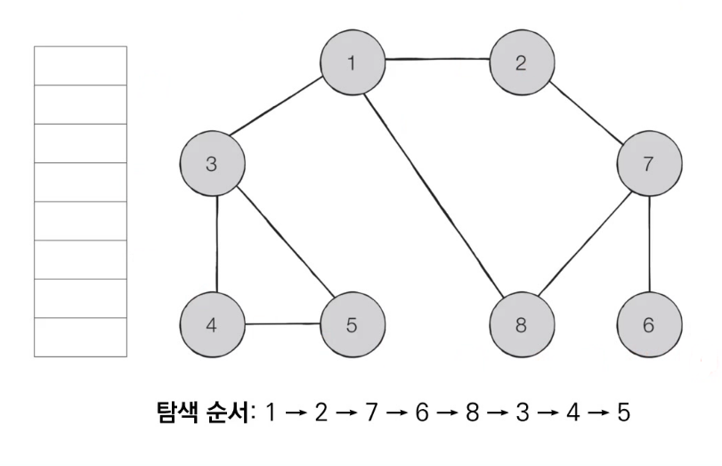

# 1. DFS

## (1) DFS (Depth-First Search)

- DFS는 **깊이 우선 탐색**이라고도 부르며, 그래프에서 **깊은 부분을 우선적으로 탐색**하는 알고리즘이다.
- **스택** 자료구조 (혹은 재귀 함수)를 이용하며, 구체적 동작 과정은 다음과 같다
  - 탐색 시작 노드를 스택에 삽입하고 방문 처리를 한다.
  - 스택의 최상단 노드에 방문하지 않은 인접한 노드가 하나라도 있으면, 그 노드를 스택에 넣고 방문 처리한다. 방문하지 않은 인접 노드가 없으면 스택에서 최상단 노드를 꺼낸다.
  - 2번의 과정을 수행할 수 없을 때까지 반복한다.


## (2) 동작 과정

- 【Step 0】 그래프를 준비한다. (방문 기준: **번호가 낮은 인접 노드**부터)

  - 시작 노드: 1

  


- 【Step 1】 

  - 시작 노드인 1을 스택에 삽입하고, 방문 처리를 한다.

  


- 【Step 2】

  - 스택의 최상단 노드인 1에서 방문하지 않은 인접 노드 2, 3, 8이 있다.
  - 이 중에서 가장 작은 노드인 2를 스택에 넣고 방문 처리를 한다.

  


- 【Step 3】

  - 스택의 최상단 노드인 2에서 방문하지 않은 인접 노드 7이 있다.
  - 따라서 7번 노드를 스택에 넣고 방문 처리를 한다.

  


- 【Step 4】

  - 스택의 최상단 노드인 7에서 방문하지 않은 인접 노드 6, 8이 있다.
  - 이 중에서 가장 작은 노드인 6를 스택에 넣고 방문 처리를 한다.

  


- 【Step 5】

  - 스택의 최상단 노드인 6에서 방문하지 않은 인접 노드가 없다.
  - 따라서 스택에서 6번 노드를 꺼낸다.

  


- 【Step 6】

  - 스택의 최상단 노드인 7에서 방문하지 않은 인접 노드 8이 있다.
  - 따라서 8번 노드를 스택에 넣고 방문 처리를 한다.

  


- 이러한 과정을 반복하였을 때, **전체 노드의 탐색 순서** (스택에 들어간 순서)는 다음과 같다.

  


## (3) 구현 방법

1. DFS 함수 정의

   ```python
   def DFS(graph, v, visited):
       # 현재 노드를 방문 처리
       visited[v] = True
       print(v, end=' ')
       
       # 현재 노드와 연결된 다른 노드를 재귀적으로 방문
       for i in graph[v]:
           # 노드 i가 방문되지 않았으면
           if not visited[i]:
               DFS(graph, i, visited)	# 방문
   ```


2. 메인

   ```python
   # 각 노드가 연결된 정보를 표현 (2차원 리스트)
   graph = [
       [],			# 0번 노드는 X
       [2, 3, 8],	# 1 → 2, 3, 8
       [1, 7],		# 2 → 1, 7 (무방향이라 1도 O)
       [1, 4, 5],	# 3 → 1, 4, 5
       [3, 5],		# 4 → 3, 5
       [3, 4],		# 5 → 3, 4
       [7],		# 6 → 7
       [2, 6, 8],	# 7 → 2, 6, 8
       [1, 7]		# 8 → 1, 7
   ]
   
   # 각 노드가 방문된 정보를 표현 (1차원 리스트)
   # 0번 노드는 사용하지 X → 배열 크기를 노드 개수 +1
   visited = [False] * 9
   
   DFS(graph, 1, visited)
   ```

   

