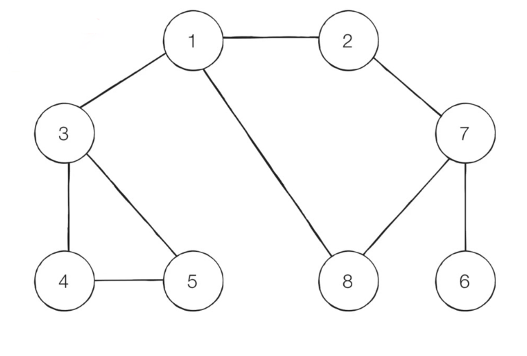
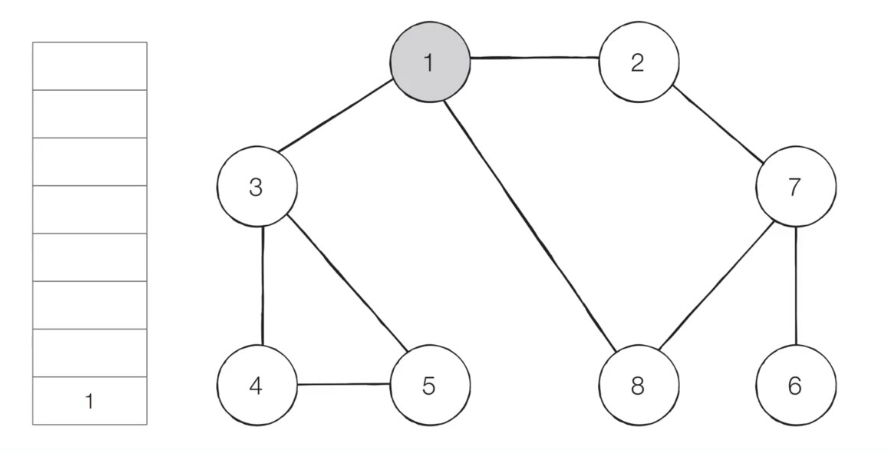
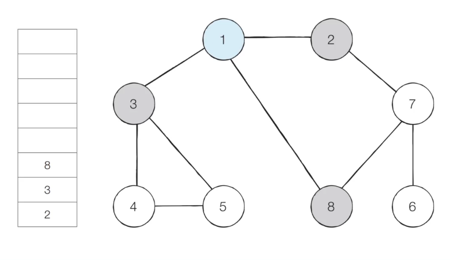
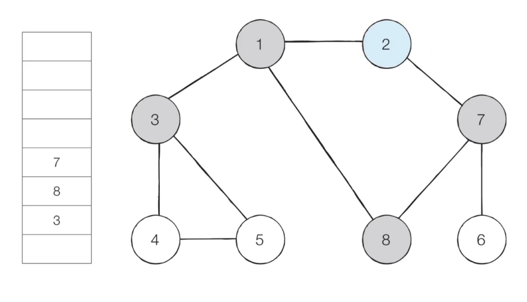
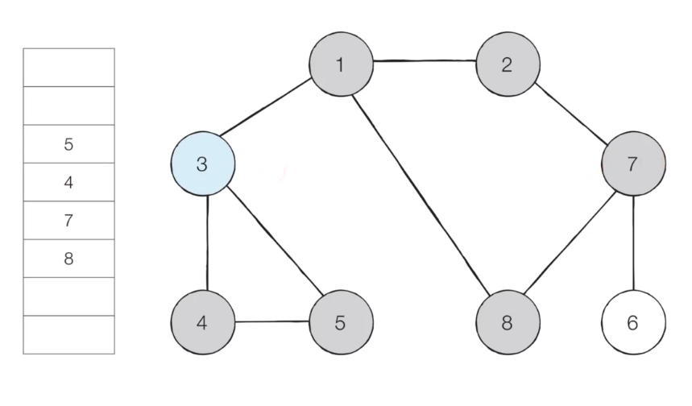
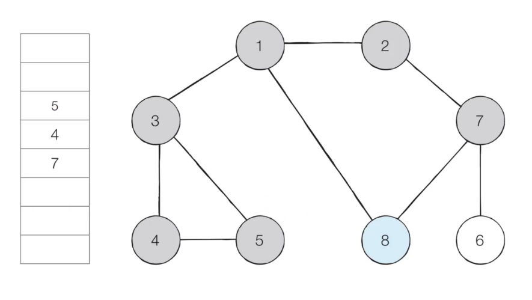
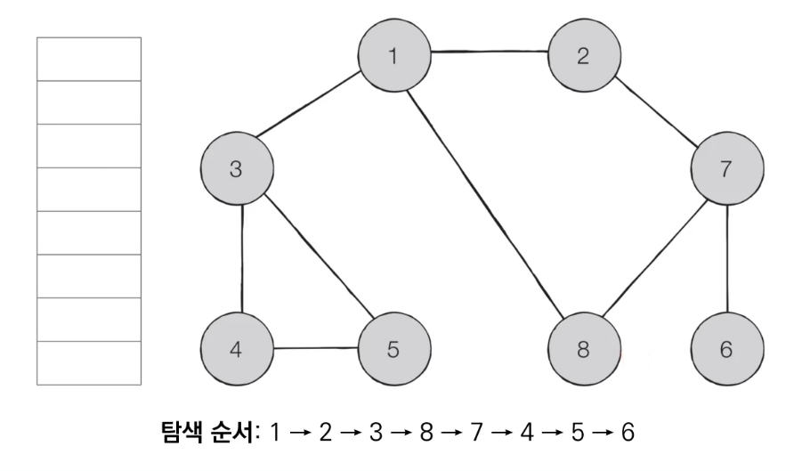

# 1. BFS

## (1) BFS (Breadth-First Search)

- BFS는 **너비 우선 탐색**이라고도 부르며, 그래프에서 **가까운 노드부터 우선적으로 탐색**하는 알고리즘이다.
- ✨**큐 자료구조**를 이용하며, 구체적 동작 과정은 다음과 같다
  - 탐색 시작 노드를 큐에 삽입하고 방문 처리를 한다.
  - 큐에서 노드를 꺼낸 뒤에, 꺼내진 노드의 인접 노드 중 방문하지 않은 노드를 모두 큐에 삽입하고 방문 처리한다.
  - 2번의 과정을 수행할 수 없을 때까지 반복한다.
- 특정 조건에서의 최단 경로 문제를 해결할 때에도 활용된다.


## (2) 동작 과정

- 【Step 0】 그래프를 준비한다. (방문 기준: **번호가 낮은 인접 노드**부터)

  - 시작 노드: 1

  

- 【Step 1】 

  - 시작 노드인 1을 큐에 삽입하고, 방문 처리를 한다.

  


- 【Step 2】 

  - 큐에서 노드 1을 꺼내, 방문하지 않은 인접 노드 2, 3, 8을 큐에 삽입하고, 방문 처리를 한다.

  

- 【Step 3】 

  - 큐에서 노드 2를 꺼내, 방문하지 않은 인접 노드 7을 큐에 삽입하고, 방문 처리를 한다.

  

- 【Step 4】 

  - 큐에서 노드 3을 꺼내, 방문하지 않은 인접 노드 4, 5를 큐에 삽입하고, 방문 처리를 한다.

  

- 【Step 5】 

  - 큐에서 노드 8을 꺼내고, 방문하지 않은 인접 노드가 없으므로 무시한다.

  

- 이러한 과정을 반복하였을 때, **전체 노드의 탐색 순서** (큐에 들어간 순서)는 다음과 같다.

  - 시작 노드로부터 가까운 노드부터 탐색 → 최단 거리 문제에서 활용
  - 1과 거리가 1인 2, 3, 8번 노드
  - 1과 거리가 2인 7, 4, 5번 노드
  - 1과 거리가 3인 6번 노드

  


## (3) 구현 방법

1. BFS 함수 정의

   ```python
   from collections import deque
   
   def BFS(graph, start, visited):
       # 큐 구현을 위해 deque 라이브러리 사용
       # 시작 노드를 큐에 넣어줌.
       queue = deque([start])
       
       # 현재 노드를 방문 처리
       visited[start] = True
       
       # 큐가 빌 때까지 반복
       while queue:
           # 큐에서 하나의 원소를 뽑아 출력
           v = queue.popleft()
           print(v, end=' ')
           
           # 아직 방문하지 않은 인접한 원소들을 큐에 삽입
           for i in graph[v]:
               if not visited[i]:
                   queue.append(i)
                   visited[i] = True
   ```


2. 메인

   ```python
   # 각 노드가 연결된 정보를 표현 (2차원 리스트)
   graph = [
       [],			# 0번 노드는 X
       [2, 3, 8],	# 1 → 2, 3, 8
       [1, 7],		# 2 → 1, 7 (무방향이라 1도 O)
       [1, 4, 5],	# 3 → 1, 4, 5
       [3, 5],		# 4 → 3, 5
       [3, 4],		# 5 → 3, 4
       [7],		# 6 → 7
       [2, 6, 8],	# 7 → 2, 6, 8
       [1, 7]		# 8 → 1, 7
   ]
   
   # 각 노드가 방문된 정보를 표현 (1차원 리스트)
   visited = [False] * 9
   
   BFS(graph, 1, visited)
   ```