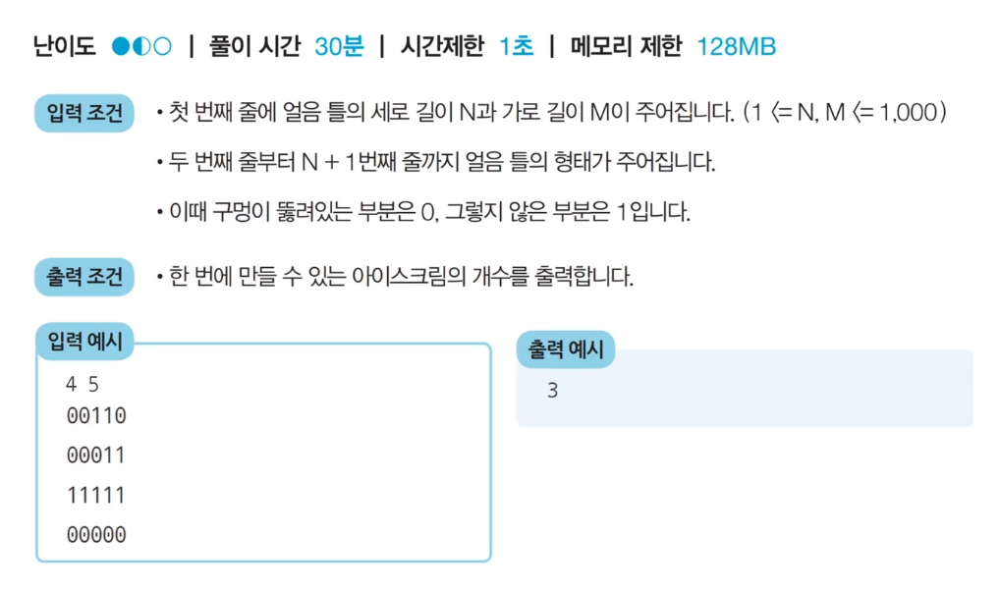
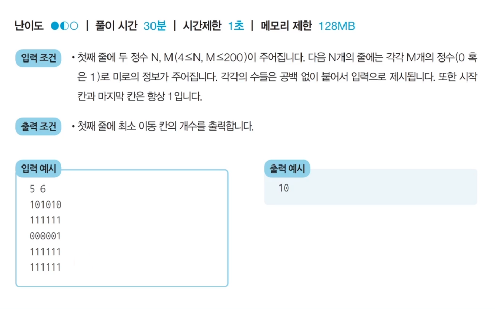
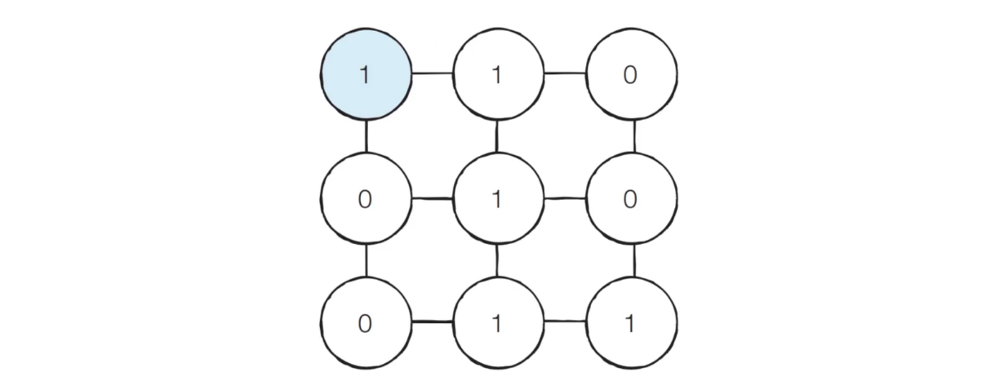
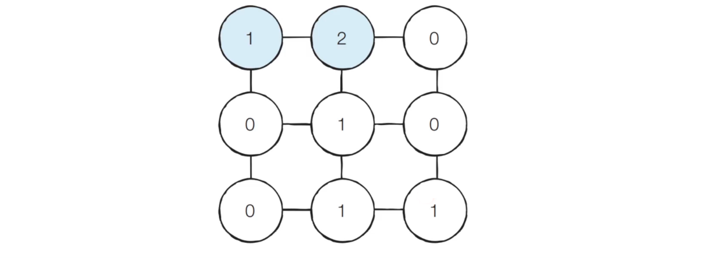
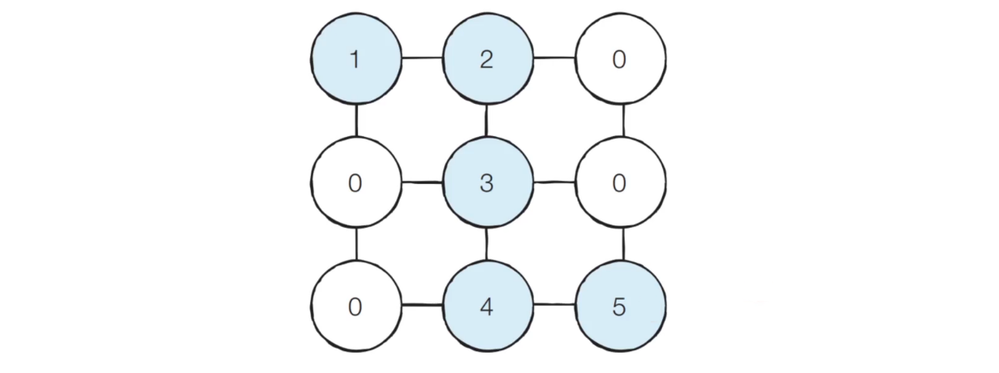

# 1. 【문제 1】 음료수 얼려 먹기🍨🍧🍦

- 연결된 요소 찾기 문제 (Connected Component)

- N × M 크기의 얼음 틀이 있다.
- 구멍이 뚫려 있는 부분은 0, 칸막이가 존재하는 부분은 1로 표시된다.
- 구멍이 뚫려 있는 부분끼리 상, 하, 좌, 우로 붙어 있는 경우 서로 연결되어 있는 것으로 간주한다.
- 이때, 얼음 틀의 모양이 주어졌을 때 생성되는 총 아이스크림의 개수를 구하는 프로그램을 작성하자.


- 예를 들어, 4 × 5 얼음 틀이 다음과 같이 생겼다면, 아이스크림이 총 3개 생성된다.

  




## (1) 내가 짠 코드

- 난이도 1개 반인데... 2시간 고민해도 못 풀었어

  ```python
  def DFS(y, x):
      if x >= m or x < 0 or y >= n or y < 0:
          return
      
      directions = [-1, 0, 1]
  
      for dir in directions:
          if arr2D[y + dir][x] == 0 and check[y + dir][x] == 0:
              check[y + dir][x] = 1
              DFS(y + dir, x)
              
          if arr2D[y][x + dir] == 0 and check[y][x + dir] == 0:
              check[y][x + dir] = 1
              DFS(y, x + dir)
  
  n, m = map(int, input().split())
  arr2D = list()
  check = list()
  
  for i in range(n):
      arr2D.append(list(map(int, input())))
      check.append([0] * m)
  
  DFS(0, 0)
  ```


## (2) 문제 해결 아이디어

- 이 문제는 **DFS 혹은 BFS로 해결**할 수 있다.
- 얼음을 얼릴 수 있는 공간이 상, 하, 좌, 우로 연결되어 있다고 표현할 수 있으므로, 그래프 형태로 모델링 할 수 있다.

- DFS를 활용하는 알고리즘
  - 특정한 지점의 주변 상, 하, 좌, 우를 살펴본 뒤, 주변 지점 중에서 값이 0이면서 아직 방문하지 않은 지점이 있다면 해당 지점을 방문한다.
  - 방문한 지점에서 다시 상, 하, 좌, 우를 살펴보면서 방문을 진행하는 과정을 반복하면, 연결된 모든 지점을 방문할 수 있다.
  - 모든 노드에 대하여 위의 과정을 반복하며, 방문하지 않은 지점의 수를 카운트한다.


## (3) 답안 예시

> DFS

```python
def DFS(x, y):
    # 주어진 범위를 벗어나는 경우, 즉시 종료
    if x <= -1 or x >= n or y <= -1 or y >= m:
        return False
    
    # 현재 노드를 아직 방문하지 않았다면
    if graph[x][y] == 0:
        graph[x][y] = 1	# 현재 노드 방문 처리
        
        # 상하좌우 인접 노드 방문하기
        DFS(x - 1, y)
        DFS(x, y - 1)
        DFS(x + 1, y)
        DFS(x, y + 1)
        
        return True
    
    # graph[x][y] == 1이면 False
    # 체크 배열 만들 필요 없고 그냥 1로 채워가는 거네..
    return False
```

```python
n, m = map(int, input().split())

# 2차원 리스트 정보 입력 받기
graph = list()
for i in range(n):
    graph.append(list(map(int, input())))

# 모든 위치에 대하여 음료수 채우기 (1 채우기)
result = 0
for i in range(n):
    for j in range(m):
        # 현재 위치에서 DFS 수행
        if DFS(i, j) == True:
            result += 1	# 인접 노드들의 모든 방문 처리가 1번 끝나면 횟수 증가
            
print(result)
```


# 2. 【문제 2】 미로 탈출🐂🐃

- 철수는 N × M 크기의 직사각형 형태의 미로에 갇혔다. 미로에는 여러 마리의 괴물이 있어 이를 피해 탈출해야 한다.
- 철수의 위치는 (1, 1)이고 미로의 출구는 (N, M)의 위치에 존재하며, 한 번에 한 칸씩 이동할 수 있다. 이때 괴물이 있는 부분은 0으로, 없는 부분은 1로 표시되어 있다. 미로는 반드시 탈출할 수 있는 형태로 제시된다.
- 이때 철수가 탈출하기 위해 움직여야 하는 최소 칸의 개수를 구하자. 칸을 셀 때는 시작 칸과 마지막 칸을 모두 포함해서 계산한다.



## (1) 내가 짠 코드

- 못 풀었다..


## (2) 문제 해결 아이디어

- BFS는 시작 지점에서 가까운 노드부터 차례대로 그래프의 모든 노드를 탐색한다.
- 상하좌우로 연결된 모든 노드로의 **거리가 1로 동일**하다. (→ BFS로 최단 거리)
  - 따라서, (1, 1) 지점부터 BFS를 수행하여 모든 노드의 최단 거리 값을 기록하면 해결할 수 있다.


- 【Step 1】 

  - 처음에 (1, 1)의 위치에서 시작

  

- 【Step 2】 

  - (1, 1) 좌표에서 상하좌우로 탐색을 진행하면 바로 옆 노드인 (1, 2) 위치의 노드를 방문하게 된다.
  - 새롭게 방문하는 **(1, 2) 노드의 값을 2로 바꾼다.**

  

- 【Step 3】 

  - 마찬가지로 BFS를 계속 수행하면 결과적으로 다음과 같이 최단 경로의 값들이 1씩 증가하는 형태로 변경된다.

  


## (3) 답안 예시

> BFS

```python
def BFS(x, y):
    queue = deque()
    queue.append(x, y)
    
    # 큐가 빌 때까지 반복
    while queue:
        x, y = queue.popleft()
        
        # 현재 위치에서 4가지 방향으로의 위치 확인
        for i in range(4):
            nx = x + dx[i]
            ny = y + dy[i]
            
            # 미로 찾기 공간을 벗어난 경우 무시
            if nx < 0 or nx >= n or ny < 0 or ny >= m:
                continue
            # 벽(괴물)인 경우 무시
            if graph[nx][ny] == 0:
                continue
                
            # 해당 노드를 처음 방문하는 경우에만 최단 거리 기록
            if graph[nx][ny] == 1:
                graph[nx][ny] = graph[x][y] + 1
                queue.append(nx, ny)
    
    # 가장 오른쪽 아래까지의 최단 거리 반환
	return graph[n - 1][m - 1]
```

```python
from collections import deque

n, m = map(int, input().split())

graph = list()
for i in range(n):
    graph.append(list(map(int, input())))

# 이동할 네 가지 방향 정의
dx = [-1, 1, 0, 0]
dy = [0, 0, -1, 1]

print(BFS(0, 0))
```

