# 1. 다익스트라 (Dijkstra) 알고리즘

## (1) 최단 경로 문제

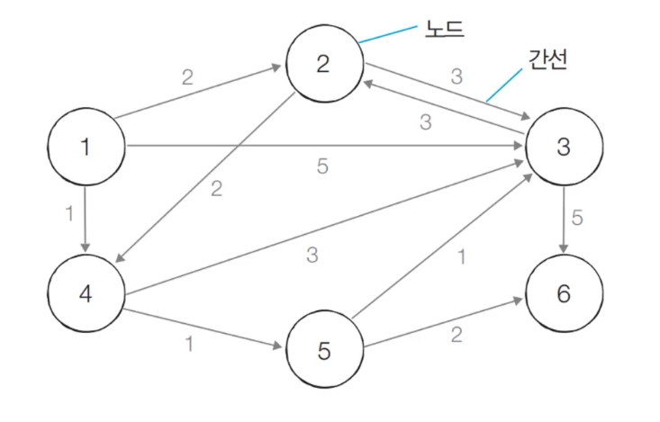

- **최단 경로 알고리즘**: 가장 짧은 경로를 찾는 알고리즘
- **다양한 문제 상황**
  - 한 지점에서 다른 한 지점까지의 최단 경로
  - **한 지점에서 다른 모든 지점까지의 최단 경로** ✔️
  - 모든 지점에서 다른 모든 지점까지의 최단 경로 → 플로이드 워셜
- 각 지점은 그래프에서 **노드 **(혹은 정점)로 표현
- 지점 간 연결된 도로는 그래프에서 **간선**으로 표현


## (2) 개요

- **특정 노드**에서 출발하여, **다른 모든 노드**로 가는 최단 경로를 계산한다.
- 음의 간선이 없을 때 정상적으로 동작한다.
  - 현실 세계의 도로(간선)은 음의 간선으로 표현되지 않는다.
  - 따라서 문제가 없다!
- **그리디 알고리즘**으로 분류된다.
  - **매 상황에서 가장 비용이 적은 노드를 선택**해 임의의 과정을 반복한다.
  - 기본적으로 최단 경로 문제는 **DP 알고리즘**으로 분류된다.
  - 다익스트라 알고리즘은 그 중에서도 그리디 알고리즘인 것!


## (3) 알고리즘

- 동작 과정
  1. 출발 노드를 설정한다.
  2. 최단 거리 테이블을 초기화한다.
     - 모든 노드에 가기까지의 거리를 무한으로 설정
     - 자기 자신에게 가는 거리는 0으로 설정
  3. 방문하지 않은 노드 중에서 최단 거리가 가장 짧은 노드를 선택한다.❤️
     - 이 부분이 그리디 알고리즘
     - 다음 노드로 갈 때, 그 전까지의 최단 거리 비용은 결정이 나 있는 상태기 때문에, 다익스트라 알고리즘이 그리디로 동작할 수 있다.
  4. 해당 노드를 거쳐 다른 노드로 가는 비용을 계산하여 최단 거리 테이블을 갱신한다.
  5. 위 과정에서 3번과 4번을 반복한다.


- 최단 거리 테이블

  - 각 노드에 대한 현재까지의 최단 거리 정보를 담고 있다.
  - 처리 과정에서 더 짧은 경로를 찾으면, '이제부터는 이 경로가 제일 짧은 경로야'라고 갱신한다.

  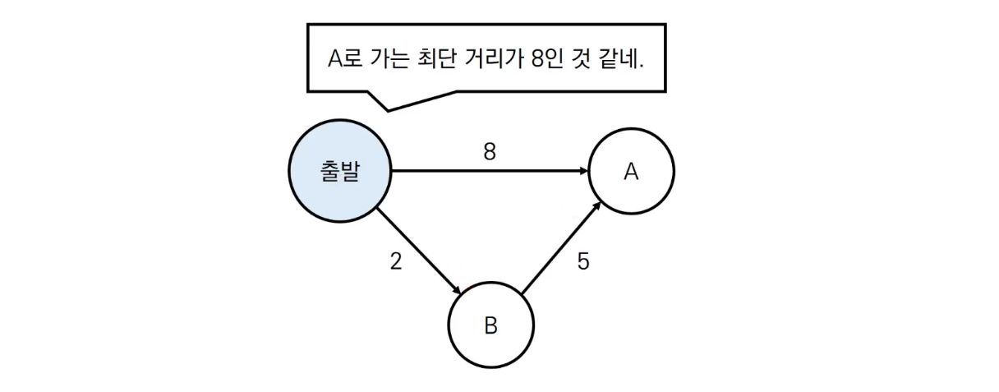

  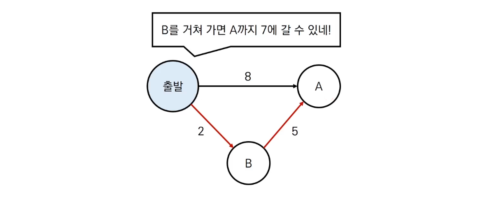


- 【초기 상태】 

  - 그래프를 준비하고, 출발 노드를 설정한다.
  - 최단 거리 테이블은 출발 지점인 1의 거리는 0, 나머지는 무한으로 초기화한다.

  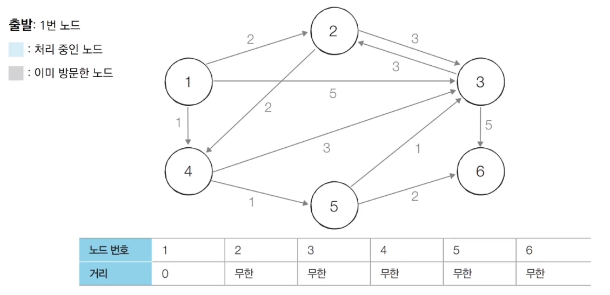


- 【Step 1】

  - 방문하지 않은 노드 중에서, 최단 거리가 가장 짧은 노드인 **1번** 노드를 처리한다.

  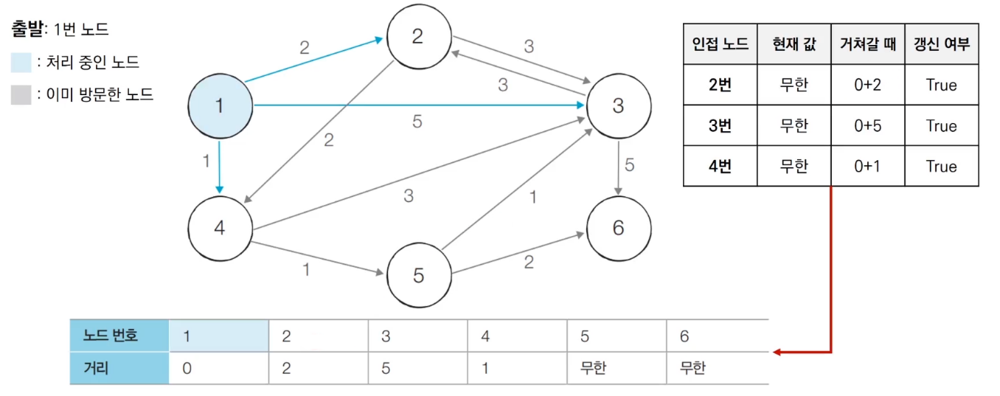


- 【Step 2】

  - 방문하지 않은 노드 중에서, 최단 거리가 가장 짧은 노드인 **4번** 노드를 처리한다.

    - 1 → 4의 거리 1

    - 4 → 3의 거리 3,    4 → 5의 거리 1

    - 3번으로 가는 현재 최단 거리는 5,    4번을 거칠 때는 4

      → 최단 거리 테이블의 값 4로 갱신

    - 5번으로 가는 현재 최단 거리 무한,    4번을 거칠 때는 2

      → 최단 거리 테이블의 값 2로 갱신

    - 4번 노드 방문 체크

  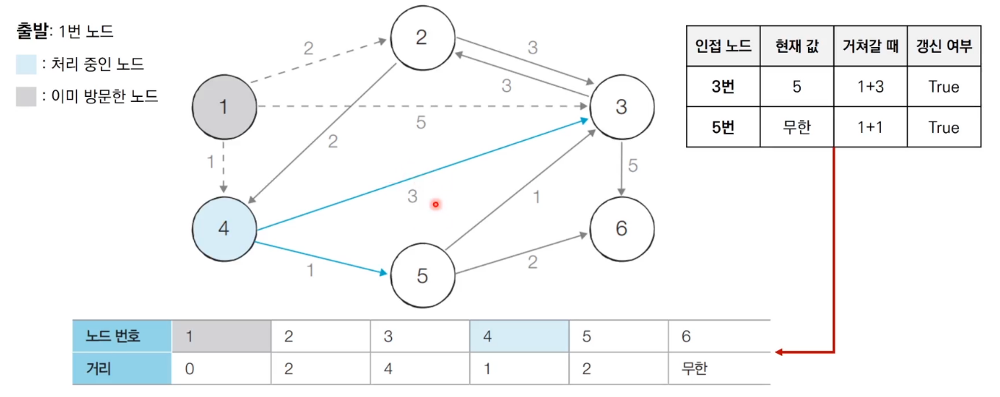


- 【Step 3】

  - 방문하지 않은 노드 중에서, 최단 거리가 가장 짧은 노드인 **2번** 노드를 처리한다. (5번 노드도 같은 비용을 갖고 있지만, 일반적으로 번호가 작은 것부터 선택한다.)

  - 3번으로 가는 현재 최단 거리는 4,   2번을 거칠 때는 5

    → 테이블 갱신 X

  - 4번으로 가는 현재 최단 거리는 1,   2번을 거칠 때는 4

    → 테이블 갱신 X (이미 방문한 노드는 무시하는 방법도 O. 이미 방문한 노드라면 최소 비용이 바뀌지 않으니깐.)

  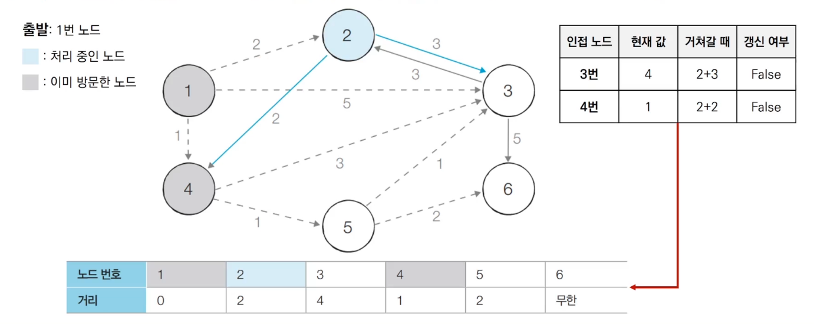


- 【Step 4】

  - 방문하지 않은 노드 중에서, 최단 거리가 가장 짧은 노드인 **5번** 노드를 처리한다.

  - 3번으로 가는 현재 최단 거리는 4,   5번을 거칠 때는 3

    → 최단 거리 테이블의 값 3으로 갱신

  - 6번으로 가는 현재 최단 거리는 무한,   5번을 거칠 때는 4

    → 최단 거리 테이블의 값 4로 갱신

  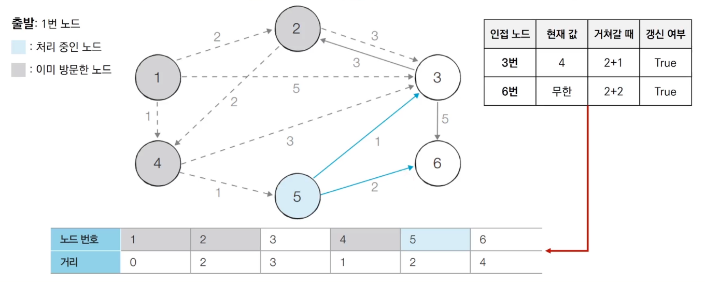


- 【Step 5】

  - 방문하지 않은 노드 중에서, 최단 거리가 가장 짧은 노드인 **3번** 노드를 처리한다.

  - 2번으로 가는 현재 최단 거리는 2,   3번을 거칠 때는 6

    → 테이블 갱신 X (이미 방문한 노드는 무시하는 방법도 O)

  - 6번으로 가는 현재 최단 거리는 4,   3번을 거칠 때는 8

    → 테이블 갱신 X

  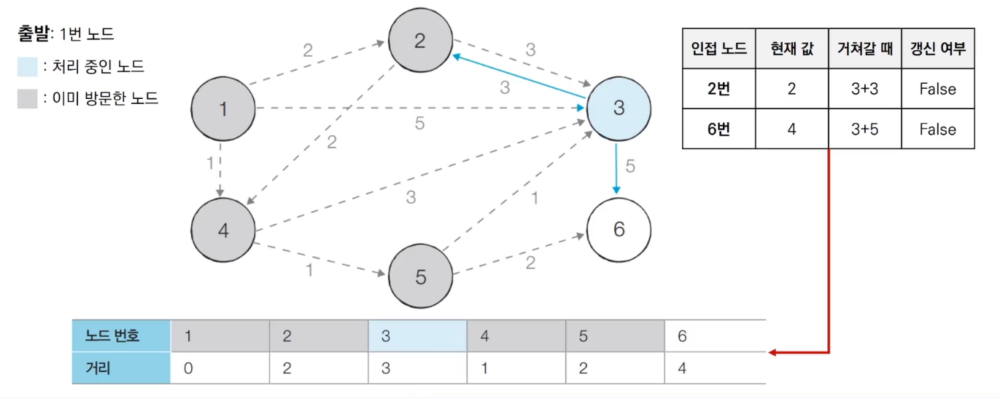


- 【Step 6】

  - 방문하지 않은 노드 중에서, 최단 거리가 가장 짧은 노드인 **6번** 노드를 처리한다. (사실 마지막 노드는 처리하지 않아도 O)
  - 이동할 수 있는 인접 노드가 없으므로, 탐색을 종료한다.

  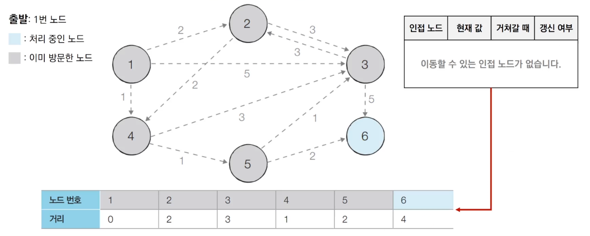


## (4) 특징

- 그리디 알고리즘
  - **매 상황에서 방문하지 않은, 가장 비용이 적은 노드를 선택**해 임의의 과정을 반복한다.
- 단계를 거치며 **한 번 처리된 노드의 최단 거리는 고정**되어, 더이상 바뀌지 않는다.
  - **한 단계당 하나의 노드에 대한 최단 거리를 확실히 찾는 것으로 이해**할 수 있다.
- 다익스트라 알고리즘을 수행한 뒤, **테이블에 각 노드까지의 최단 거리 정보가 저장**된다.
  - 최단 경로까지 출력하고 싶다면, 소스코드에 추가 기능을 넣어야 한다


# 2. 간단한 구현 방법

- 단계마다 방문하지 않은 노드 중에서 최단 거리가 가장 짧은 노드를 선택하기 위해, **매 단계마다 1차원 테이블의 모든 원소를 확인 (순차 탐색)**한다.❤️


## (1) 소스코드

1. 변수 초기화

   ```python
   import sys
   input = sys.stdin.readline
   INF = int(1e9)	# 무한을 의미하는 값으로 10억을 설정
   
   # 노드의 개수 v, 간선의 개수 e 입력
   v, e = map(int, input().split())
   
   # 시작 노드 번호 입력
   start = int(input())
   
   # 각 노드에 인접한 노드 정보를 담는 리스트 만들기
   graph [[] for i in range(v + 1)]
   
   # 방문한 적이 있는지 체크하는 리스트 만들기
   visited = [False] * (v + 1)
   
   # 최단 거리 테이블을 모두 무한으로 초기화
   distance = [INF] * (v + 1)
   ```


2. 모든 간선 정보 입력 (방향 그래프라고 가정)

   ```python
   for _ in range(e):
       # v1 → v2로 가는 비용이 w
       v1, v2, w = map(int, input().split())
       graph[v1].append((v2, w))	# 튜플로 인접 노드 정보 넣기
   ```


3. 방문하지 않은 노드 중, 가장 최단 거리가 짧은 노드의 번호를 반환❤️

   ```python
   def get_smallest_node():
       min_value = INF
       index = 0	# 가장 최단 거리가 짧은 노드(인덱스)
       
       for i in range(1, v + 1):
           if distance[i] < min_value and not visited[i]:
               min_value = distance[i]
               index = i
               
       return index
   ```


4. 다익스트라 알고리즘

   ```python
   def dijkstra(start):
       # 시작 노드에 대해서 초기화
       distance[start] = 0
       visited[start] = True
       
       # 출발 노드로부터 당장 도달할 수 있는 다른 노드들까지의 거리를 먼저 테이블에 갱신
       for j in graph[start]:	# j[0]: v2, j[1]: w
           distance[j[0]] = j[1]
           
       # 시작 노드를 제외한 전체 n - 1개의 노드에 대해 반복
       for i in range(n - 1):
           # 현재 최단 거리가 가장 짧은 노드를 꺼내, 방문 처리
           now = get_smallest_node()
           visited[now] = True
           
           # 현재 노드와 연결된 다른 노드를 확인
           for j in graph[now]:
               cost = distance[now] + j[1]
               
               # 현재 노드를 거쳐서 다른 노드로 이동하는 거리가 더 짧은 경우
               if cost < distance[j[0]]:
                   distance[j[0]] = cost	# 테이블 갱신
   ```


5. 메인

   ```python
   dijkstra(start)
   
   # 모든 노드로 가기 위한 최단 거리를 출력
   for i in range(1, n + 1):
       # 도달할 수 없는 경우, INFINITY라고 출력
       if distance[i] == INF:
           print('INFINITY')
       # 도달할 수 있는 경우, 거리 출력
       else:
           print(distance[i])
   ```


## (2) 성능 분석

- 노드의 개수가 V개라면, 총 O(V)번에 걸쳐서 최단 거리가 가장 짧은 노드를 매번 선형 탐색해야 한다.
- 따라서 전체 시간 복잡도는 **O(V²)**이다.
- 일반적으로, 코딩 테스트의 최단 경로 문제에서 전체 노드의 개수가 5,000개 이하라면 이 코드로 문제를 해결할 수 있다.
  - 하지만 노드의 개수가 10,000 이상 넘어가는 문제라면?


# 3. 개선된 구현 방법

## (1) 우선순위 큐 & 힙

- [우선순위 큐](02_Priority-Queue.md)
  - **우선순위가 가장 높은 데이터를 가장 먼저 삭제**
  - **최소 힙**과 **최대 힙** → 다익스트라 최단 경로 알고리즘 등 다양한 알고리즘에서 사용됨.


- 힙 라이브러리 사용 예제: 최소 힙

  ```python
  import heapq
  
  # 오름차순 힙 정렬 (Heap Sort)
  def heapSort(iterable):
      h = list()
      res = list()
      
      # 모든 원소를 차례대로 힙에 삽입
      for value in iterable:
          heapq.heappush(h, value)
          
      # 힙에 삽입된 모든 원소를 차례로 꺼내어, res에 담기
      for i in range(len(h)):
          res.append(heapq.heappop(h))	# heappop(value)
          
      return res
  
  result = heapsort([1, 3, 5, 7, 9, 2, 4, 6, 8, 0])
  print(result)	#[0, 1, 2, 3, 4, 5, 6, 7, 8, 9]
  ```


- 힙 라이브러리 사용 예제: 최대 힙

  ```python
  import heapq
  
  # 내림차순 힙 정렬 (Heap Sort)
  def heapSort(iterable):
      h = list()
      res = list()
      
      # 모든 원소를 차례대로 힙에 삽입
      for value in iterable:
          heapq.heappush(h, -value)
          
      # 힙에 삽입된 모든 원소를 차례로 꺼내어, res에 담기
      for i in range(len(h)):
          res.append(-heapq.heappop(h))	# heappop(value)
          
      return res
  
  result = heapsort([1, 3, 5, 7, 9, 2, 4, 6, 8, 0])
  print(result)	#[9, 8, 7, 6, 5, 4, 3, 2, 1, 0]
  ```


## (2) 개선된 구현 방법✨

- 단계마다 **방문하지 않은 노드 중에서 최단 거리가 가장 짧은 노드를 선택**하기 위해 **힙(Heap) 자료구조를 이용**한다.❤️
- 다익스트라 알고리즘이 동작하는 **기본 원리는 동일**하다.
  - 현재 가장 가까운 노드를 저장해 놓기 위해 힙 자료구조를 추가적으로 이용한다는 점이 다르다.
  - 현재의 최단 거리가 가장 짧은 노드를 선택해야 하므로, **최소 힙**을 사용한다.


## (3) 소스코드

1. 변수 초기화

   -  방문 처리를 위한 **visited 테이블이 없음**

   ```python
   import heapq
   import sys
   input = sys.stdin.readline
   INF = int(1e9)	# 무한을 의미하는 값으로 10억을 설정
   
   # 노드의 개수 v, 간선의 개수 e 입력
   v, e = map(int, input().split())
   
   # 시작 노드 번호 입력
   start = int(input())
   
   # 각 노드에 인접한 노드 정보를 담는 리스트 만들기
   graph [[] for i in range(v + 1)]
   
   # 최단 거리 테이블을 모두 무한으로 초기화
   distance = [INF] * (v + 1)
   ```


2. 모든 간선 정보 입력 (방향 그래프라고 가정)

   ```python
   for _ in range(e):
       # v1 → v2로 가는 비용이 w
       v1, v2, w = map(int, input().split())
       graph[v1].append((v2, w))	# 튜플로 인접 노드 정보 넣기
   ```


3. 다익스트라 알고리즘

   - 현재 상황에서 가장 최단 거리가 짧은 노드를 찾는 함수가 X

   ```python
   def dijkstra(start):
       q = list()
       
       # 시작 노드로 가기 위한 최단 경로는 0으로 설정하여, 큐에 삽입
       # 우선순위 큐에, (dist, now)의 쌍을 넣는다.
       # dist는 n까지의 최소 비용
       heapq.heappush(q, (0, start))	
       distance[start] = 0
       
       # 큐가 비어있지 않다면
       while q:
           # 가장 최단 거리가 짧은 노드에 대한 정보 꺼내기
           dist, now = heapq.heappop(q)
           
           # 현재 노드가 이미 처리된 적이 있는 노드라면 무시
           # 이미 처리된 노드 = 최소 비용을 가짐
           if distance[now] < dist:
               continue
               
           # 현재 노드와 연결된 다른 인접 노드들을 확인
           for i in graph[now]:
               cost = dist + i[1]	# i[0]: v2, i[1]: w
               
               # 현재 노드를 거쳐, 다른 노드로 이동하는 거리가 더 짧은 경우
               # 최단 거리 테이블 갱신 & 해당 인접 노드와 cost를 큐에 삽입
               if cost < distance[i[0]]:
                   distance[i[0]] = cost
                   heapq.heappush(q, (cost, i[0]))
   ```


5. 메인

   ```python
   dijkstra(start)
   
   # 모든 노드로 가기 위한 최단 거리를 출력
   for i in range(1, n + 1):
       # 도달할 수 없는 경우, INFINITY라고 출력
       if distance[i] == INF:
           print('INFINITY')
       # 도달할 수 있는 경우, 거리 출력
       else:
           print(distance[i])
   ```


## (4) 동작 과정 (우선순위 큐)

- 【초기 상태】 

  - 그래프를 준비하고, 출발 노드를 설정하여 우선순위 큐에 삽입한다.
  - 우선순위 큐는 트리 자료구조지만, 그림에서는 선형으로 도식화.
  - 우선순위 큐의 데이터는 튜플 형태로 넣는데, 거리가 작은 것부터 먼저 나올 수 있도록 구성

  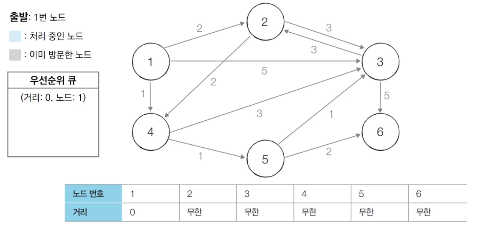


- 【Step 1】

  - 우선순위 큐에서 원소를 꺼낸다.
  - **1번** 노드는 아직 방문하지 않았으므로, 이를 처리한다.
    - 우선순위 큐에는 최단 거리 값이 갱신된 인접 노드만 담는다.

  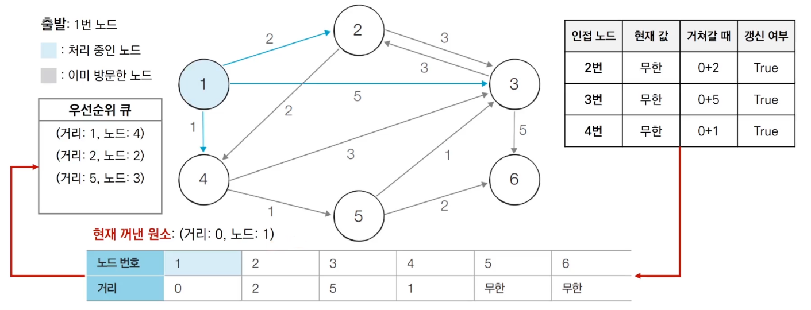


- 【Step 2】

  - 우선순위 큐에서 원소를 꺼낸다. 이때 거리 값이 가장 작은 **4번** 노드가 꺼내진다.
  - **4번** 노드는 아직 방문하지 않았으므로, 이를 처리한다.
    - 4번과 인접한 노드 3번이, 5번과 인접한 노드 3번보다 큐에 나중에 들어왔지만, 더 위쪽에 위치한 걸 볼 수 있다.

  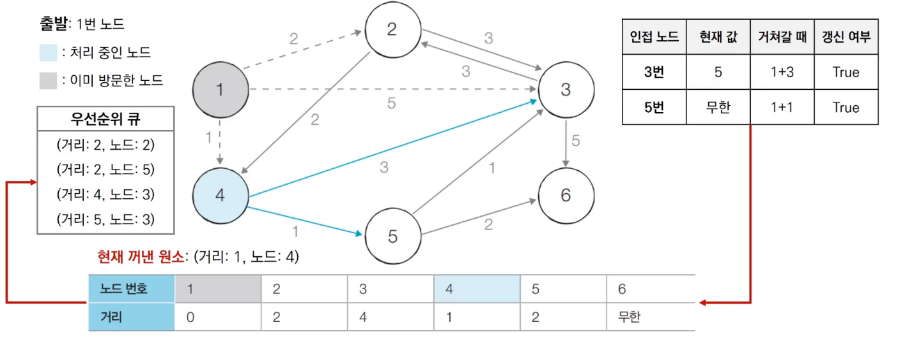


- 【Step 3】

  - 우선순위 큐에서 원소를 꺼낸다. 이때 거리 값이 가장 작은 **2번** 노드가 꺼내진다.
  - **2번** 노드는 아직 방문하지 않았으므로, 이를 처리한다.
  - 최단 거리 비용이 갱신되지 않았기 때문에, 큐에는 아무 값도 들어오지 않는다.

  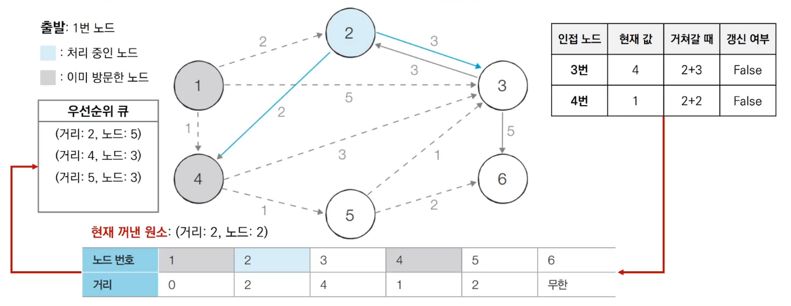


- 【Step 4】

  - 우선순위 큐에서 원소를 꺼낸다. 이때 거리 값이 가장 작은 **5번** 노드가 꺼내진다.
  - **5번** 노드는 아직 방문하지 않았으므로, 이를 처리한다.
  - 3번 노드, 6번 노드까지의 최단 거리가 갱신되어, 이를 큐에 담는다.

  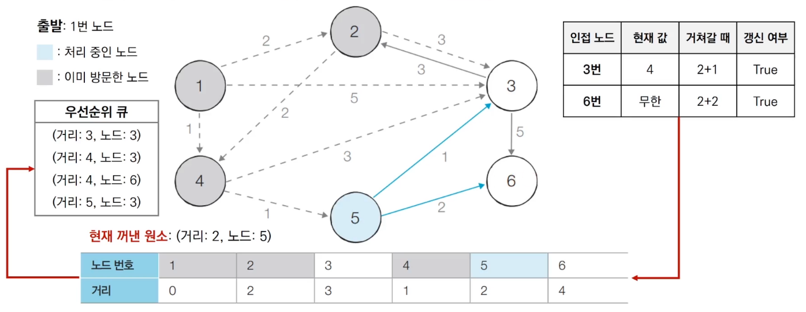


- 【Step 5】

  - 우선순위 큐에서 원소를 꺼낸다. 이때 거리 값이 가장 작은 **3번** 노드가 꺼내진다.
  - **3번** 노드는 아직 방문하지 않았으므로, 이를 처리한다.
  - 최단 거리 비용이 갱신되지 않았기 때문에, 큐에는 아무 값도 들어오지 않는다.

  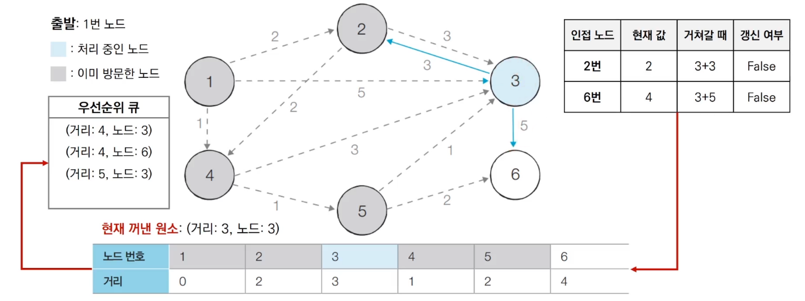


- 【Step 6】

  - 우선순위 큐에서 원소를 꺼낸다. 이때 거리 값이 가장 작은 **3번** 노드가 꺼내진다.
  - **3번** 노드는 이미 방문했으므로, 무시한다.

  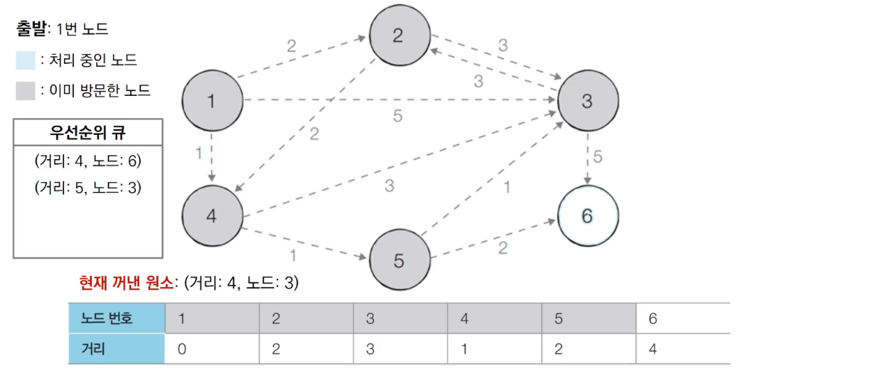


- 【Step 7】

  - 우선순위 큐에서 원소를 꺼낸다. 
  - **6번** 노드는 아직 방문하지 않았으므로 이를 처리한다.
  - 6번에서는 더이상 연결된 노드가 없으니, 아무것도 갱신되지 않고 끝난다.

  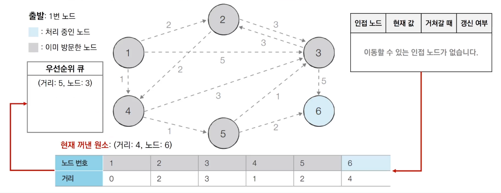


- 【Step 8】

  - 우선순위 큐에서 원소를 꺼낸다.
  - **3번** 노드는 이미 방문했으므로, 무시한다.

  


## (5) 성능 분석

- 힙 자료구조를 이용하는 다익스트라 알고리즘의 시간 복잡도는 **O(ElogV)**
  - E는 간선, V는 노드의 수
- 노드를 하나씩 꺼내 검사하는 반복문 (while 문)은 노드의 개수 V 이상의 횟수로는 처리되지 않는다.
  - 결과적으로, 현재 우선순위 큐에서 꺼낸 노드와 연결된 다른 노드들을 확인하는 총 횟수는, 최대 간선의 개수 E만큼의 연산이 수행된다.
- 직관적으로 전체 과정은 E개의 원소를 우선순위 큐에 넣었다가 빼내는 연산과 매우 유사하다.
  - 시간 복잡도를 O(ElogE)로 판단할 수 있다.
  - 중복 간선을 포함하지 않는 경우, 이를 O(ElogV)로 정리할 수 있다.
    - O(ElogE) → O(ElogV²) → O(2ElogV) → O(ElogV)