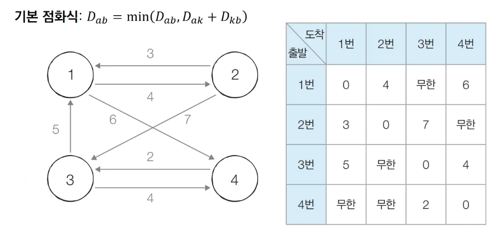
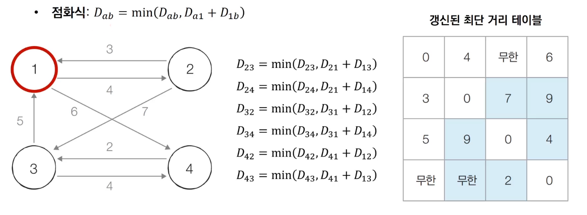
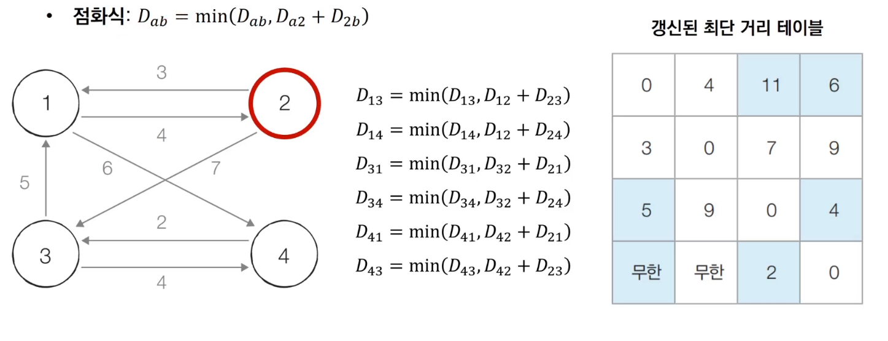
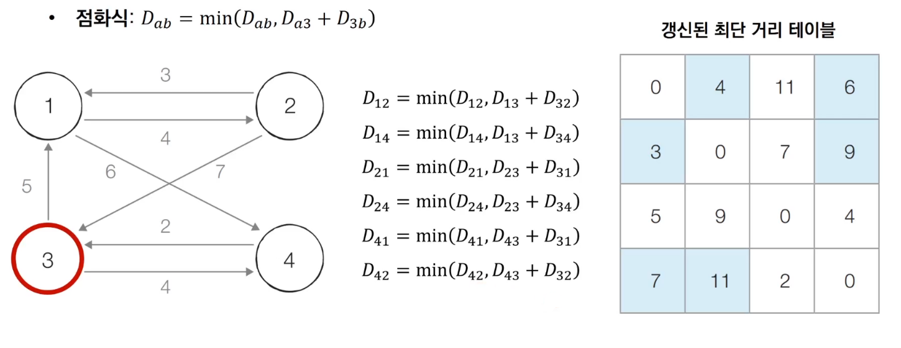
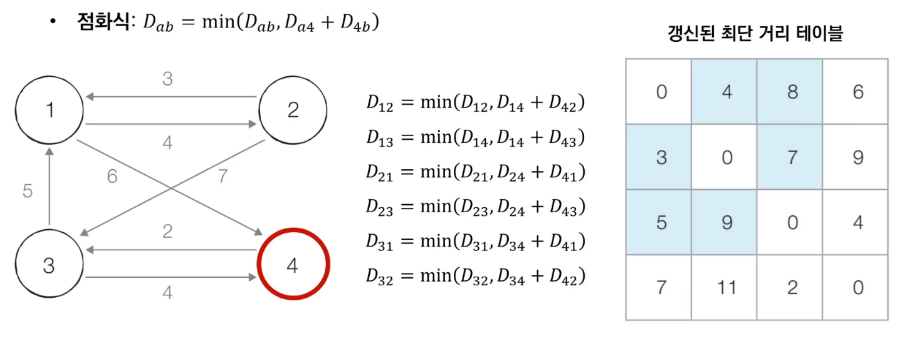

# 1. 플로이드 워셜 알고리즘 (Floyd-Warshall Algorithm)

## (1) 최단 경로 문제

- **최단 경로 알고리즘**: 가장 짧은 경로를 찾는 알고리즘
- **다양한 문제 상황**
  - 한 지점에서 다른 한 지점까지의 최단 경로
  - 한 지점에서 다른 모든 지점까지의 최단 경로 → 다익스트라
  - **모든 지점에서 다른 모든 지점까지의 최단 경로** ✔️


## (2) 개요

- **모든 노드에서 다른 모든 노드까지의 최단 경로를 모두 계산**한다.
- 다익스트라 알고리즘과 마찬가지로, 단계별로 **거쳐가는 노드를 기준으로 알고리즘을 수행**한다.
  - 다만, 매 단계마다 방문하지 않는 노드 중 최단 거리를 갖는 노드를 찾는 과정이 필요하지 않다.💔
- 2차원 테이블에 최단 거리 정보를 저장한다.
- **다이나믹 프로그래밍** 유형에 속한다.
  - 점화식에 맞게 3중 반복문을 돌며 2차원 테이블을 갱신한다.
  - 다익스트라에 비해 구현 난이도가 쉬운 편이지만, 시간복잡도가 O(n³)이기 때문에, 노드와 간선의 개수가 많은 경우 다익스트라 알고리즘을 사용한다.


## (3) 동작 과정

- 각 단계마다 **특정한 노드 k를 거쳐 가는 경우를 확인**한다.

  - a에서 b로 가는 최단 거리보다, a에서 k를 거쳐 b로 가는 거리가 더 짧은지 비교한다.

  - 점화식

    


- 【초기 상태】

  - 그래프를 준비하고, 최단 거리 테이블을 초기화한다.
  - 행 a: 출발 노드, 열 b: 도착 노드

  


- 【Step 1】

  - **1번** 노드를 거쳐 가는 경우를 고려하여 테이블을 갱신한다.
  - k = 1
  - 모든 a에서 모든 b로 가는 최단 거리를 갱신 → 1행, 1열, 대각선 제외한 테이블이 모두 갱신된다.

  


- 【Step 2】

  - **2번** 노드를 거쳐 가는 경우를 고려하여 테이블을 갱신한다.
  - k = 2
  - 모든 a에서 모든 b로 가는 최단 거리를 갱신 → 2행, 2열, 대각선 제외한 테이블이 모두 갱신된다.

  


- 【Step 3】

  - **3번** 노드를 거쳐 가는 경우를 고려하여 테이블을 갱신한다.
  - k = 3
  - 모든 a에서 모든 b로 가는 최단 거리를 갱신 → 3행, 3열, 대각선 제외한 테이블이 모두 갱신된다.

  


- 【Step 4】

  - **4번** 노드를 거쳐 가는 경우를 고려하여 테이블을 갱신한다.
  - k = 4
  - 모든 a에서 모든 b로 가는 최단 거리를 갱신 → 4행, 4열, 대각선 제외한 테이블이 모두 갱신된다.

  


## (4) 구현 방법

1. 변수 선언

   ```python
   INF = int(1e9)
   
   # 노드의 개수 v, 간선의 개수 e 입력
   v, e = map(int, input().split())
   
   # 2차원 리스트(그래프)를 만들고, 무한으로 초기화
   # 처음엔 간선 비용을 입력받아 저장하고,
   # 후에 최단 거리 테이블로서의 역할을 할 것
   graph = [[INF] * (n + 1) for _ in range(n + 1)]
   ```


2. 그래프 초기화

   ```python
   # 자기 자신 → 자기 자신으로 가는 비용은 0으로 초기화
   for v1 in range(1, v + 1):
       for v2 in range(1, v + 1):
           if v1 == v2:
               graph[v1][v2] = 0
               
   # 각 간선 정보를 입력받아, 그 값으로 초기화
   for _ in range(e):
       # v1 → v2로 가는 비용 w
       v1, v2, w = map(int, input().split())
       graph[v1][v2] = w
   ```


3. 점화식에 따른 플로이드 워셜 알고리즘 수행

   ```python
   for k in range(1, v + 1):
       for v1 in range(1, v + 1):
           for v2 in range(1, v + 1):
               graph[v1][v2] = min(graph[v1][v2], graph[v1][k] + graph[k][v2])
   ```


4. 수행 결과 출력

   ```python
   for v1 in range(1, v + 1):
   	for v2 in range(1, v + 1):
           # 도달할 수 없는 경우, INFINITY 출력
           if graph[v1][v2] == INF:
               print('INFINITY', end=' ')
           # 도달할 수 있는 경우, 거리 출력
       	else:
               print(graph[v1][v2], end=' ')
               
   	print()
   ```


## (5) 성능 분석

- 노드의 개수 N개일 때, 알고리즘 상으로 N번의 단계를 수행한다.
  - 각 단계마다 O(N²)의 연산을 통해, 현재 노드를 거쳐 가는 모든 경로를 고려한다.
- 따라서 플로이드 워셜 알고리즘의 총 시간 복잡도는 **O(N³)**이다.
