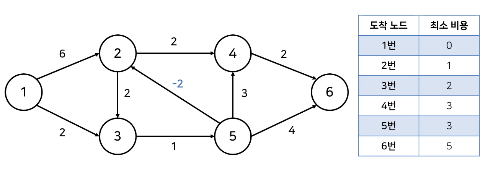
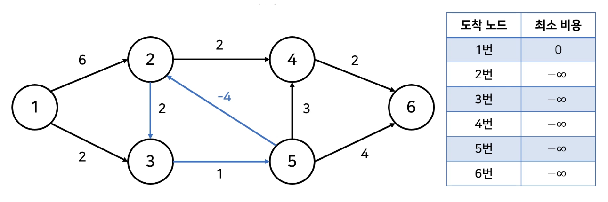

# 1. 벨만 포드 알고리즘 (Bellman-Ford Algorithm)

## (1) 최단 경로 문제

- **최단 경로 알고리즘**: 가장 짧은 경로를 찾는 알고리즘
- **다양한 문제 상황**
  - 한 지점에서 다른 한 지점까지의 최단 경로
  - 한 지점에서 다른 모든 지점까지의 최단 경로 → 다익스트라
  - 모든 지점에서 다른 모든 지점까지의 최단 경로 → 플로이드 워셜
  - **음수 간선이 포함된 상황에서의 최단 경로** ✔️
    - 음의 간선이 포함된 상황에서도 사용할 수 있다.
    - 음수 간선의 순환을 감지할 수 있다.
    - 기본 시간 복잡도는 **O(VE)**로, 다익스트라 알고리즘에 비해 느리다.


## (2) 음수 간선이 포함된 상황에서의 최단 거리 문제

- [백준 '타임머신' 문제](https://www.acmicpc.net/problem/11657)

- N개의 도시가 있다. 그리고 한 도시에서 출발하여 다른 도시에 도착하는 버스가 M개 있다. 각 버스는 A, B, C로 나타낼 수 있는데, A는 시작도시, B는 도착도시, C는 버스를 타고 이동하는데 걸리는 시간이다.

  시간 C가 양수가 아닌 경우가 있다. C = 0인 경우는 순간 이동을 하는 경우, C < 0인 경우는 타임머신으로 시간을 되돌아가는 경우이다.

  1번 도시에서 출발해서 나머지 도시로 가는 가장 빠른 시간을 구하는 프로그램을 작성하자.

- 도시의 개수: N (1 ≤ N ≤ **500**)

- 버스 노선의 개수: M (1 ≤ M ≤ **6000**)

- 이 문제를 어떻게 해결할 수 있을까?

  - 모든 간선의 비용이 양수일 때는 다익스트라 최단 경로 알고리즘을 사용

  - 아래 그래프에는 음수 간선이 포함되어 있으나, 여전히 최단 거리를 계산할 수 있다.

    - 2번 도착: 1 → 3 → 5 → 2
    - 4번 도착: 1 → (3, 5) → 2 → 4

    

  - 하지만, **음수 간선의 순환**이 포함된다면?

    - 이 경우 최단 거리가 음의 무한인 노드가 발생

    


## (3) 동작 과정

1. 출발 노드 설정
2. 최단 거리 테이블 초기화
3. 다음 과정을 N - 1번 반복
   - **전체 간선 E개를 하나씩 확인** ✔️
   - 각 간선을 거쳐 다른 노드로 가는 비용을 계산, 최단 거리 테이블 갱신
4. 만약 음수 간선 순환이 발생하는지 체크하고 싶다면, **3번 과정을 한 번 더 수행**
   - 이때 최단 거리 테이블이 갱신된다면, 음수 간선 순환이 존재하는 것


## (4) 벨만 포드 vs 다익스트라

- 다익스트라 알고리즘
  - 매번 방문하지 않은 노드 중, 최단 거리가 가장 짧은 노드를 선택한다.
  - 음수 간선이 없다면, 최적의 해를 찾을 수 있다.
- 벨만 포드 알고리즘
  - 매번 모든 간선을 전부 확인한다.
    - 따라서, **다익스트라 알고리즘에서의 최적의 해를 항상 포함**한다.
  - 다익스트라에 비해 시간이 오래 걸리지만, 음수 간선 순환을 탐지할 수 있다.


## (5) 구현 방법

1. 벨만 포드 알고리즘

   ```python
   import sys
   input = sys.stdin.readline
   INF = int(1e9)
   
   def bf(start):
       # 시작 노드에 대해서 최단 거리 테이블 초기화
       dist[start] = 0
       
       # 전체 v번의 라운드 반복
       for i in range(v):
           # 매 반복마다 '모든 간선'을 확인하며,
           for j in range(e):
               curr = edges[j][0]
               next_node = edges[j][1]
               cost = edges[j][2]
               
               # 현재 간선을 거쳐 다른 노드로 이동하는 거리가 더 짧은 경우
               if dist[curr] != INF and dist[next_node] > dist[curr] + cost:
                   dist[next_node] = dist[curr] + cost
                   
                   # v번째 라운드에서도 값이 갱신된다면 음수 순환이 존재
                   # 즉, 테이블 갱신하는 조건문 안에 들어왔는데 i = v - 1이면,
                   # 음수 순환이 존재한다는 의미
                   if i == v - 1:
                       return True
                   
   	return False
   ```


2. 그래프 정보 입력

   ```python
   # 노드 개수 v, 간선 개수 e 입력
   v, e = map(int, input().split())
   
   # 모든 간선에 대한 정보를 담는 리스트
   edges = list()
   
   # 최단 거리 테이블을 모두 무한으로 초기화
   dist = [INF] * (n + 1)
   
   # 모든 간선 정보 입력받기
   for _ in range(e):
       v1, v2, w = map(int, input().split())
       edges.append(v1, v2, w)
   ```


3. 벨만 포드 알고리즘 수행

   ```python
   is_negative_cycle = bf(1)	# 1번 노드가 시작
   
   if is_negative_cycle:
       print('-1')
   else:
       # 1번 노드를 제외한, 다른 모든 노드로 가는 최단 거리 출력
       for i in range(2, n + 1):
           if dist[i] == INF:
               print('-1')
           else:
               print(dist[i])
   ```

   