# 1. 유니온 파인드 자료구조 (Union-Find)

- 서로소 집합을 판단

- 서로소 집합(Disjoint Sets)
  - 공통 원소가 없는 두 집합
  - {1, 2}와 {3, 4}는 서로소 관계
  - {1, 2}와 {2, 3}은 서로소 관계 X


# 2. 서로소 집합 자료구조

- **서로소 부분 집합들로 나누어진 원소들의 데이터를 처리**하기 위한 자료구조
- 두 종류의 연산 지원
  - **합집합(Union)**: 두 개의 원소가 포함된 집합을, 하나의 집합으로 합치는 연산
  - **찾기(Find)**: 특정한 원소가 속한 집합이 어떤 집합인지 알려주는 연산
- 서로소 집합 자료구조는, **합치기 찾기(Union Find) 자료구조**라 불리기도 한다.


## (1) 동작 과정

- 여러 개의 합치기 연산이 주어졌을 때
  1. 합집합(Union) 연산을 확인하여, 서로 연결된 두 노드 A, B를 확인한다.
     - A와 B의 루트 노드 A', B'을 각각 찾는다.
     - A'를 B'의 부모 노드로 설정한다.
  2. 모든 합집합(Union) 연산을 처리할 때까지 1번의 과정을 반복한다.


- 【초기 단계】 노드의 개수 크기의 **부모 테이블 (Not Root Table)**을 초기화한다.

  - **처리할 연산들:** Union(1, 4), Union(2, 3), Union(2, 4), Union(5, 6)
    - Union() 안에는 노드 번호가 들어간다.
    - Union 연산 수행 후, 각 노드가 들어있는 집합이 하나로 합쳐진다.
  - 처음에는 모두 부모를 자기 자신으로 설정한다.
  - 6개의 노드가 각각 서로 다른 집합이고, 원소가 하나씩 있기 때문이다.

  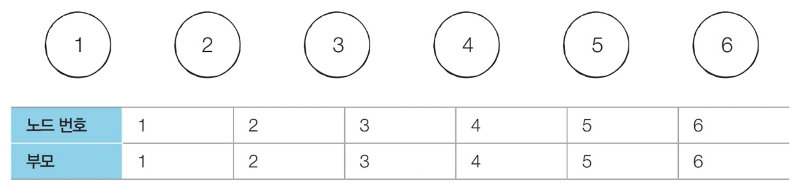


- 【Step 1】

  - **처리할 연산들:** **Union(1, 4)**, Union(2, 3), Union(2, 4), Union(5, 6)
  - 노드 1과 노드 4의 루트 노드를 각각 찾는다.
  - 현재, 루트 노드는 각각 1과 4이므로, 더 큰 번호에 해당하는 루트 노드 4의 부모를 1로 설정한다.
    - 일반적으로, 합치기 연산을 할 때는 더 큰 루트 노드가 더 작은 루트 노드를 가리키게 만들어서 테이블을 갱신하는 것이 관행적이다.

  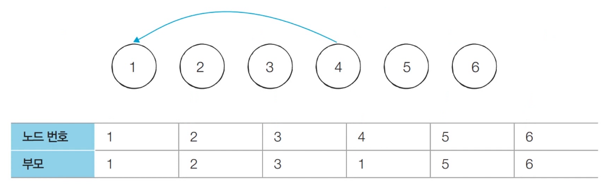


- 【Step 2】

  - **처리할 연산들:** Union(1, 4), **Union(2, 3)**, Union(2, 4), Union(5, 6)
  - 노드 2와 노드 3의 루트 노드를 각각 찾는다.
  - 현재, 루트 노드는 각각 2와 3이므로, 더 큰 번호에 해당하는 루트 노드 3의 부모를 2로 설정한다.

  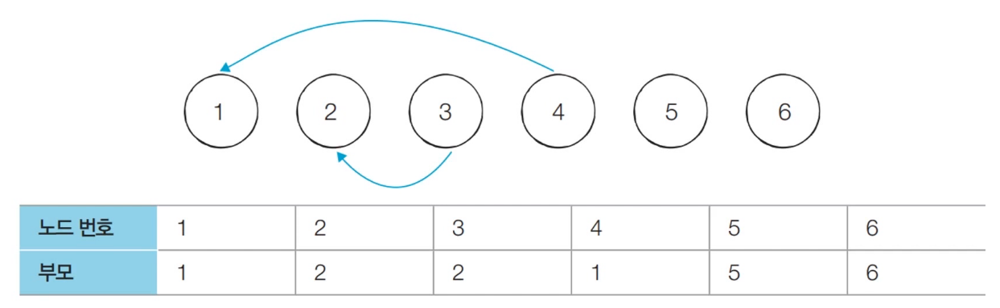


- 【Step 3】

  - **처리할 연산들:** Union(1, 4), Union(2, 3), **Union(2, 4)**, Union(5, 6)
  - 노드 2와 노드 4의 루트 노드를 각각 찾는다.
  - 현재, 루트 노드는 각각 2와 1이므로, 더 큰 번호에 해당하는 루트 노드 2의 부모를 1로 설정한다.
  - 현재 3번 노드와 4번 노드는 같은 집합에 있지만, 부모 노드는 각각 2, 1로 다르다.
    - 따라서, 두 노드가 같은 집합에 포함되어 있는지 확인하기 위해서 는 루트 노드를 찾을 수 있도록 해야한다.

  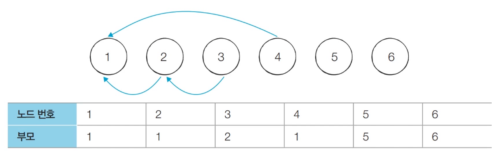


- 【Step 4】

  - **처리할 연산들:** Union(1, 4), Union(2, 3), Union(2, 4), **Union(5, 6)**
  - 노드 5와 노드 6의 루트 노드를 각각 찾는다.
  - 현재, 루트 노드는 각각 5와 6이므로, 더 큰 번호에 해당하는 루트 노드 6의 부모를 5로 설정한다.

  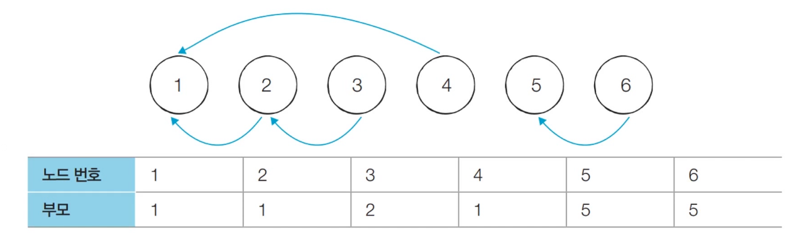


- 서로소 집합 자료 구조에서는 **연결성**을 통해, 손쉽게 집합의 형태를 확인할 수 있다.

  - 왼쪽 집합과 오른쪽 집합은 서로소 관계이다.
  
  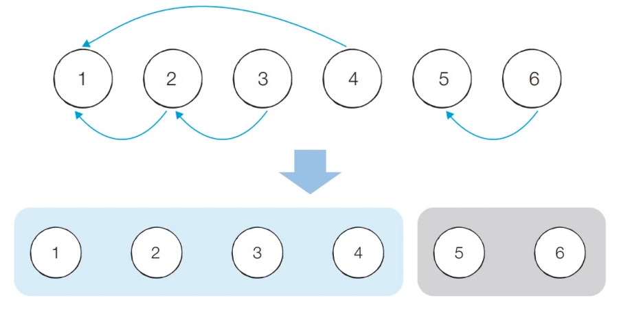


## (2) 연결성

- 기본적 형태의 서로소 집합 자료구조에서는 루트 노드에 즉시 접근할 수 없다.

- 루트 노드를 찾기 위해, 부모 테이블을 계속해서 확인하면서 거슬러 올라가야 한다.💜

- 다음 예시에서, 노드 3의 루트 노드를 찾기 위해서는 노드 2를 거쳐 노드 1에 접근해야 한다.

  - 함수 상에서 재귀적으로 접근

  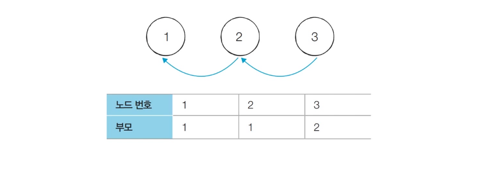

## (3) 구현 방법

1. 특정 원소가 속한 집합을 찾기💜

   - find_parent는 관행적으로 쓰이는 이름

   ```python
   def find_parent(parent, x):
       # 루트 노드를 찾을 때까지 재귀 호출
       # 부모 노드가 자기 자신이 아니면, 루트 노드가 아니란 소리
       if parent[x] != x:
           return find_parent(parent, parent[x])	# 부모의 부모…
       
       return x
   ```


2. 두 원소가 속한 집합을 합치기

   ```python
   def union_parent(parent, a, b):
       # a, b 각각의 루트 노드를 저장
       a = find_parent(parent, a)
       b = find_parent(parent, b)
       
       # 루트 노드 번호가 큰 쪽이, 작은 쪽을 부모로 삼는다.
       if a < b:
           parent[b] = a
       else:
           parent[a] = b
   ```


3. 입력

   ```python
   # 노드의 개수 v, 간선(Union 연산)의 개수 e
   v, e = map(int, input().split())
   
   # 부모 테이블 선언 및 부모를 자기 자신으로 초기화
   parent = [0] * (v + 1)
   for i in range(1, v + 1):
       parent[i] = i
   ```


4. Union 연산 수행 및 출력

   ```python
   # Union 연산을 각각 수행
   for i in range(e):
       a, b = map(int, input().split())
       union_parent(parent, a, b)
       
   # 각 원소가 속한 집합(루트 노드) 출력
   # 루트 노드가 같으면, 같은 집합
   print('각 원소가 속한 집합: ', end='')
   for i in range(1, v + 1):
       print(find_parent(parent, i), end=' ')
   
   print()
   
   # 부모 테이블 내용 출력
   print('부모 테이블: ', end='')
   for i in range(1, v + 1):
       print(parent[i], end=' ')
   ```


## (4) 기본적 구현 방법의 문제점

- 합집합(Union) 연산이 편향되게 이루어질 경우, 찾기(Find) 함수가 비효율적으로 동작한다.

  - 부모 테이블을 참조하여, 루트 노드를 찾기 위해 함수 재귀 호출

- 최악의 경우, Find 함수가 모든 노드를 다 확인하게 되어, Find 함수의 시간 복잡도가 O(V)가 된다.

  - 다음과 같이, {1, 2, 3, 4, 5}의 총 5개의 원소가 존재한 상황을 확인해 보자.

  - 수행된 연산들: Union(4, 5), Union(3, 4), Union(2, 3), Union(1, 2)

  - 5번 노드의 루트 노드 찾기 → 5, 4, 3, 2, 1번 노드를 모두 돌게 된다.

    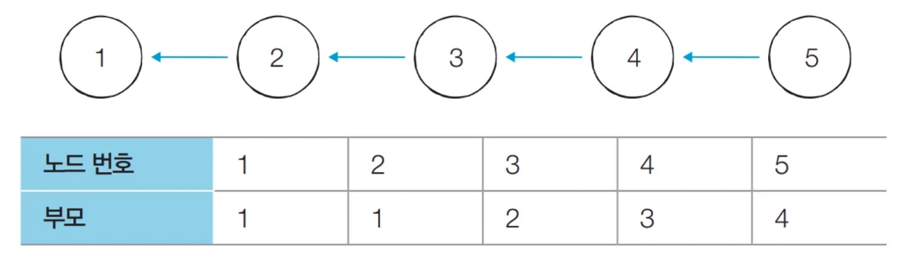


# 3. 개선된 방법: 경로 압축

## (1) 경로 압축

- Find 함수를 최적화하기 위해, **경로 압축**(Path Compression) 이용

- 찾기 함수를 재귀적으로 호출한 뒤, **부모 테이블 값을 바로 갱신**한다.

  - 기존 Find 함수: `return`

    ```python
    def find_parent(parent, x):
        if parent[x] != x:
            return find_parent(parent, parent[x])
        
        return x
    ```

  - 경로 압축을 이용한 Find 함수

    - 함수를 실행하면, 부모 테이블의 값이 루트 노드의 번호로 갱신된다.
    - 따라서, 다른 노드들은 매번 재귀를 돌 필요가 없다.

    ```python
    def find_parent(parent, x):
        if parent[x] != x:
            parent[x] = find_parent(parent, parent[x])
        
        return parent[x]
    ```


- 경로 압축 기법을 적용하면, 각 노드에 대하여 Find 함수를 호출한 이후, 해당 노드의 루트 노드가 바로 부모 노드가 된다.

- 동일한 예시에 대해서 모든 Union 함수를 처리한 후, 각 원소에 대해 Find 함수를 수행하면 다음과 같이 부모 테이블이 갱신된다.

- 기존 방법보다 시간 복잡도가 개선된다.

  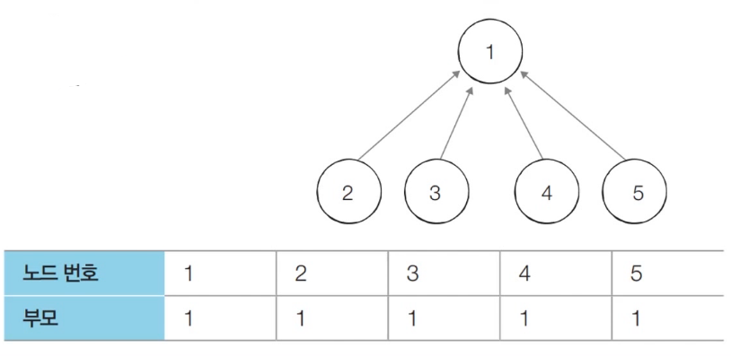


## (2) 구현 방법

> find_parent 함수만 다르고, 나머지 부분 전부 동일

```python
def find_parent(parent, x):
    if parent[x] != x:
        parent[x] = find_parent(parent, parent[x])
    
    return parent[x]
```


# 4. 서로소 집합을 활용한 사이클 판별

- 서로소 집합은 **무방향 그래프 내에서의 사이클을 판별**할 때 사용할 수 있다.
  - 방향 그래프 내의 사이클 여부는, DFS를 이용해 판별한다.


## (1) 동작 과정

- **사이클 판별 알고리즘**
  1. 각 간선을 하나씩 확인하며, 두 노드의 루트 노드를 확인한다.
     - 루트 노드가 서로 다르다면, 두 노드에 대하여 **Union 연산**을 수행한다.
     - 루트 노드가 서로 같다면(이미 같은 집합이라면), 사이클이 발생한 것
  2. 그래프에 포함되어 있는 모든 간선에 대하여 1번 과정을 반복한다.


- 【초기 단계】 모든 노드에 대하여, 자기 자신을 부모로 설정하는 형태로 부모 테이블을 초기화한다.

  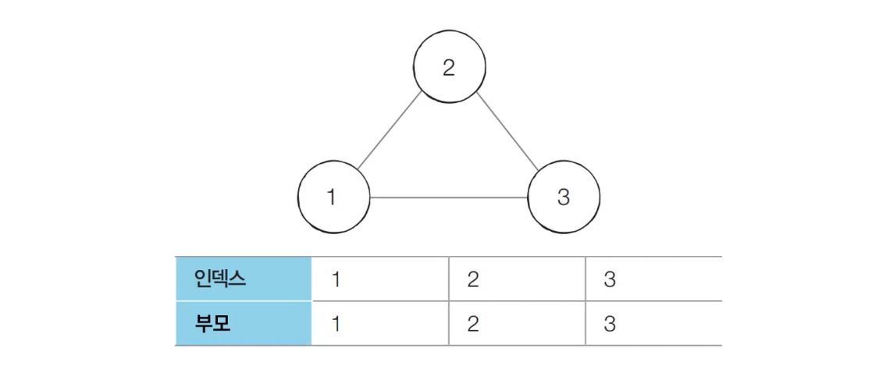

- 【Step 1】 간선 (1, 2)를 확인한다.

  - 노드 1과 노드 2의 루트 노드는 각각 1과 2이다.
  - 따라서, 더 큰 번호에 해당하는 노드 2의 부모 노드를 1로 변경한다.

  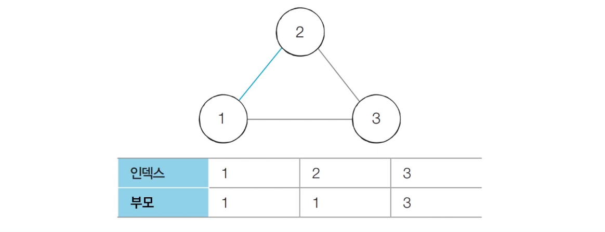


- 【Step 2】 간선 (1, 3)을 확인한다.

  - 노드 1과 노드 3의 루트 노드는 각각 1과 3이다.
  - 따라서, 더 큰 번호에 해당하는 노드 3의 부모 노드를 1로 변경한다.

  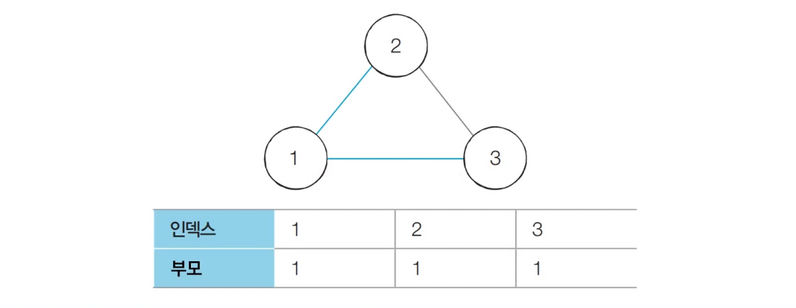


- 【Step 3】 간선 (2, 3)을 확인한다.

  - 이미 노드 2와 노드 3의 루트 노드는 모두 1이다.
  - 다시 말해, **사이클이 발생**했다는 것을 알 수 있다.

  


## (2) 구현 방법

1. 특정 원소가 속한 집합 찾기

   ```python
   def find_parent(parent, x):
       if parent[x] != x:
           parent[x] = find_parent(parent, parent[x])
       
       return parent[x]
   ```


2. 두 원소가 속한 집합을 합치기

   ```python
   def union_parent(parent, a, b):
       a = find_parent(parent, a)
       b = find_parent(parent, b)
       
       if a < b:
           parent[b] = a
       else:
           parent[a] = b
   ```


3. 입력

   ```python
   # 노드의 개수 v, 간선(Union 연산)의 개수 e
   v, e = map(int, input().split())
   
   # 부모 테이블 선언 및 부모를 자기 자신으로 초기화
   parent = [0] * (v + 1)
   for i in range(1, v + 1):
       parent[i] = i
   ```


4. 사이클 발생 여부 확인

   ```python
   cycle = False
   
   for i in range(e):
       a, b = map(int, input().split())
       
       # 사이클이 발생한 경우 종료
       if find_parent(parent, a) == find_parent(parent, b):
           cycle = True
           break
       # 사이클이 발생하지 않았다면, 합집합 연산 수행
   	else:
           union_parent(parent, a, b)
   
   if cycle:
       print('사이클이 발생했습니다.')
   else:
       print('사이클이 발생하지 않았습니다.')
   ```

   
