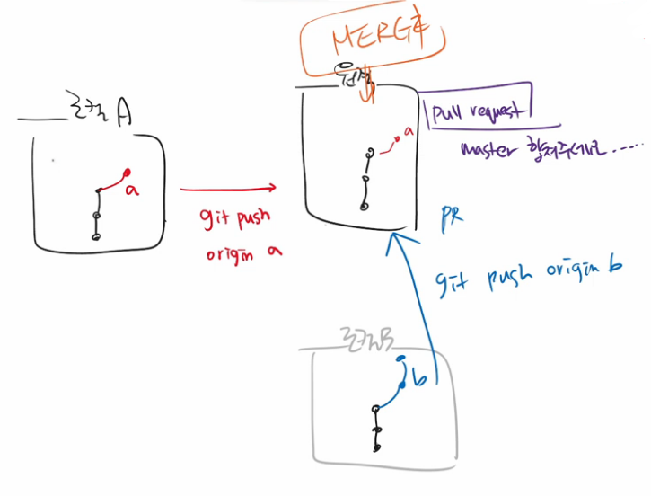

# Checkout

1. **`checkout`**으로 이전 버전으로 돌아갈 수 있다.
    단, 커밋하지 않은 모든 내용은 되돌아갈 수 X
    
    (브랜치 이동도 가능하다.)
    
    ```bash
    $ git checkout {Commit Hash}
    ```

    
    
2. 러버덕 디버깅
   - 인형을 앞에 두고 대화하는 거래...
   - 왼쪽은 실제 파는 제품이라는데 너무 귀엽다.....

<table border=none>
	<thead>
		<tr>
			
		</tr>
		<tr>
			
	</thead>
</table>


# Git 추가 명령어

1. **Unstage**: Staging Area에서 빼내 Working Directory로

   ```bash
   $ git restore --staged {File Name}
   ```

2. **Discard**: Working Directory의 변경 사항을 버릴 때

   ```bash
   $ git restore {File Name}
   ```


# Clone

## 1. Clone (내 Desktop 기준의 설명)

- GitHub에 있는 강사님의 TIL Repository를 내 컴퓨터에 받아서 쓰고 싶을 때…

  ```bash
  $ git clone {https://github.com/kdt-live/TIL-kdt-1.git}
  ```

- '다운로드 전용' 폴더에 받아오면, 그 안에 TIL-kdt-1 폴더가 생성됨.

- ```bash
  $ cd ./TIL-kdt-1
  ```

  를 입력하면 경로에 (master)라고 뜸.


## 2. Clone vs. Download ZIP

- 압축파일을 받는 것 → 최신 버전의 파일/폴더만 받는 것

- Clone을 하는 것 → Git 저장소를 받는 것

  - 클론 시, 원격 저장소 이름의 폴더가 생성
- 이때 .git이 자동으로 생성됨. → 즉, 버전의 기록을 볼 수 있다. (버전이 업데이트 되면, 바로 pull 받을 수 있음. push는 X.)


## 3. Clone vs. Pull

- Clone: 저장소를 받아옴.

- Pull: 커밋을 받아옴.

- 팀 프로젝트 시작할 때
  - 조장: 로컬 저장소 만들고 init → GitHub에 push해서 원격 저장소 만들기 → 팀원 초대
  - 조원: 조장이 만든 GitHub를 클론해 옴.
  - 그후 서로 push ↔ pull
  - 만약 팀플 시작하면 **`GitHub Desktop`** 깔아서 하자...


# Branch

## 1. Git Flow

- Git을 활용해 협업하는 흐름.

- **Branch**를 활용하는 전략. 가지치기.

  

- GitHub Flow의 기본 원칙이 있음.


## 2. Branch

1. Branch 관련 명령어

   - **branch 조회**

     ```bash
     $ git branch
     ```

   - **branch 생성** (생성 전 최초의 커밋 필요 = root commit)

     ```bash
     $ git branch {Branch Name}
     ```

   - 작업 중인 **branch 이동**

     ```bash
     $ git checkout {Branch Name}
     ```

   - **branch 생성하고 이동**

     ```bash
     $ git checkout -b {Branch Name}
     ```

   - master에서 **다른 branch 합치기**

     ```bash
     $ git merge {Branch Name}
     ```

   - **branch 지우기** (이때, 커밋은 지워지지 X)

     ```bash
     $ git branch -d {Branch Name}
     ```

     

2. 여기서, 한 브랜치에서 커밋한 내용은, 다른 브랜치에서 확인할 수 없다.
3. `Head -> master`는 내가 커밋한 브랜치가 master라는 뜻이다.
4. 보통 합치고 나면 브랜치를 지운다.


# GitHub에서의 협업

## 1. Merge Pull Request

- Contributors로 내가 등록되어 있는 경우
- 각 브랜치에서 master 브랜치에게 pull request를 보낸다.
- 브랜치에서 merge 요청을 수락하면, 브랜치 2개가 병합됨.



## 2. Fork

- 다른 사람 A의 Repo를 fork로 찍어서
- 내 Repo로 가져온다. (그대로 복제)
- 로컬에서 커밋 후 푸시하면, 내 Repo에 올라간다.
- A에게 Pull Request를 보내면, A가 Merge를 할지말지 결정한다.


# 실습

- [kdt-hphk/test-01](https://github.com/kdt-hphk/test-01) Repo를 fork해서 clone

- example 브랜치를 만들어 그 안에 n회차/이름 폴더 생성

- 그 폴더에 README.md 파일 생성 후 수업 후기 작성

- ```bash
  $ git clone https://github.com/kdt-hphk/test-01.git
  $ git cd test-01/3회차
  $ git mkdir 최보영
  $ git cd 최보영
  $ git touch README.md
  
  $ git add .
  $ git commit -m "220707 3회차 최보영 실습"
  $ git push origin example
  ```

- 그 후 [jupiter6676/test-01](https://github.com/jupiter6676/test-01.git)로 이동, PR 보내기

- **가이드** → [GitHub Fork & Pull Request (제출하기)](https://hphk-edu.notion.site/GitHub-Fork-Pull-Request-5d02e08a90314c72a732d366ac2d552b)