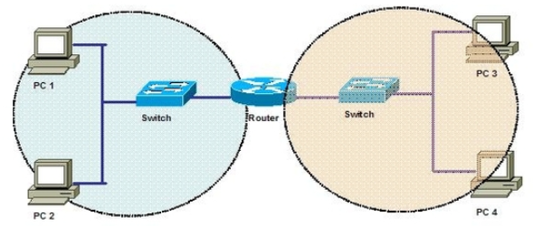

    ℹ️ dasdfasdf

    ✅ dasdfasdf

    ⚠️ dasdfasdf

    ⛔ dasdfasdf

# 1. OSI 7 계층

- 네트워크의 동작을 7 계층으로 나눠, 통신용 규약을 최대한 하나로 통합한 것
- 대부분 TCP/IP 프로토콜 스택 기반
- 네트워크 프로토콜을 모듈별로 개발할 수 있음

> 계층별 프로토콜 및 장비

| Layer |     Name     |                      Protocols                       |             장비             |
| :---: | :----------: | :--------------------------------------------------: | :--------------------------: |
|   7   | Application  |      HTTP, SMP, SMTP, STUN, TFTP, TELNET, POP3       |        ADC, NGFW, WAF        |
|   6   | Presentation |                    TLS, AFP, SSH                     |                              |
|   5   |   Session    |         L2TP, PPTP, NFS, RPC, RTCP, SIP, SSH         |                              |
|   4   |  Transport   |            TCP, UDP, SCTP, DCCP, AH, AEP             |   Load Balancer, Firewall    |
|   3   |   Network    |  ARP, IPv4, IPv6, NAT, APSec, VRRP, 라우팅 프로토콜  |      Router, L3 Switch       |
|   2   |  Data Link   | IEEE 802.2, RAPA, PPP, Frame Relay, ATM, Fiber Cable | Switch, Bridge, Network Card |
|   1   |   Physical   |          RS232, 100BaseTX, ISDN 등의 케이블          |       Cable, Hub, TAP        |

- 애플리케이션 계층 (상위 계층)

  - 7 ~ 5 계층
  - 애플리케이션 개발자는 상위 계층만을 고려
  - 데이터를 표현하는 데에 초점을 맞춤
  - Top-down

- 하위 계층

  - 1 ~ 4 계층

  - 네트워크 엔지니어는 하위 계층만을 고려

  - 데이터를 상대방에게 잘 전달하는 역할

  - Bottom-up

# 2. TCP/IP 프로토콜

- 이론보다 실용성에 중심을 둔 프로토콜
- 4 계층으로 구분

> OSI 7 계층과 TCP/IP 프로토콜

- OSI 7 계층은 Data Flow 하위 계층과 Application 상위 계층으로 묶어서 구분
  - 이는 데이터 전달에 집중하는 영역과 애플리케이션에 집중하는 영역으로 구분한 것
- 애플리케이션 엔지니어와 네트워크 엔지니어가 고려할 부분에 대한 구분이 TCP/IP 프로토콜에서 더 명확하게 드러남

# 3. OSI 계층별 이해

## 3-1. 1 Layer - Physical

    

    	ℹ️
    

    

        
물리적 연결과 관련된 정보를 정의하는 계층

    

### (1) 역할

- 주로 **전기 신호를 송수신**하는 데에 초점
  - 데이터를 전기 신호나 광 신호로 변환
  - 들어온 전기 신호를 잘 전달하는 것이 목적
  - 주소의 개념이 없어, 전기 신호가 들어온 포트를 제외한 모든 포트에 동일한 전기 신호를 전송
  - 전송 방법, 제어 신호, 기계적 속성 등을 정의

### (2) 주요 장비

- **허브** (Hub), **리피터** (Repeater)
  - 신호를 멀리 보내기 위한 증폭 장치
  - 허브는 리피터와 다르게 여러 장비를 연결할 수 있음
- **케이블** (Cable)
  - 데이터를 전송하기 위한 물리적 장치
  - 이더넷, 광섬유 등
- **트랜시버** (Tranceiver)
  - 컴퓨터의 랜 카드와 케이블을 연결하는 장비
  - 송신기와 수신기를 포함
    - 데이터를 전기 신호로 변환하여 케이블에 송출
    - 수신된 전기 신호를 데이터로 변환
- **탭** (TAP)
  - 네트워크 모니터링 & 패킷 분석을 위해 전기 신호를 다른 장비로 복제하는 장비

### (3) 참고

## 3-2. 2 Layer - Data Link

    

    	ℹ️
    

    

        
물리적 장비를 통해 전송되는 데이터의 오류를 검출 및 수정하여, 신뢰성 있는 데이터 전송을 보장하는 계층

    

### (1) 역할

- **주소 정보**를 정의하고 **정확한 주소로 통신**하는 데에 초점
  - 출발지와 도착지의 MAC 주소를 확인하고, 정확히 보내졌는지 검사한 뒤 데이터를 처리
  - ✨ **MAC 주소**
    - 2 계층의 **물리적 주소** 체계로, MAC 주소를 통해 통신해야 할 포트를 지정하여 내보낼 수 있음
    - 네트워크 인터페이스 카드에는 고유 MAC 주소가 존재
      - MAC 주소를 이용해 전기 신호가 자신에게 오는 게 맞는지 확인
      - 맞을 경우 상위 계층에서 처리할 수 있도록 메모리에 적재

    - 스위치를 통해 단말의 MAC 주소와 연결 포트를 알 수 있음

- **Framing** (단위화)
  - NIC는 전기 신호(Bit)를 ✨**프레임**(Frame) 단위로 묶어서 분리
  - 프레임
    - 네트워크 통신에서 데이터를 전송하는 단위
    - 프레임 구분을 위한 길이를 나누는 방법은 Character Oriented (바이트 단위)와 Bit Oriented (비트 단위) 방법이 있음
    - 프레임은 Header, Data, Trailer의 요소로 구성되어 있음
      - **Header**: 출발지와 도착지의 MAC 주소가 포함되며, 프레임이 올바른 목적지로 전달되도록 함
      - **Data**: 실제 전송되는 데이터
      - **Trailer**: 오류 검출을 위한 CRC(Cyclic Redundancy Check)와 같은 오류 검출 코드를 포함하여, 데이터 전송 중 발생한 오류를 수신 측이 감지할 수 있음
- **Flow Control** (흐름 제어)
  - 송신자와 수신자의 처리 속도 차이를 해결하기 위한 제어
  - 수신자가 송신자에게 피드백을 주어, 데이터 전송 속도를 조절
  - 빠른 송신자가 느린 수신자를 압도하지 못하도록 함
- **Error Control** (에러 제어)
  - 데이터에 대한 에러 탐지 및 수정을 담당
    - 송신자는 데이터를 Framing한 후, 이를 0과 1로 이루어진 비트로 변환하여 전송
    - 전기 신호는 외부 영향에 취약하여, 위 과정에서 물리적 손실 또는 변형이 일어날 수 있음
    - 따라서 **수신측의 Data Link 계층에서** 전기 신호를 Framing하는 과정에서 에러를 검출함
  - Data Link 계층 외 **end-to-end에서도 별도의 에러 처리**를 진행함
    - out-of-order delivery 현상을 해결하기 위해서 수행
    - out-of-order delivery는 데이터가 전송된 순서와는 다른 순서로 도착하는 현상
  - Detection (검출)
    - Parity Check, CRC, Checksum, Hamming Code 등
  - Correction (수정)
    - FEC, BEC 등
    - 이더넷 기반의 2 계층에서는 에러 탐지 역할만 수행
      - 손상된 Frame은 버림

- ✅✅✅✅✅✅ **여기서부터!!!** 대표적 프로토콜은 Ethernet, HDLC, PPP 등
  - 📌 ARP

> Flow Control

> IEEE 802.3 Ethernet Frame

### (2) 주요 장비

- **네트워크 인터페이스 카드 (NIC)**
  - PC나 서버에 네트워크를 연결해 주는 카드나 인터페이스
  - 랜 카드, 물리 네트워크 인터페이스, 이더넷 카드, 네트워크 어뎁터 등의 별칭이 존재
  - 동작 방식
    - 전기 신호를 데이터 형태로 변환
    - 목적지와 출발지의 MAC 주소 확인
    - 네트워크 인터페이스 카드의 MAC 주소 확인
    - 두 MAC 주소가 맞으면 데이터를 처리하고, 아니면 데이터를 폐기
- **스위치**
  - 네트워크 중간에서 패킷을 받아, 필요한 곳에만 보내주는 중재자 역할
  - 단말의 MAC 주소와 단말의 포트 주소를 매핑한 📌 **MAC 주소 테이블**을 가짐
    - MAC 주소, 📌 VLAN, 포트 정보를 매핑하여 저장
    - 📌 Broadcasting Domain/Traffic
    - 📌 Frame Flooding
- **브리지**
  - 네트워크 세그먼트(큰 네트워크를 구성하는 작은 네트워크 집합)를 서로 연결하는 장치
  - 📌 세그먼트 (Broadcast domain - 라우터가 구성하는 범위..? 같은 느낌)

### (3) 참고

- [Chapter 11. Data-Link Layer](https://velog.io/@wilko97/Chapter-11.-Data-Link-Layer)
- [데이터 링크 계층(Data Link Layer) - Error Control](https://east-star.tistory.com/26)

## 3-3. 3 Layer - Network

    

    	ℹ️
    

    

        
논리적 주소(IP)를 정의하며, 라우팅과 포워딩을 통해 패킷(Packet)을 전송하는 계층

    

- 📌 Datagram (Network Layer) vs Segment (Transport Layer)
  - Sending Side
    - Transport Layer에서 Segment를 Datagram으로 Encaptulation(캡슐화)
  - Receiving Side
    - Datagram에서 Segment를 추출하여 Transport Layer로 전달
- 📌 두 가지 역할
  - Routing
    - Forwarding 전에 패킷을 어떤 경로로 보낼 것인지 결정하는 것
    - 라우팅 알고리즘
  - Forwarding
    - 복수 개의 Output(MAC Address? Switch?)이 연결되어 있는 Router에 패킷이 들어왔을 때, 어느 Port로 보내줄 것인지 결정하는 것
    - 포워딩 테이블
- 📌 두 가지 평면
  - Data Plane: 입력 링크에서 출력 링크로 데이터그램을 전달
  - Control Plane: 
    - Per-router Control Plane
    - Logically Centralized Control Plane
- 📌 Network Service Model
- 📌 ARP (Address Resolution Protocol)
  - 주소 해결 프로토콜
  - 수신자의 MAC 주소를 알기 위해 사용하는 프로토콜
  - IP 주소 - MAC 주소를 매핑한 ARP 테이블을 가짐
    - 해당 테이블은 일정 시간 경과 시 파기
  - 초기 송신에서는 Default Gateway를 통해 ARP를 수행
    - Default Gateway의 IP를 알고 있어야 함
    - 해당 IP는 고정되어 있거나, DHCP 서버로부터 할당받음
- ✨ IP 주소
  - 

---

- https://catsbi.notion.site/3560cc4231a64165a97334e8a714fa91
- https://www.guru99.com/layers-of-osi-model.html

- https://community.fs.com/article/tcpip-vs-osi-whats-the-difference-between-the-two-models.html
- https://kumarjanglu.online/7-layers-of-osi-model-ccna-course/

- 2 계층
  - https://m.blog.naver.com/joo1020_kr/221471086900
  - https://egstory.net/edge-study/tech-lesson/aos-cx-switching/544/
  - [[네트워크] VLAN 총정리 (개념, 명령어, 설정)](https://m.blog.naver.com/lunarispars/221440105402)

- 3 계층
  - [[OSI 모델 Layer 3] - 네트워크 계층](https://velog.io/@jinh2352/OSI-%EB%AA%A8%EB%8D%B8-Layer-3-%EB%84%A4%ED%8A%B8%EC%9B%8C%ED%81%AC-%EA%B3%84%EC%B8%B5)
  - 🎬 [IP 주소를 묶는 방법, CIDR란?](https://youtu.be/kYiQGpPVnyI)
  - [[네트워크] Network layer](https://inyongs.tistory.com/63)
  - [네트워크 - Network Layer](https://dev-ahn.tistory.com/78)
  - [Network Layer(네트워크 계층)](https://velog.io/@jeongbeom4693/Network-Layer%EB%84%A4%ED%8A%B8%EC%9B%8C%ED%81%AC-%EA%B3%84%EC%B8%B5)