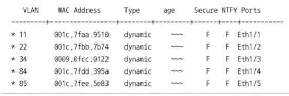

    ℹ️ dasdfasdf

    ✅ dasdfasdf

    ⚠️ dasdfasdf

    ⛔ dasdfasdf

# 1. OSI 7 계층

- 네트워크의 동작을 7 계층으로 나눠, 통신용 규약을 최대한 하나로 통합한 것
- 대부분 TCP/IP 프로토콜 스택 기반
- 네트워크 프로토콜을 모듈별로 개발할 수 있음

> 계층별 프로토콜 및 장비

| Layer |     Name     |                      Protocols                       |             장비             |
| :---: | :----------: | :--------------------------------------------------: | :--------------------------: |
|   7   | Application  |      HTTP, SMP, SMTP, STUN, TFTP, TELNET, POP3       |        ADC, NGFW, WAF        |
|   6   | Presentation |                    TLS, AFP, SSH                     |                              |
|   5   |   Session    |         L2TP, PPTP, NFS, RPC, RTCP, SIP, SSH         |                              |
|   4   |  Transport   |            TCP, UDP, SCTP, DCCP, AH, AEP             |   Load Balancer, Firewall    |
|   3   |   Network    |  ARP, IPv4, IPv6, NAT, APSec, VRRP, 라우팅 프로토콜  |      Router, L3 Switch       |
|   2   |  Data Link   | IEEE 802.2, RAPA, PPP, Frame Relay, ATM, Fiber Cable | Switch, Bridge, Network Card |
|   1   |   Physical   |          RS232, 100BaseTX, ISDN 등의 케이블          |       Cable, Hub, TAP        |

- 애플리케이션 계층 (상위 계층)

  - 7 ~ 5 계층
  - 애플리케이션 개발자는 상위 계층만을 고려
  - 데이터를 표현하는 데에 초점을 맞춤
  - Top-down
- 하위 계층
  - 1 ~ 4 계층
  - 네트워크 엔지니어는 하위 계층만을 고려
  - 데이터를 상대방에게 잘 전달하는 역할
  - Bottom-up

> OSI 7 Layer

# 2. TCP/IP 프로토콜

- 이론보다 실용성에 중심을 둔 프로토콜
- 4 계층으로 구분

> OSI 7 계층과 TCP/IP 프로토콜

- OSI 7 계층은 Data Flow 하위 계층과 Application 상위 계층으로 묶어서 구분
  - 이는 데이터 전달에 집중하는 영역과 애플리케이션에 집중하는 영역으로 구분한 것
- 애플리케이션 엔지니어와 네트워크 엔지니어가 고려할 부분에 대한 구분이 TCP/IP 프로토콜에서 더 명확하게 드러남

# 3. OSI 계층별 이해

## 3.1. Physical 계층 (1 계층)

    

    	ℹ️
    

    

        
물리적 연결과 관련된 정보를 정의하는 계층

    

### 3.1.1. 역할

- 주로 **전기 신호를 송수신**하는 데에 초점
  - 데이터를 전기 신호나 광 신호로 변환
  - 들어온 전기 신호를 잘 전달하는 것이 목적
  - 주소의 개념이 없어, 전기 신호가 들어온 포트를 제외한 모든 포트에 동일한 전기 신호를 전송
  - 전송 방법, 제어 신호, 기계적 속성 등을 정의

### 3.1.2. 주요 장비

- **리피터**(Repeater)
  - 케이블을 타고 이동하는 전기 신호를 멀리 보내기 위한 증폭 장치

- **허브**(Hub), 

  - 케이블을 타고 이동하는 전기 신호를 멀리 보내기 위한 증폭 장치

  - 허브는 리피터와 다르게 여러 장비를 연결할 수 있음 (Multiport Repeater)

    - 서로 다른 네트워크의 기기들로부터 오는 신호를 받아, 신호를 증폭하여 다른 기기로 전달함

  - **플러딩**(Flooding)

    - 허브는 한 장비로부터 수신한 데이터 프레임을, 허브와 연결된 모든 컴퓨터에 데이터를 전송함
    - 따라서 필요 없는 포트까지 프레임을 전송하여 충돌이 발생함 → 콜리전 도메인
  
  - **콜리전 도메인**(Collision Domain)

    - 대부분의 컴퓨터는 이더넷(Ethernet) 방식으로 통신함

      - 이더넷은 서로 다른 기기들이 데이터를 보내면서 발생하는 신호의 충돌을 막기 위해 CSMA/CD 방식의 Collision Detect 기술을 사용함
      - 서로 다른 컴퓨터의 신호가 충돌한 경우, 이를 알려준 후 다시 신호를 보내도록 하는 방식

    - 이때 서로의 신호 충돌을 감지할 수 있는 영역을 콜리전 도메인이라고 함

      - 같은 콜리전 도메인 영역의 컴퓨터들은 동시에 신호를 보내는 경우 충돌함
      - 따라서 한 컴퓨터가 메시지를 보낼 때까지 기다린 후, 다음 컴퓨터가 메시지를 보내야 함
  
    - 그러나, ==허브는 콜리전 도메인을 나누지 못함==
  
      
  
      - 이는 2계층의 스위치 혹은 브리지와 허브의 큰 차이 중 하나임
      - 허브를 통해 연결된 모든 네트워크 장비들은 한 번에 하나의 장비만 메시지를 보낼 수 있음
      - 스위치는 콜리전 도메인을 나누어 줄 수 있으며, 요즘은 거의 스위치를 사용함

- **케이블**(Cable)
  - 데이터를 전송하기 위한 물리적 장치
  - 이더넷, 광섬유 등

- **트랜시버**(Tranceiver)
  - 컴퓨터의 랜 카드와 케이블을 연결하는 장비
  - 송신기와 수신기를 포함
    - 데이터를 전기 신호로 변환하여 케이블에 송출
    - 수신된 전기 신호를 데이터로 변환

- **탭**(TAP)
  - 네트워크 모니터링 & 패킷 분석을 위해 전기 신호를 다른 장비로 복제하는 장비

### 3.1.3. 참고

- [[Network 용어] 허브(HUB)란?](https://yeoulcoding.tistory.com/127)

## 3.2. Data Link 계층 (2 계층)

    

    	ℹ️
    

    

        
물리적 장비를 통해 전송되는 데이터의 오류를 검출 및 수정하여, 신뢰성 있는 데이터 전송을 보장하는 계층

    

### 3.2.1. 역할

- **주소 정보**를 정의하고 **정확한 주소로 통신**하는 데에 초점
  - 출발지와 도착지의 MAC 주소를 확인하고, 정확히 보내졌는지 검사한 뒤 데이터를 처리
  - ✨ **MAC 주소**
    - 2 계층의 **물리적 주소** 체계로, MAC 주소를 통해 통신해야 할 포트를 지정하여 내보낼 수 있음
    - **네트워크 인터페이스 카드**에는 고유 MAC 주소가 존재
      - MAC 주소를 이용해 전기 신호가 자신에게 오는 게 맞는지 확인
      - 맞을 경우 상위 계층에서 처리할 수 있도록 메모리에 적재

    - 스위치를 통해 단말의 MAC 주소와 연결 포트를 알 수 있음

### 3.2.2. 기능

- **Addressing**(MAC 주소)

  - ==네트워크 상에서 장치들이 서로를 구분==하기 위해 사용하는 ==물리적 주소==
  - NIC에 부여된 고유한 번호로, 디바이스가 제작될 때 정해지기 때문에 변경되지 않음
  

- **Framing**(단위화)
  - NIC는 전기 신호(Bit)를 ✨**프레임**(Frame) 단위로 묶어서 분리
  - 프레임
    - 네트워크 통신에서 데이터를 전송하는 단위
    - 프레임 구분을 위한 길이를 나누는 방법은 Character Oriented(바이트 단위)와 Bit Oriented(비트 단위) 방법이 있음
    - 프레임은 Header, Data, Trailer의 요소로 구성되어 있음
      - **Header**: 출발지와 도착지의 MAC 주소가 포함되며, 프레임이 올바른 목적지로 전달되도록 함
      - **Data**: 실제 전송되는 데이터
      - **Trailer**: 오류 검출을 위한 CRC(Cyclic Redundancy Check)와 같은 오류 검출 코드를 포함하여, 데이터 전송 중 발생한 오류를 수신 측이 감지할 수 있음

- **Flow Control**(흐름 제어)
  - 송신자와 수신자의 처리 속도 차이를 해결하기 위한 제어
  - 수신자가 송신자에게 피드백을 주어, 데이터 전송 속도를 조절
  - 빠른 송신자가 느린 수신자를 압도하지 못하도록 함
  - 종류
    - Stop and Wait: 수신측이 ACK를 수신한 경우에만 다음 프레임을 전송
    - Sliding Windows: 위의 방식에서 번호를 붙인 프레임을 연속으로 보냄으로써, Utilization을 높임

- **Error Control**(에러 제어)
  - 데이터에 대한 에러 탐지 및 수정을 담당
    - 송신자는 데이터를 Framing한 후, 이를 0과 1로 이루어진 비트로 변환하여 전송
    - 전기 신호는 외부 영향에 취약하여, 위 과정에서 물리적 손실 또는 변형이 일어날 수 있음
    - 따라서 **수신측의 Data Link 계층에서** 전기 신호를 Framing하는 과정에서 에러를 검출함
  - Data Link 계층 외 **end-to-end에서도 별도의 에러 처리**를 진행함
    - out-of-order delivery 현상을 해결하기 위해서 수행
    - out-of-order delivery는 데이터가 전송된 순서와는 다른 순서로 도착하는 현상
  - Detection(검출)
    - Parity Check, CRC, Checksum, Hamming Code 등
  - Correction(수정)
    - FEC, BEC 등
    - 이더넷 기반의 2 계층에서는 에러 탐지 역할만 수행
      - 손상된 Frame은 버림

- **Automatic Repeat Request**(ARQ, 재전송)

  - Stop and Wait: 일정 시간 내 ACK이 오지 않는 경우 재전송
  - Go Back N: Sliding Windows 기반

    - 수신측: 에러가 있는 프레임이 정상적으로 수신될 때까지 모든 프레임을 저장하지 않음
    - 송신측: 에러가 있는 프레임부터 모든 프레임을 재전송함

  - Selective Repeat: 재대로 온 프레임은 수신측이 버퍼링 수행

> Flow Control

> IEEE 802.3 Ethernet Frame

### 3.2.3. 프로토콜

- 대표적 프로토콜
  - 회선 제어, 흐름 제어, 오류 제어 등을 위한 규칙
  - HDLC, LLC/MAC(Ethernet), PPP 등
  - 분류
    - 비동기식 프로토콜: 거의 사용되지 않음
    - 동기식 프로토콜
      - 문자(바이트) 위주 프로토콜
        - 프레임을 Byte로 구성되는 문자들의 연속된 열로 간주함
        - 문자 단위로 전송
        - 비효율적이며 ARQ를 지원하지 않기에 거의 사용되지 않음

      - **비트 위주 프로토콜**
        - 프레임을 비트열로 간주함
        - 국제 표준화된 HDLC와, 그로부터 파생된 LAPB, LAPD, LAPM 프로토콜이 대표적임
        - HDLC로부터 발전된 프로토콜에는 PPP가 있음

- **HDLC 프로토콜**

  - 컴퓨터가 일대일 혹은 일대다로 연결된 환경에서의 데이터 송수신 기능을 제공

  - 용어

    - 호스트(Host): 데이터 통신을 위해 연결된 각각의 컴퓨터
    - 주국(Primary Station): 명령을 전송하는 호스트
    - 종국(Secondary Station): 명령에 응답하는 호스트
    - 혼합국(Combined Station): 주국과 종국의 기능을 모두 가지는 호스트
    - 명령(Command): 주국에서 전송되는 메시지
    - 응답(Response): 종국으로부터 회신되는 메시지

  - 프레임 구조

    

    - **01111110**: 프레임의 시작과 끝을 구분하는 용도로 사용됨
    - **Address**: 일대다 환경에서 호스트를 구분할 때 사용됨
      - 주국은 Address에 종국의 주소를 저장
      - 종국은 Address에 자신의 주소를 저장
    - **Control**: 프레임의 종류를 구분하는 용도로 사용됨
      - 정보 프레임: 네트워크 계층의 데이터 전송을 담당
      - 감독 프레임: 정보 프레임에 대한 응답
      - 비번호 프레임
    - **Data**: 크기가 가변적이며, 네트워크 계층의 패킷이 캡슐화된 것
    - **Checksum**: CRC 오류 검출 용도로 사용됨

  - 프레임 종류

    - Control에 따라 달라짐
    - 정보 프레임(Information Frame): 네트워크 계층의 데이터 전송을 수행
      - Seq
        - Sliding Windows 프로토콜 사용
        - 송신용 순서 번호(3bit)로 사용 → 0~7의 번호만 사용 가능
      - Next
        - Piggybacking을 이용하여 응답
          - Piggybacking: 호스트 간 데이터 송수신 시 정보 프레임 안에 응답도 함께 전송
        - 수신측은 데이터를 받고, 송신측은 상대가 잘 받았음을 확인할 수 있음
          - 잘 받았다는 증거로, Next 안에 다음으로 전송받아야 할 프레임 순서 번호가 담겨 있음
          - 그러면 송신측은 해당 응답을 받은 후 다음 프레임을 전송
        - Next에도 순서 번호가 있으므로 3bit를 할당받음
      - P/F
        - 주국이 다수의 종국을 제어하기 위해 사용
        - 값이 1인 경우에 의미가 있음
          - 주국 → 종국: 데이터를 전송할 컴퓨터가 있는지 조사 (Poll)
          - 종국 → 주국: 주국으로부터 전송 허가를 받았음을 알림 (Final)
    - 감독 프레임(Supervisor Frame): 정보 프레임에 대한 응답 기능을 수행
      - Type의 2bit 값에 따라 유형이 다름
        - 00(RR, Receive Ready): 긍정 응답으로, 다음 프레임을 받을 준비가 되었음을 알림
        - 01(REJ, Reject): 부정 응답으로, Next 필드에 재전송되어야 하는 프레임의 번호를 저장한 후 응답
        - 10(RNR, Receive Not Ready): Next 필드의 앞 번호 프레임까지 제대로 받았으나, 더이상 프레임을 수신하지 않겠다는 의미
        - 11(SREJ, Selective Reject): 선택적 재전송 방식에서의 부정 응답으로 사용되며, Next에 재전송되어야 할 프레임 번호가 저장됨
    - 비번호 프레임(Unnumbered Frame): 순서 번호가 없는 프레임을 정의하며, 주로 연결 제어 시에 사용
      - 연결에는 3가지 종류가 있음
        - 정규 응답(Normal Response)
          - 주국과 종국으로 이루어짐
          - 종국은 반드시 주국의 허락을 받아야만 데이터 전송이 가능
        - 비동기 균형(Asynchronous Balanced)
          - 주국과 종국이 아닌, 두 개의 호스트가 동일한 힘을 가진 혼합국으로 이루어짐
          - LAPB 프로토콜이 이에 해당
        - 비동기 응답(Asynchronous Response)
          - 주국과 종국으로 이루어짐
          - 종국은 주국의 허락이 없어도 데이터 전송이 가능
          - LAP 프로토콜이 이에 해당

### 3.2.4. 주요 장비

- **네트워크 인터페이스 카드(NIC)**
  
  - PC나 서버 등의 컴퓨터를 네트워크에 연결해 주는 장치
  
  - 서로 다른 형태의 데이터를 전송하는 컴퓨터와 네트워크 간 상호작용이 가능하도록 하는 장치
  
  - NIC는 고유한 MAC 주소를 가짐
  
  - 랜 카드, 물리 네트워크 인터페이스, 이더넷 카드, 네트워크 어댑터 등의 별칭이 존재
  
  - 동작 방식
  
    - 컴퓨터 연결: NIC는 컴퓨터에 물리적으로 연결됨
  
    - **데이터 변환**: 데이터를 패킷으로 변환하여 네트워크를 통해 전송하기 적합한 물리적 신호로 변환
  
      
  
      - 유선 NIC: 데이터를 전기 신호로 변환
      - 무선 NIC: 데이터를 전파로 변환
  
    - **데이터 송신**: 데이터 패킷을 적절한 매체를 통해 네트워크로 전송
  
      - 유선 NIC: 이더넷 케이블을 통해 전송
      - 무선 NIC: Wi-Fi를 통해 전송
  
    - **데이터 수신**: NIC가 데이터 패킷을 수신하여 디코딩하고 처리
  
      - 목적지와 출발지의 MAC 주소 확인
      - 네트워크 인터페이스 카드의 MAC 주소 확인
      - 받은 패킷의 목적지 주소와 자신의 MAC 주소가 맞으면 데이터를 처리하고, 아니면 데이터를 폐기
  
    - **데이터 처리**: 오류 검사, 패킷 재조립, 버퍼링 작업 및 네트워크 프로토콜과 설정을 관리

- **스위치(Switch)** - L2 스위치

  

  - 네트워크 중간에서 패킷을 받아, 필요한 곳에만 보내주는 중재자 역할
  
  - 단말의 MAC 주소와 단말의 포트 주소를 매핑한 **MAC 주소 테이블**을 가짐
  
  - 포트별로 콜리전 도메인이 나뉘기 때문에, 동시에 여러 포트에서 통신할 수 있음
  
  - **Forwarding/Filtering**
  
    - Forwarding: 패킷의 헤더 안에서 목적지 MAC 주소를 확인하여, 해당 MAC 주소와 매핑된 포트로만 패킷을 전달하는 것
    - Filtering: 이때 다른 포트로는 해당 패킷을 전달하지 않음
    - Unicast에 대해서만 포워딩/필터링 작업을 수행하며, 플러딩하는 경우는 거의 없음
    - BUM 트래픽(Broadcast, Unknown Unicast, Multicast)에 대해서는 플러딩을 수행함
    - ==ARP Broadcast==를 통해 MAC 주소를 습득하는 과정에서, 이미 스위치는 ARP 프로토콜을 주고받은 단말의 MAC 주소와 포트 주소를 학습함
  
  - **Flooding**
  
    - MAC 주소 테이블에 없는 목적지 MAC 주소를 가진 패킷이 스위치로 들어오면, 전체 포트로 패킷을 전달하는 것
  
  - **Address Learning**
  
    - MAC 주소 테이블에 어느 위치(포트)에 어떤 장비(MAC 주소)가 연결되어 있는지에 대한 정보를 기록하고 유지하는 것
  
    - 특정 포트를 타고 스위치로 도달한 패킷의 ==출발지 MAC 주소==를 매핑하여 저장함
  
      
  
    - 어드레스 러닝은 출발지 MAC 주소를 사용하므로, 브로드캐스트 및 멀티캐스트에 대한 MAC 주소를 학습할 수 없음
  
      - 브로드캐스트 및 멀티캐스트에는 목적지 MAC 주소만 사용되기 때문
  
  - VLAN
  
    
  
    - 물리적 배치와 상관 없이 LAN을 논리적으로 분할 구성하는 기술
      - 두 스위치가 물리적으로 떨어져 있어도, 같은 VLAN으로 나뉘어 있다면 하나의 네트워크로 동작함
  
      - VLAN으로 분할된 스위치는 물리적으로 별도의 스위치인 것 처럼 취급됨
  
      - VLAN을 사용하면 회사의 여러 부서가 하나의 네트워크를 사용하면서도, 각 부서끼리는 분리된 네트워크로 구성할 수 있음
  
      - VLAN으로 분할하면 유니캐스트 뿐만 아니라, 브로드캐스트로도 VLAN끼리 통신할 수 없음
  
      - VLAN 간의 통신을 위해서는 3계층 장비가 필요함
  
    - VLAN 할당 방식
      - MAC 주소 기반 VLAN
        - MAC 주소와 VLAN을 매핑
  
        - 단말이 연결된 포트가 바뀌어도, 단말의 MAC 주소와 매핑되는 VLAN에 접속하게 됨
  
      - 포트 기반 VLAN
        - 일반적인 VLAN
  
        - 포트와 VLAN을 매핑
  
        - 스위치의 포트에 할당된 VLAN에 접속할 수 있음
  
    - VLAN TAG
      
      - 스위치가 3개의 VLAN을 사용하는 경우, 각 VLAN이 통신하려면 3개의 포트가 필요함
      
      - VLAN을 더 많이 사용하는 중·대형 네트워크에서는 더 많은 포트의 낭비가 일어남
      
      - VLAN 태그를 통해 이러한 문제를 해결
  
      - VLAN 태그를 사용할 수 있는 포트를 태그 포트 또는 트렁크 포트라고 함
      
        - 하나의 포트에서 여러 VLAN이 전송할 수 있게 됨
        - 송신 측에서 태그 포트로 패킷을 보낼 때 VLAN ID를 붙여서 보냄
        - 태그 포트에서는 VLAN ID를 제거하면서 해당 수신 측 VLAN으로 패킷을 전달함
      
      - MAC 주소 테이블에 VLAN 필드가 추가됨
      
        
      
        - VLAN으로 네트워크를 분리 시, 각 VLAN마다 MAC 주소가 매핑되는 것처럼 동작함

- **브리지(Bridge)**
  - 스위치와 거의 비슷한 기능을 수행함
  - 그러나 스위치는 하드웨어적으로 프레임을 처리하기 때문에 처리 속도가 더 빠름
  - 요즘은 스위치를 사용하는 추세
  

### 3.2.5. 참고

- [Chapter 11. Data-Link Layer](https://velog.io/@wilko97/Chapter-11.-Data-Link-Layer)
- [데이터 링크 계층(Data Link Layer) - Error Control](https://east-star.tistory.com/26)
- [데이터링크 프로토콜](https://velog.io/@chlvlftn22/%EB%8D%B0%EC%9D%B4%ED%84%B0%EB%A7%81%ED%81%AC-%ED%94%84%EB%A1%9C%ED%86%A0%EC%BD%9C)
- [[데이터통신] 9. Data Link Control Protocols](https://velog.io/@bsu1209/%EB%8D%B0%EC%9D%B4%ED%84%B0%ED%86%B5%EC%8B%A0-Data-Link-Control-Protocols)
- [HDLC 프로토콜( High-Level Data Link Control )](https://lordofkangs.tistory.com/61)
- [HDLC 프로토콜](https://ddingz.tistory.com/158)
- [NIC (Network Interface Card)에 대하여](https://alluknow.tistory.com/73)
- [쉽게 이해하는 네트워크 10. TCP/IP 네트워크 인터페이스 계층의 역할과 데이터 전송 (ft. 랜카드와 MAC 주소)](https://better-together.tistory.com/101)
- [IT 엔지니어를 위한 네트워크 입문 - 4장 스위치: 2계층 장비](https://velog.io/@indongcha/IT-%EC%97%94%EC%A7%80%EB%8B%88%EC%96%B4%EB%A5%BC-%EC%9C%84%ED%95%9C-%EB%84%A4%ED%8A%B8%EC%9B%8C%ED%81%AC-%EC%9E%85%EB%AC%B8-4%EC%9E%A5-%EC%8A%A4%EC%9C%84%EC%B9%98-2%EA%B3%84%EC%B8%B5-%EC%9E%A5%EB%B9%84)
- [OSI 7계층 장비(리피터, 허브, 브리지, 스위치, 라우터)](https://heisyoung.tistory.com/52)
- [[Network 용어] 브리지(Bridge), 스위치(Switch)란?](https://yeoulcoding.tistory.com/131)
- [[이론] 브리지와 스위치의 차이점](https://letitkang.tistory.com/95)
- [리피터, 허브, 브리지, 스위치, 라우터 정리](https://hyewon-study-log.tistory.com/113)
- [네트워크] VLAN 총정리 (개념, 명령어, 설정)

## 3.3. Network 계층 (3 계층)

    

    	ℹ️
    

    

        
논리적 주소(IP)를 정의하며, 라우팅과 포워딩을 통해 패킷(Packet)을 전송하는 계층

    

### 3.3.1. 역할

- 1계층 (물리 계층)
  - 디지털 신호 ↔ 아날로그(전기) 신호 상호 변환
  - 허브를 통해 브로드캐스팅 방식으로 모든 컴퓨터에 신호 전달 가능
    - ✨✨✨✨ [브로드캐스트(Broadcast)란?](https://velog.io/@ragnarok_code/%EB%B8%8C%EB%A1%9C%EB%93%9C%EC%BA%90%EC%8A%A4%ED%8A%B8Broadcast%EB%9E%80)

- 2계층 (데이터 링크 계층)
  - MAC 주소 테이블
  - 특정 MAC 주소를 통해 특정 목적지 포트로 데이터 전송 가능
  - 플러딩(Flooding)
    - 목적지 MAC 주소 - 포트가 테이블에 등록되지 않다면, 연결된 모든 컴퓨터에 신호를 보냄
    - 플러딩을 통해 MAC 주소를 테이블에 등록함

- 3계층
  - ==서로 다른 네트워크==에 있는 목적지로 데이터를 전송할 수 있도록 함
    - 스위치로 연결된 컴퓨터들의 집합을 하나의 네트워크로 볼 수 있음
    - 2계층에서는
      - MAC 주소를 이용하여 1개의 스위치에 등록된 컴퓨터에게 데이터를 전송하였음
      - 즉, 같은 네트워크 내의 컴퓨터에게 데이터를 전송하였음

### 3.3.2. 기능

- **Addressing**(IP 주소)

  - 네트워크에서 ==장치들이 서로를 인식하고 통신==하기 위한 ==논리적 주소==

  - 모든 네트워크 장치(호스트, 라우터 등)은 IP 주소를 반드시 가짐

  - IP 주소는 장치가 가지는 고유한 주소로, ==라우팅==을 위해 사용됨

  - IP 패킷

    - 네트워크 계층에서 데이터 캡슐화 시, 데이터에 IP 헤더를 추가하는데 그 형태를 IP 패킷이라 함

    - IP 패킷은 다음과 같은 구조를 띰

      

- **라우팅**(Routing)
  - 라우터라는 네트워크 장비를 이용함
  - ==네트워크 간의 통신==이 일어날 때, ==목적지까지 가는 경로==를 안내해 줌
  - 라우터에게는 ==라우팅 테이블==이 존재하며, 해당 테이블이 경로 정보를 등록하고 관리함
  - L3 스위치도 라우터의 역할을 할 수 있음
  - **라우팅 알고리즘**(Routing Algorithm)
    - 라우팅 알고리즘을 통해, 패킷 전달 전 최적의 경로를 탐색함
    - 해당 과정에서 **포워딩 테이블**(Forwarding Table)이 만들어짐
      - 라우팅 테이블이라고도 함
  - **제어 평면**(Control Plane)에서 일어남

- **패킷 포워딩**(Packet Forwarding)
  - 라우터에는 패킷을 받는 곳인 입력 포트, 패킷을 보내는 곳인 출력 포트가 있음
  
  - 포워딩은 입력 포트에서 출력 포트로 패킷을 이동시키는 것
    - 패킷이 라우터의 입력 포트에 도달하면, 라우터는 그 패킷을 적절한 출력 포트로 이동시켜야 함
    
      - 라우터 내부의 스위칭 구조를 통해 입력 포트와 출력 포트를 연결함
    
        
    
    - ==포워딩 테이블을 이용==하여 어떤 출력 포트로 이동시킬 것인지를 결정함
    
  - **데이터 평면**(Data Plane)에서 일어남

- **제어 평면**(Control Plane)
  - 네트워크 장치의 동작을 제어하고 관리
  - 주로 소프트웨어적으로 구현되며, 복잡한 논리와 알고리즘을 수행함
  - 주요 기능
    - 라우팅(Routing): 라우팅 알고리즘을 통해 포워딩 테이블을 작성함
    - 정책 관리(Policy Management): 네트워크 정책을 설정하고, 이를 데이터 평면에 전달하여 트래픽이 정책에 맞게 처리되도록 함
    - 장치 간 협력(Device Coordination): 네트워크 내 여러 장치 간의 협력을 통해 네트워크 성능과 안정성을 유지함

- **데이터 평면**(Data Plane)
  - 네트워크 장치가 실제로 데이터를 전달하는 부분
  - 주로 하드웨어적으로 구현됨
  - 주요 기능
    - 패킷 포워딩(Packet Forwarding): 수신된 패킷을 올바른 출력 포트로 전달함
    - 트래픽 필터링(Traffic Filtering): 방화벽 등을 통해, 특정 조건에 맞는 트래픽을 필터링하거나 차단함
    - 품질 보장(QoS, Quality of Service): 특정 트래픽에 대해 우선 순위를 부여하여 네트워크 성능을 최적화함

###  3.3.3. 동작 방식

- 라우터별 제어(Per-router Control Plane)

  

  - 라우팅 알고리즘이 모든 라우터 각각에서 동작하여, 서로의 알고리즘이 소통하며 포워딩 테이블을 작성함

  - 포워딩과 라우팅 기능이 각각의 라우터에 존재하며, 각 라우터들은 서로 통신하며 자신의 포워딩 테이블을 수정함

  - OSPF, BGP 프로토콜

    

- 논리적 중앙 집중 제어 방식(Logically Centralized Control Plane, SDN)

  

  - 논리적으로 중앙 집중된 컨트롤러가 포워딩 테이블을 작성하고, 해당 테이블을 각 라우터가 사용할 수 있도록 배포함
    - 컨트롤러는 프로토콜을 통해 각 라우터의 제어 에이전트(CA)와 상호작용하여, 라우터의 포워딩 테이블을 구성 및 관리함
    - CA는 서로 상호작용하지 않고, 컨트롤러와의 통신 및 컨트롤러의 명령 수행을 위한 기능만을 수행함
  - 기존 방식과 다르게 데이터 평면은 포워딩의 역할에만 집중하며, 라우팅 알고리즘을 통해 포워딩 테이블을 제작하는 것은 SDN 소프트웨어가 담당하게 됨
  - 일반화된 **일치와 행동(Match-plus-action) 추상화**를 통해, 기존에 별도의 장치로 구현되었던 부하 분산, 방화벽, NAT 등 다양한 기능 또한 라우터에서 수행할 수 있게 됨
    - Match-plus-action
      - 일치에 따른 동작 방식을 정의한 것으로, 네트워크 장비마다 다름
      - 라우터
        - Match: 목적지 IP 주소와 일치하면
        - Action: 해당 링크로 패킷 전달
      - 스위치
        - Match: 목적지 MAC 주소와 일치하면
        - Action: 포워딩 혹은 플러딩
      - 방화벽
        - Match: IP 주소와 TCP/UTP 포트 번호가 일치하면
        - Action: 접근 허용 또는 거부
      - 네트워크 주소 변환(NAT)
        - Match: IP 주소와 포트 번호가 일치하면
        - Action: IP 주소와 포트 번호를 재구성
  

- 네트워크 서비스 모델
  - 송수신 호스트 간의 패킷 전송 특성을 정의하는 모델
  
  - 네트워크 계층은 다양한 서비스 모델을 제공하며, 모델에 따라 다음의 의문에 대한 답이 결정됨
    - 전송 계층(4계층, Transport)은 네트워크 계층이 목적지까지 패킷을 전달한다는 것을 믿을 수 있는가?
    - 여러 패킷이 전송될 때, 수신 호스트의 전송 계층에 패킷이 보낸 순서와 동일하게 전달되는가?
    - 연속적인 두 패킷 사이의 송신 시간이, 해당 패킷의 수신 시간과 동일한가?
    - 네트워크가 네트워크 혼잡에 대한 피드백을 제공할 수 있는가?
    - 송수신 호스트에서 전송 계층을 연결하는 채널의 추상적인 관점이란?
    
  - 네트워크 계층은 다음과 같은 서비스를 제공함
    - 보장된 전달
      - 패킷이 출발지로부터 목적지까지 도착하는 것을 보장하는 서비스
    - 지연 제한 이내의 보장된 전달
      - 패킷이 특정 지연 제한 안에 목적지까지 전달하는 것을 보장하는 서비스
    - 순서화 패킷 전달
      - 패킷이 송신된 순서대로 목적지에 도착하는 것을 보장하는 서비스
    - 최소 대역폭 보장
      - 송신과 수신 호스트 사이에 특정한 비트율의 전송 링크를 에뮬레이트
      - 송신 호스트가 특정 비트율 이하로 비트를 전송하는 한, 모든 패킷이 목적지로 전달됨을 보장하는 서비스
    - 보안 서비스
      - 전송 계층의 모든 세그먼트에 대한 기밀성 유지
        - 모든 데이터그램을 송신 호스트에서 암호화할 수 있어야 함
        - 모든 데이터그램을 수신 호스트에서 복호화할 수 있어야 함
    
  - **최선형 서비스**(Best-effort Service)
  
    - 인터넷 네트워크 계층은 최선형 서비스를 제공
  
      - 빠른 시간 내의 데이터 전송을 최우선으로 하는 전달 방식
      - 데이터의 중요도나 주체와 무관하게, 선입선출 방식으로 처리함
      - 수신자의 데이터 수신 여부, 전송 데이터의 품질(QoS), 데이터의 우선도를 보장하지 않는 특징을 가짐
      - 분실되거나 손상된 데이터를 복구하는 기능을 제공하지 않음
  
    - 특징
  
      - 패킷이 목적지까지 도착하는 것을 보장하지 않음
      - 패킷이 송신된 순서대로 목적지에 도착하는 것을 보장하지 않음
      - 호스트 간의 지연 방지를 보장하지 않음
      - 최소 대역폭을 보장하지 않음
  
    - 최근 데이터 트래픽이 증가함에 따라 최선형 서비스 유지가 어려워지고 있음
  
      - 트래픽에 대한 전송 차등화를 통해 트래픽 품질 보장과 추가 요금을 부가하거나,
      - 요금제 변경을 통한 별도의 망 이용 요금을 부가하는 등의 트래픽 관리 방식이 사용되기도 함
  
    - 최선형 서비스보다 좋은 서비스 모델도 정의 및 구현되어 있음
  
      
  
      - ATM 구조: 지연 제한 이내의 보장된 전달, 순서화 패킷 전달, 최소 대역폭 보장
      - Intserv 구조의 제안: 종단 간 지연 보장, 혼잡 방지 통신을 목표로 함
      - 그럼에도 최선형 서비스는 많은 범위의 애플리케이션에서 사용할 만큼 좋다고 입증되었음
        - 충분한 대역폭의 프로비저닝
          - 실시간 회의 애플리케이션: Skype, FaceTime
          - 스트리밍 서비스: Netflix
        - 매커니즘의 단순성으로 인해 인터넷에 널리 배포될 수 있었음

### 3.3.4. 주요 장비

- 라우터(Router)
  - DHCP(Dynamic Host Configuration Protocol) 기능을 통해, IP 주소를 자동으로 할당함

- 📌 Datagram (Network Layer) vs Segment (Transport Layer)
  - Sending Side
    - Transport Layer에서 Segment를 Datagram으로 Encaptulation(캡슐화)
  - Receiving Side
    - Datagram에서 Segment를 추출하여 Transport Layer로 전달
- 📌 ARP (Address Resolution Protocol)
  - 주소 해결 프로토콜
  - 수신자의 MAC 주소를 알기 위해 사용하는 프로토콜
  - IP 주소 - MAC 주소를 매핑한 ARP 테이블을 가짐
    - 해당 테이블은 일정 시간 경과 시 파기
  - 초기 송신에서는 Default Gateway를 통해 ARP를 수행
    - Default Gateway의 IP를 알고 있어야 함
    - 해당 IP는 고정되어 있거나, DHCP 서버로부터 할당받음
- ✨ IP 주소

### 참고

- [[OSI 모델 Layer 3] - 네트워크 계층](https://velog.io/@jinh2352/OSI-%EB%AA%A8%EB%8D%B8-Layer-3-%EB%84%A4%ED%8A%B8%EC%9B%8C%ED%81%AC-%EA%B3%84%EC%B8%B5)
- 🎬 [IP 주소를 묶는 방법, CIDR란?](https://youtu.be/kYiQGpPVnyI)
- [[네트워크] Network layer](https://inyongs.tistory.com/63)
- [네트워크 - Network Layer](https://dev-ahn.tistory.com/78)
- [Network Layer(네트워크 계층)](https://velog.io/@jeongbeom4693/Network-Layer%EB%84%A4%ED%8A%B8%EC%9B%8C%ED%81%AC-%EA%B3%84%EC%B8%B5)
- [OSI 3 계층 네트워크 계층 (Network Layer) 알아보기](https://jake-seo-dev.tistory.com/228)
- [What is the data plane?](https://ngrok.com/blog-post/data-plane)
- [12. Software Defined Networking, OpenFlow - 일반화된 포워딩 방식, SDN, 소프트웨어 정의 네트워킹](https://movefast.tistory.com/54)
- [[네트워크] 네트워크 계층 (4) SDN 개념 / OpenFlow](https://narakit.tistory.com/9)
- [3계층 [네트워크 계층] part 1 포워딩과 라우팅](https://velog.io/@97gkswn/3%EA%B3%84%EC%B8%B5-%EB%84%A4%ED%8A%B8%EC%9B%8C%ED%81%AC-%EA%B3%84%EC%B8%B5-part-1%ED%8F%AC%EC%9B%8C%EB%94%A9%EA%B3%BC-%EB%9D%BC%EC%9A%B0%ED%8C%85)
- [[제4장] 네트워크 계층: 데이터 평면](https://velog.io/@jnary/%EC%A0%9C4%EC%9E%A5-%EB%84%A4%ED%8A%B8%EC%9B%8C%ED%81%AC-%EA%B3%84%EC%B8%B5-%EB%8D%B0%EC%9D%B4%ED%84%B0-%ED%8F%89%EB%A9%B4)
- [[Network] 네트워크 서비스 모델 요점 정리](https://howudong.tistory.com/411)

---

- https://catsbi.notion.site/3560cc4231a64165a97334e8a714fa91
- https://www.guru99.com/layers-of-osi-model.html

- https://community.fs.com/article/tcpip-vs-osi-whats-the-difference-between-the-two-models.html
- https://kumarjanglu.online/7-layers-of-osi-model-ccna-course/
