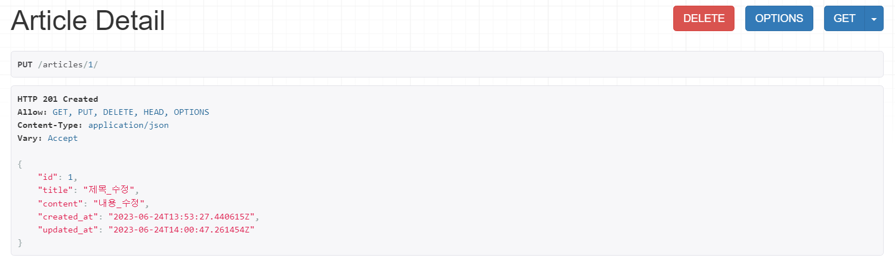

# DRF

- https://www.udemy.com/course/try-django/
- https://velog.io/@good6877/DRF%EB%A1%9C-CRUD-%EB%A7%8C%EB%93%A4%EA%B8%B0
- https://www.youtube.com/watch?v=iOueE9AXDQQ
- https://prohannah.tistory.com/156
- https://jaeseongdev.github.io/development/2021/06/15/REST%EC%9D%98-%EA%B8%B0%EB%B3%B8-%EC%9B%90%EC%B9%99-6%EA%B0%80%EC%A7%80/
- https://thalals.tistory.com/335
- https://jaeseongdev.github.io/development/2021/04/22/REST_API%EC%97%90%EC%84%9C%EC%9D%98_HTTP_%EC%83%81%ED%83%9C%EC%BD%94%EB%93%9C_%EC%83%81%ED%83%9C%EB%A9%94%EC%8B%9C%EC%A7%80.md/
- https://milooy.github.io/TIL/Django/react-with-django-rest-framework.html#progressive-web-app


## 1. REST

### (1) REST

> Representational State Transfer

- 웹 아키텍처 스타일로, 클라이언트와 서버가 데이터를 주고 받는 방식이다.
- 자원을 이름으로 구분하여, 해당 자원의 상태(정보)를 주고 받는 모든 것을 의미한다.
  - 자원의 표현
    - 자원: 소프트웨어가 관리하는 모든 것
    - 자원의 표현: 자원을 표현하기 위한 이름
    - ex) 자원 - DB의 학생 정보, 자원의 표현 - 'students'

  - 상태 전달
    - 데이터가 요청되는 시점에 전달
    - JSON 혹은 XML을 통해 데이터를 주고 받는다.

- URI를 통해 자원을 표시하고, HTTP Method를 이용해 해당 자원에 대한 CRUD Operation을 적용한다.
  - 웹 사이트의 이미지, 텍스트, DB 내용 등의 모든 자원에 고유한 ID인 HTTP URI를 부여한다.
  - CRUD Operation
    - Create: 생성 (POST)
    - Read: 조회 (GET)
    - Update: 수정 (PUT)
    - Delete: 삭제 (DELETE)


### (2) 필요성

- 예전에는 웹 페이지를 보여 주는 웹 서버에서 DB의 데이터를 읽어오고 저장하는 기능을 모두 담당했었다.
- 하지만 모바일 애플리케이션이 등장함에 따라 더 이상 웹으로만 서비스를 제공하는 것에는 한계가 있다.
- 따라서 HTML로 렌더링하는 웹 서버가 아닌, **JSON**이나 XML과 같은 형식을 통해 데이터를 다루는 별도의 API 서버가 필요했다.
- 웹과 동일한 기능을 제공하는 스마트폰 앱에서 기존의 웹 서버를 사용하여, 매번 HTML을 읽어 태그의 정보를 찾아오게 되면 매우 비효율적이다.
- 따라서 웹, 데스크탑, 모바일에서 **하나의 API 서버**와 통신하며 데이터(JSON/XML)를 주고받을 수 있다.


### (3) 주요 원칙

> 6가지의 원칙을 준수한 인터페이스를 RESTful하다고 표현한다.

1. 클라이언트-서버 분리 (Client-Server Separation)
   - 클라이언트와 서버는 독립적으로 개발되어야 한다.
   - 각각의 역할과 책임이 분리되며, 각각의 변경이 다른 쪽에 영향을 주지 않는다.
   - 서버는 비즈니스 로직 처리와 데이터 관리를 담당하고, 클라이언트는 사용자 인터페이스와 사용자 상호작용을 처리한다. (관심사의 분리)


2. 무상태성 (Statelessness)
   - 서버는 클라이언트의 상태를 저장하지 않으며, 모든 클라이언트 요청에는 요청을 이해하기 위해 필요한 정보를 모두 포함되어야 한다.
   - 클라이언트의 상태는 클라이언트 자체에서 관리되어야 한다.
   - 세션, 쿠키 정보를 별도로 저장하고 관리하지 않기 때문에 API 서버는 들어오는 요청만 단순히 처리하면 된다.


3. 캐시 가능성 (Cacheability)
   - 서버는 응답을 캐시 가능하도록 표시하여, 클라이언트 또는 중간 서버에 저장할 수 있도록 유도해야 한다.
   - 캐싱은 네트워크 성능을 향상하고, 서버 부하를 줄이며, 응답 시간을 단축한다.


4. 다중 계층 (Layered System)
   - REST 아키텍처는 계층화된 구조를 가질 수 있다.
   - 중간 서버나 프록시 서버 등의 계층을 추가하여, 보안, 로드 밸런싱, 암호화 등을 처리할 수 있다.
   - 클라이언트는 서버와 직접 통신하며, 클라이언트에게 계층 구조는 투명하게 작동한다.


5. 인터페이스 일관성 (Uniform Interface)
   - RESTful API는 통일된 인터페이스 규칙을 따라야 한다.
   - 일관된 인터페이스를 통해 클라이언트는 리소스를 식별하고 조작할 수 있으며, 서버는 클라이언트의 요청을 이해하고 처리할 수 있다.
   - 4가지 인터페이스 규칙
     - 리소스 식별 (Idenitfication of resources)
       - 요청 시 개별 자원을 URI로 식별할 수 있어야 한다.
       - URL을 사용해 API에서는 접근하려는 자원을 식별할 수 있다.
     - 표현을 통한 자원 조작 (Manipulation of resources through representations)
       - RESTful한 앱은 동일한 URI에서, 동일한 자원의 두 개 이상의 표현을 지원한다.
       - HTTP 메소드인 GET, POST, PUT, DELETE 등을 활용해 자원을 조작할 수 있다.
       - 클라이언트가 자원을 지칭하는 메시지와 메타데이터를 가지고 있으면, 서버 상의 해당 자원을 변경, 삭제할 수 있다.
     - 자기 서술적 메시지 (Self-discriptive messages)
       - 요청, 응답과 같은 메시지는 그 자체만 보고 무슨 의미인지 파악할 수 있어야 한다.
     - 애플리케이션의 상태에 대한 엔진으로서의 하이퍼미디어 (Hypermedia as the engine of application state)
       - 애플리케이션의 상태가 하이퍼링크를 이용해 전이되어야 한다.
       - ex) 메인 페이지 → 글 목록 페이지 (`GET /articles`) → 글 작성 (`GET /new-form`) → 글 저장 (`POST /articles`) → 생성한 글 조회 (`GET /articles/10`) → 글 목록 페이지 (`GET /articles`)


6. Code on Demand (Optional)
   - 서버에서 코드를 클라이언트로 보내서 실행할 수 있어야 한다.
   - ex) 서버로부터 받은 Javascript 파일을 브라우저에서 실행할 수 있다.


### (4) 설계 규칙

> URI는 자원의 정보를 표시해야 한다.


1.  자원은 **명사**를 사용한다.

   - 자원(행위가 아닌 객체)의 범주에 따라 네이밍 규칙이 존재한다.

   - **문서 (Document)**

     - 단일 개념 (파일 하나, 객체 인스턴스, 데이터베이스의 Row 등)

     - 단수 사용 (`/user-management`)

       ```
       /user-management
       ```

   - **컬렉션 (Collection)**

     - 서버가 관리하는 자원 디렉터리

     - 서버가 자원의 URI를 생성하고 관리

     - POST 기반 등록 (회원 관리 API 등)

     - 복수 사용 (`/users`)

       ```
       /user-management/users
       /user-management/users/{id}
       ```

   - **스토어 (Store)**

     - 클라이언트가 관리하는 자원 저장소

     - 클라이언트가 자원의 URI를 알고 관리

     - PUT 기반 등록 (정적 컨텐츠 관리, 원격 파일 관리 등)

     - 복수 사용 (`/files`)

       ```
       /files
       /files/file.txt
       ```

   - **컨트롤 URI 혹은 컨트롤러 (Controller)**

     - 문서, 컬렉션, 스토어로 해결하기 어려운 추가 프로세스 실행
     - GET, POST만 사용할 수 있는 Form의 경우, 컨트롤 URI 사용
     - 동사 사용


2. 자원에 대한 **행위**는 **HTTP Method**로 표현한다.

   - 단, URI에 CURD 함수명이 들어가면 안 된다.

     ```
     GET /members/delete/1	(X)
     DELETE /members/1		(O)
     ```

   - 경로 중 변하는 부분은 고유 값으로 대체한다. (하나의 특정 자원을 나타내는 고유 값인 id 활용)

     ```
     POST /members		# member 생성
     DELETE /members/10	# id = 10인 member 삭제
     ```


3. 일관성이 핵심이다.

   - 슬래시(`/`)는 계층 관계를 나타낼 때 사용한다.

   - 마지막 문자로 `/`를 사용하지 않는다.

     ```
     http://api.example.com/device-management/managed-devices/	(X)
     http://api.example.com/device-management/managed-devices	(O)
     ```

   - 가독성을 위해 하이픈(`-`)을 사용한다.

   - 언더스코어(`_`)는 사용하지 않는다.

   - 소문자를 사용한다.

   - 파일 확장자를 사용하지 않는다.


4. 필터를 위해 쿼리 파라미터를 사용한다.

   - 자원의 정렬, 필터링, 페이징은 신규 API를 생성하지 않고, 쿼리 파라미터를 활용한다.

     ```
     /device-management/managed-devices?region=USA
     /device-management/managed-devices?region=USA&brand=XYZ
     /device-management/managed-devices?sort=installation-date
     ```


## 2. DRF

- Django Rest Framework
- Django에서 RESTful API 서버를 쉽게 만들 수 있도록 도와주는 프레임워크
- DB 데이터를 JSON 파일로 **직렬화(Serialize)**하는 기능을 제공한다.


## 3. DRF - CRUD (APIView)

> [DRF로 CRUD 만들기](https://velog.io/@good6877/DRF%EB%A1%9C-CRUD-%EB%A7%8C%EB%93%A4%EA%B8%B0)
>
> [DRF / APIVIEW사용 하여 게시판 만들기 1 ListAPIVIEW, RetrieveAPIView](https://velog.io/@good6877/DRF-APIVIEW%EC%82%AC%EC%9A%A9-%ED%95%98%EC%97%AC-%EA%B2%8C%EC%8B%9C%ED%8C%90-%EB%A7%8C%EB%93%A4%EA%B8%B0-ListAPIVIEW-RetrieveAPIView)
>
> [[D.R.F] APIView로 CRUD 구현하기](https://wisdom-990629.tistory.com/entry/DRF-APIView%EB%A1%9C-CRUD-%EA%B5%AC%ED%98%84%ED%95%98%EA%B8%B0)


### (1) 초기 세팅

- 가상 환경 설정

- 패키지 설치

  ```bash
  $ pip install djangorestframework
  ```


- app 생성

  ```bash
  $ python manage.py startapp articles
  ```


- `settings.py`에 앱 등록

  ```python
  INSTALLED_APPS = [
      # ...
      'rest_framework',
      'articles',
  ]
  ```


###  (2) models.py

- `articles/models.py`

  ```python
  from django.db import models
  
  class Article(models.Model):
      title = models.CharField(max_length=50)
      content = models.TextField()
      created_at = models.DateTimeField(auto_now_add=True)
      updated_at = models.DateTimeField(auto_now=True)
  ```

  - 아직 회원 관련 앱을 만들지 않았으므로, 간단하게 정의하였다.
  - 추후 회원도 DRF를 통해 구현해 보도록 한다.


### (3) serializer.py

- `articles/serializer.py` 생성

  ```python
  from rest_framework import serializers
  from .models import Article
  
  class ArticleSerializer(serializers.ModelSerializer):
      class Meta:
          model = Article
          fields = '__all__'
  ```

  - `rest_framework`에서 `serializers`를 import하고, 안의 `ModelSerializer` 클래스를 상속 받아 사용한다.
  - `ModelSerializer` 클래스를 사용하면, 직렬화할 model과 fields를 설정할 수 있다.
  - 여기선 Article 모델의 모든 필드를 직렬화하겠다는 의미 (ModelForm이랑 비슷한 것 같다.)


### (4) views.py

- `articles/views.py`

- import

  ```python
  from .models import Article
  from .serializer import ArticleSerializer
  
  # APIView
  from rest_framework.views import APIView
  from rest_framework.response import Response
  from rest_framework import status
  from django.http import Http404
  ```


- 일반적인 블로그를 생각했을 때, **글 목록 페이지(`ArticleList`**)에서 글의 목록을 확인(`get`)하거나 글 작성 페이지(`post`)로 이동할 수 있고, **글 상세 페이지(`ArticleDetail`**)에서 글의 내용을 확인(`get`)하거나 수정(`put`) 또는 삭제(`delete`)할 수 있다.
- 코드를 보면, 페이지를 렌더링하는 것 빼면 기존에 했던 것과 비슷한 것 같다.


- `ArticleList` 클래스

  ```python
  # 글 목록 페이지
  class ArticleList(APIView):
      # 1. 모든 글 목록 보기
      def get(self, request):
          articles = Article.objects.all()
          serializer = ArticleSerializer(articles, many=True) # 여러 객체 직렬화 → many=True
  
          return Response(serializer.data)
      
      # 2. 새로운 글 작성
      def post(self, request):
          serializer = ArticleSerializer(data=request.data)   # request.data는 사용자 입력 데이터
  
          if serializer.is_valid():   # 유효성 검사
              serializer.save()   # 저장
              return Response(serializer.data, status=status.HTTP_201_CREATED)
          
          return Response(serializer.errors, status=status.HTTP_400_BAD_REQUEST)
  ```

  - `APIView`를 상속받는다.
  - `get()`
    - `articles`: 요청이 들어오면 DB에서 모든 Article 객체를 가져온다.
    - `serializer`: 위의 `articles`를 JSON 형식으로 직렬화한다.
    - 해당 데이터를 응답한다.
  - `post()`
    - `serializer`: 사용자가 입력한 데이터를 JSON 형식으로 직렬화한다.
    - 해당 데이터가 유효하면, 저장 후 응답한다. (`POST`와 `PUT`은 201 상태 코드)
    - 그렇지 않으면 오류를 응답한다.


- `ArticleDetail` 클래스

  ```python
  # 글 상세 페이지
  class ArticleDetail(APIView):
      # pk값에 해당하는 Article 객체 받아오기
      def get_object(self, pk):
          try:
              return Article.objects.get(pk=pk)
          except Article.DoesNotExist:
              raise Http404
          
      # 1. 글 상세 보기
      def get(self, request, pk, format=None):
          article = self.get_object(pk)
          serializer = ArticleSerializer(article)
  
          return Response(serializer.data)
      
      # 2. 글 수정하기
      def put(self, request, pk, format=None):
          article = self.get_object(pk)
          serializer = ArticleSerializer(article, data=request.data)
  
          if serializer.is_valid():
              serializer.save()
              return Response(serializer.data, status=status.HTTP_201_CREATED)
  
          return Response(serializer.errors, status=status.HTTP_400_BAD_REQUEST)
      
      # 3. 글 삭제하기
      def delete(self, request, pk, format=None):
          article = self.get_object(pk)
          article.delete()
  
          return Response(status=status.HTTP_204_NO_CONTENT)
  ```

  - `get_object()`: 인자의 `pk` 값에 해당하는 Article 객체를 받아온다. `pk`는 URI에서 가져오므로, 해당 객체가 존재하지 않으면 404 에러를 발생시킨다.
  - `get()`
    - `article`: 인자의 `pk` 값에 해당하는 Article 객체를 DB에서 가져온다.
    - `serializer`: 위의 `articles`를 JSON 형식으로 직렬화한다.
    - 해당 데이터를 응답한다.
  - `put()`
    - `article`: 인자의 `pk` 값에 해당하는 Article 객체를 DB에서 가져온다.
    - `serializer`: 인스턴스 정보로 `article`을 가지며, 그걸 기반으로 사용자가 수정한 데이터를 JSON 형식으로 직렬화한다.
    - 해당 데이터가 유효하면, 저장 후 응답한다. (`POST`와 `PUT`은 201 상태 코드)
    - 그렇지 않으면 오류를 응답한다.
  - `delete()`
    - `article`: 인자의 `pk` 값에 해당하는 Article 객체를 DB에서 가져온다.
    - `article`을 DB에서 삭제한다.
    - 응답한다. (`DELETE`는 204 상태 코드)


### (5) urls.py

- `articles/urls.py`

  ```python
  from django.urls import path
  from rest_framework.urlpatterns import format_suffix_patterns
  from . import views
  
  urlpatterns = [
      path('articles/', views.ArticleList.as_view()),
      path('articles/<int:pk>/', views.ArticleDetail.as_view()),
  ]
  
  urlpatterns = format_suffix_patterns(urlpatterns)
  ```

  - [URI 네이밍 규칙](#4-설계-규칙)에 유의하여 작성한다. (근데 사실 맞는지 모르겠다.)
  - `localhost/articles`로 접속
    - GET: 글 목록
    - POST: 글 작성
  - `localhost/articles/<int:pk>`로 접속
    - GET: 글 상세 내용
    - PUT: 글 수정
    - DELETE: 글 삭제


- `config/urls.py`

  ```python
  from django.contrib import admin
  from django.urls import path, include
  
  urlpatterns = [
      path('admin/', admin.site.urls),
      path('', include('articles.urls')),
  ]
  ```

  - `articles` 앱 내부의 url을 등록한다.
  - 예전이었다면 여기의 path에 `path('/articles', ...)`와 같이 작성하고 `articles` 앱 내부에서 해당 부분을 다 생략했을 것이다.
  - 그런데 REST 규칙을 명확히 하기 위해 위와 같이 작성해 보았다.


### (6) 실행

- 터미널

  ```bash
  $ python manage.py makemigrations
  $ python manage.py migrate
  $ python manage.py runserver
  ```


- **ArticleList** - [127.0.0.1:8000/articles](http://127.0.0.1:8000/articles/)

  

  - 위에는 Article 객체 목록을 보여주는 GET 방식

  - 아래에는 새 Article 객체를 생성할 수 있는 POST 방식

  - Content에 JSON 문자열을 작성 후 POST 클릭 시, 새 객체를 생성할 수 있다.

  - 객체 생성 후, Article 목록을 확인하면, 새 Article 객체가 추가된 것을 볼 수 있다.

    


- **ArticleDetail** - [127.0.0.1:8000/articles/1](http://127.0.0.1:8000/articles/1/)

  

  - 위에는 글의 내용을 보여 주는 GET 방식과, 글을 삭제할 수 있는 DELETE 방식

  - 아래는 글의 내용을 수정할 수 있는 PUT 방식

  - 글을 수정하면, 내용이 다음과 같이 변한다.

    

  - 글을 삭제하면, 글 목록에서 해당 글을 확인할 수 없다.

    

    


## 4. 다음에 해볼 것

- https://www.udemy.com/course/try-django/
- 로그인, 프론트로 꾸미기..?
