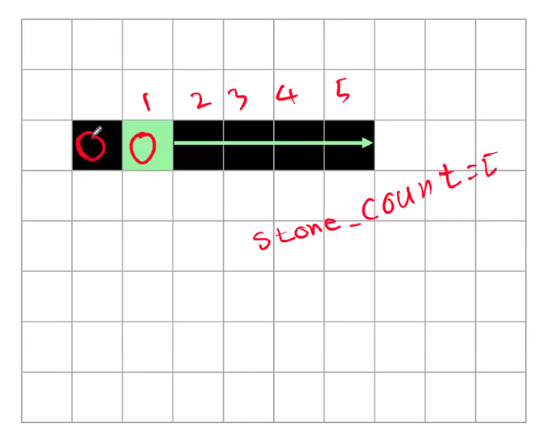

# 1. 코드 리뷰

## (1) 오목

> 카카오 코테 1.5 ~ 2번 정도, 조건이 좀 까다로웠던 문제

- https://www.acmicpc.net/problem/2615

- 문제 조건

  1. 돌이 6개 연속으로 놓인 경우, 이긴 것이 X 💙

  2. 승부의 결과, 연속된 다섯 개의 바둑알 중 **가장 왼쪽에 있는 돌의 좌표**를 출력 (세로로 놓인 경우, 가장 위에 있는 돌의 좌표)


- 문제 조건 2에 의거한 델타 탐색 방법

  ```python
  # 우, 하, 우하, 우상
  dy = [0, 1, 1, -1]
  dx = [1, 0, 1, 1]
  ```

  - 가로로 놓인 돌은 오른쪽으로 `→`
  - 세로로 놓인 돌은 아래로 `↓`
  - 대각선으로 놓인 돌은 **오른쪽 아래** `↘` 혹은 **오른쪽 위로** `↗`. (가장 왼쪽의 바둑알을 출력해야 하기 때문에)


- 연속된 돌의 개수를 구할 반복문 작성❤️

  ```python
  for d in range(4):
      ny = y + dy[d]
      nx = x + dx[d]
      
      cnt = 0
      
      # 연속된 돌의 개수를 구할 반복문
      while True:
          # 종료 조건 1. 리스트 범위를 벗어나면 X
          if not(-1 < ny < N and -1 < nx < N):
              break
          
          # 종료 조건 2. 돌 색이 다르면 X
          if board[ny][nx] != board[y][x]:
              break
          
          # 같은 색 돌 +1
          cnt += 1
          
          # 다음 좌표 탐색
          ny = y + dy[d]
      	nx = x + dx[d]
  ```
  


- 【코드 1】 연속된 돌의 개수 구하기❤️

  ```python
  #### 리스트 입력
  BLACK = 1
  WHITE = 2
  N = 19
  
  winner = 0
  
  # 이중 반복문
  for y in range(N):
      for x in range(N):
          # 검은 돌이나 흰 돌일 때만 델타 탐색을 수행
          if board[y][x] == BLACK or board[y][x] == WHITE:
              # 델타 탐색
              for d in range(4):
                  # 방향이 바뀔 때마다, 연속된 돌의 개수가 1로 갱신
                  # 왜 1부터냐면 돌이 시작 때부터 존재하기 때문에
                  stone_cnt = 1
  
                  # 다음 좌표 탐색
                  ny = y + dy[d]
                  nx = x + dx[d]
  
                  while True:
                      if not(-1 < ny < N and -1 < nx < N):
                          break
                      if board[ny][nx] != board[y][x]:
                          break
  
                      # 같은 색이고, 범위를 벗어나지 않으면
                      # 연속된 돌의 개수 +1
                      stone_cnt += 1
  
                      # 같은 방향
                      ny = y + dy[d]
                      nx = x + dx[d]
  			
              # 돌이 5개라도 육목이 될 수 있다.
              if stone_cnt == 5:
                  # 현재 기준 좌표의 이전 좌표 확인💙
  ```


- 육목 확인💙

  

  - 기준 좌표가 육목이라 승리한 것이 아니더라도, 바로 뒤에서 탐색하면 `stone_cnt = 5`가 되어 승리할 수 있기 때문에, **기준 좌표의 뒤에 있는 원소도 확인해야 한다.**
  - 따라서, 이전 좌표가 없거나(= 인덱스 범위를 벗어나거나), 이전 좌표의 돌 색이 현재 기준 좌표의 돌 색과 다르면 육목이 X

  

- 【코드 2】 이전 좌표의 돌을 확인하여 육목 판단💙

  ```python
  '''while문 내부'''
  
  if stone_cnt == 5:
      py = y - dy[d]
      px = x - dx[d]
      
      # 오목 조건 1. 기준 좌표의 이전 좌표가 범위를 벗어날 때
      # 오목 조건 2. 이전 좌표의 돌의 색과, 기준 좌표의 돌의 색이 다를 때
      if not(-1 < py < N and -1 < px < N) or board[y][x] != board[py][px]:
          # 현재 돌의 색 출력
          winner = board[y][x]
          # 현재 돌의 좌표를 출력
          print(y + 1, x + 1)
  ```


# 2. 그래프 (Graph)

## (1) 그래프 이해

> 정점(Vertex)과 이를 연결하는 간선(Edge)들의 집합으로 이루어진, 비선형 자료구조

- 소셜 네트워크와 지하철 노선도와 같이, 현실에 있는 개체 간의 관계를 나타내기 위해 사용한다.
- 그래프 관련 용어
  - 정점(Vertex): 간선으로 연결되는 객체이며, 노드(Node)라고도 한다.
  - 간선(Edge): 정점 간의 관계(연결)를 표현하는 선을 의미한다.
  - 경로(Path): 시작 정점부터 도착 정점까지 거치는 정점을 나열한 것을 의미한다.
  - 인접(Adjacency): 두 개의 정점이 하나의 간선으로 직접 연결된 상태를 의미한다.


## (2) 그래프 종류

1. 무방향 그래프 (Undirected graph)
   - **간선의 방향이 없는** 가장 일반적인 그래프
   - 간선을 통해 양방향의 정점 이동 가능
   - **차수(Degree)**: 하나의 정점에 연결된 간선의 개수
   - 모든 정점의 차수의 합 = 간선 수 × 2


2. 방향 그래프 (Directed graph)
   - **간선의 방향이 있는** 가장 일반적인 그래프
   - 간선이 가리키는 방향으로 정점 이동 가능
   - **차수(Degree)**: 진입 차수와 진출 차수로 나누어진다.
     - 진입 차수 (In-degree): 외부 정점에서 한 정점으로 들어오는 간선의 수
     - 진출 차수 (Out-degree): 한 정점에서 외부 정점으로 나가는 간선의 수


## (3) 그래프 표현✨

> 그림으로만 살펴보았던 그래프를, 실제로 문제에서 어떻게 코드로 표현할까?

.assets/image-20220809110350612.png)

1. 딕셔너리 활용

   - 인접 리스트 방식

   - 정점 번호를 key로, 해당 정점과 연결되어 있는 인접 노드들을 value로 가지는 형태

     ```python
     graph = {
         '0': [1, 2],
         '1': [0, 3, 4],
         '2': [0, 4, 5],
         '3': [1],
         '4': [1, 2, 6],
         '5': [2],
         '6': [4]
     }
     ```


2.  **인접 리스트**

   - 리스트를 통해, 각 정점에 대한 인접 정점들을 순차적으로 표현

   - 정점 번호를 index로, 해당 정점과 연결되어 있는 인접 노드들을 값으로 가지는 리스트 형태

     ```python
     graph = [
         [1, 2],
         [0, 3, 4],
         [0, 4, 5],
         [1],
         [1, 2, 6],
         [2],
         [4]
     ]
     ```

   - 【코드 예시】

     ```
     0 1
     0 2
     1 3
     1 4
     2 4
     2 5
     4 6
     ```

     ```python
     v = 7	# 정점 개수
     e = 7	# 간선 개수
     
     graph = [[] for _ in range(v)]
     
     for _ in range(e):
         v1, v2 = map(int, input().split())
         graph[v1].append(v2)
         graph[v2].append(v1)	# 무방향 그래프
     ```


3. **인접 행렬**

   - 두 정점을 연결하는 간선이 없으면 0, 있으면 1을 가지는 행렬로 표현하는 방식

   - 무방향 그래프는 대각선을 기점으로 대칭이다.

     ```python
     graph = [
         [0, 1, 1, 0, 0, 0, 0],
         [1, 0, 0, 1, 1, 0, 0],
         [1, 0, 0, 0, 1, 1, 0],
         [0, 1, 0, 0, 0, 0, 0],
         [0, 1, 1, 0, 0, 0, 1],
         [0, 0, 1, 0, 0, 0, 0],
         [0, 0, 0, 0, 1, 0, 0]
     ]
     ```

   

   - 【코드 예시】

     ```python
     v = 7	# 정점 개수
     e = 7	# 간선 개수
     
     graph = [[0] * v for _ in range(v)]
     
     for _ in range(e):
         v1, v2 = map(int, input().split())
         graph[v1][v2] = 1
         graph[v2][v1] = 1	# 무방향 그래프
     ```


4. 인접 행렬 vs 인접 리스트
   - 인접 행렬은 직관적이고 만들기 편하지만, 불필요한 공간이 생긴다.
   - 인접 리스트는 연결된 정점만 저장하여 효율적이므로, 자주 사용된다.

  
