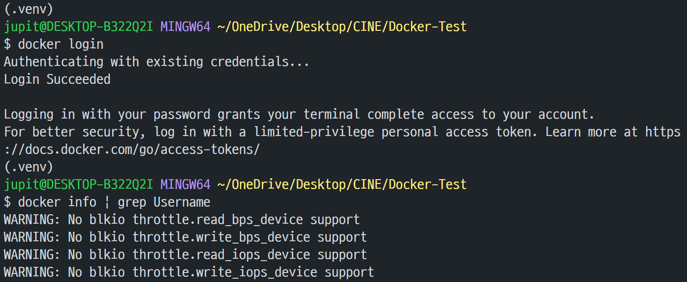
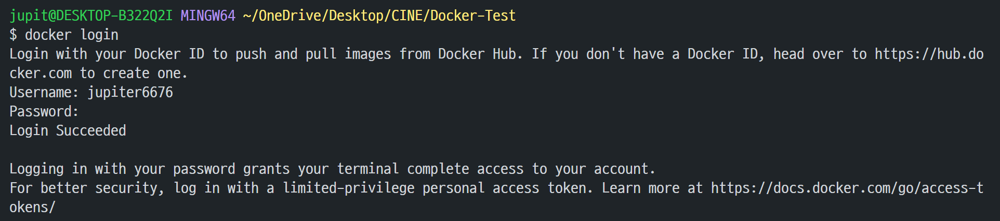

# Docker

> [도커 한방에 정리 🐳 (모든 개발자들이 배워보고 싶어 하는 툴!) + 실습](https://www.youtube.com/watch?v=LXJhA3VWXFA)


## 1. 도커 컨테이너 구성 요소

- **Dockerfile**
  - 컨테이너를 어떻게 만들어야 하는지에 대한 설명서, 레시피
  - **Copy files**: 애플리케이션을 실행하기 위해 필요한 파일
  - **Install dependencies**: 필요 라이브러리
  - **Set environment variable**: 환경 변수 설정
  - **Run setup scripts**: 어떻게 구동해야 하는지
- **Image**
  - 작성한 Dockerfile을 이용하여 Image를 만듦.
  - 애플리케이션을 실행하기 위해 필요한 코드, 런타임 환경, 시스템 툴, 시스템 라이브러리, 모든 세팅들이 포함 (Dockerfile에)
  - 한 마디로, 실행되고 있는 애플리케이션의 상태를 스냅샷으로 찰칵 찍어둔 것이라 생각. (OOP의 클래스와 비슷한 느낌)
  - 한 번 만든 이미지는 변경할 수 없음.
- **Container**
  - 만들어 둔 이미지를 고립된 환경(개별적 파일 시스템 안)에서 실행할 수 있는 것을 말함.
  - 컨테이너 안에서 애플리케이션이 동작하는 것.


## 2. 도커 이미지 배포 과정

- 로컬 머신에서 도커 파일을 작성한 후 빌드하여 이미지를 만들어, GitHub와 같은 **Container Registry**라는 곳에 **Push**
- 그러면, 그곳을 통해 개발자나 서버에서 해당 이미지를 **Pull** 받아 컨테이너를 실행한다.
- 이때, 로컬과 서버는 도커와 같은 Container Engine을 꼭 설치해야 한다.


- 이미지를 공유할 수 있는 Container Registry 종류
  - Public
    - **Docker Hub**
    - RED HAT
    - GitHub Packages
  - Private
    - 회사에서 주로 사용
    - AWS
    - Google Cloud
    - Microsoft Azure


## 3. 도커 실습

### (1) 장고 프로젝트 생성

- VSCode Docker Extension 설치
- `config` 프로젝트 파일, `tests` 앱 생성
- `tests`의 `index.html`에서 'Docker test' 문구 출력


### (2) Dockerfile 작성

- 위치는 프로젝트 최상단 (= `manage.py`와 같은 위치)

- 베이스 이미지

  ```dockerfile
  FROM [baseImage]:[version](-[stretch/buster/jessie/slim/alpine])
  ```

  - 맨 처음에는 항상 베이스 이미지로 시작
    - django를 입력하고 Ctrl + 클릭 시, python을 대신 사용하라고 되어 있다.
  - [Docker | 도커 이미지 종류](https://no-easy-dev.tistory.com/entry/Docker-Docker-Image-Differences)
    - `name:version`: 가장 최근의 안정적인 데비안 운영 체제 릴리스 기반
    - `name:version-[stretch/buster/jessie]`: 다양한 데비안 릴리스의 코드명
    - `name:version-slim`: 실행하기 위한 최소한의 패키지만 설치된 이미지
    - `name:version-alpine`: 컨테이너 내부에서 사용하기 위해 특별히 제작된 운영체제인, 알파인 리눅스 프로젝트를 기반으로 함. 이미지를 가능한 한 작게 만들기 위해 사용
    - `name:version-winowservercore`: Window Server 기반으로 작성된 이미지


- 컨테이너 안, 어떤 경로에서 앱을 실행할 것인지 명시

  ```dockerfile
  WORKDIR /[path]
  ```

  - `WORKDIR /app`이라 했다면, 앞으로 루트 경로에 있는 `app`이라는 폴더 안에, 프로젝트 관련 파일들을 모두 복사해 오게 된다.
  - 만약 해당 경로가 존재하지 않는다면 새로 만든다.
  - `WORKDIR` 명령어는 유닉스 명령어에서 `cd`와 같은 개념


- 프로젝트 파일 복사 및 실행
  - 도커 파일에서 명령어를 수행하는 것은 **레이어 시스템**으로 구성되어 있기 때문에, **빈번히 변경되는 파일일수록 제일 마지막에 작성**해 주는 것이 좋다.
  - dependency 정보를 담고 있는 `requirements.txt`파일보다는 백엔드 코드가 더 많이 변경될 것이므로, `requirements.txt`를 먼저 현재경로(`app`)로 복사해 온다.
  - 그리고 `requirements.txt`를 실행하도록 하여, 라이브러리를 설치한다.
  - 나머지 소스 파일을 복사해 온다. (이래서 docker ignore를 쓰는 건가?)
  - ***❓`EXPOSE`로 컨테이너 포트 지정? → 컨테이너 빌드 시 활용?***
  - 서버를 실행하기 위해 사용했던 명령어 → `CMD ["python", "manage.py", "runserver", "0.0.0.0:8000"]`를 통해 실행한다.
    - 가장 마지막은 IP:포트 형태로 작성
  - 배포하는 도구에 따라 명령어가 다른 것 같다.


- 더 좋게 도커 파일 작성하는 방법 → [Best practices for writing Dockerfiles](https://docs.docker.com/develop/develop-images/dockerfile_best-practices/)


- 도커 이미지를 만들 때, 가상 환경은 필요 없기 때문에, `.dockerignore` 파일을 만든다.

  ```
  */[가상환경 폴더명]
  ```


---

- `Dockerfile`

  ```dockerfile
  # ./Dockerfile
  FROM python:3
  WORKDIR /app
  
  # Install packages
  COPY requirements.txt ./
  RUN pip install -r requirements.txt
  
  # Copy all src files
  COPY . .
  
  # Run server
  CMD ["python", "manage.py", "runserver", "0.0.0.0:8000"]
  ```


- `.dockerignore`

  ```
  */.venv
  ```

---


### (3) Image 빌드

- 터미널에 다음 명령어 작성

  ```bash
  $ docker build -f [dockerfileName] -t [(dockerhubId/)imageName(:tagName)] .
  ```

  - 제일 마지막의 `.`은 build context로, Docker에게 `Dockerfile`이 최상단에 있음을 알려 주는 것이다.
  - `-f [dokerfile-name]`은 어떤 도커 파일을 사용할 것인지 명시하는 것이다.
  - `-t [imageName:tagName]`은 이미지에 이름을 부여하는 것이다.
    - `dockerhubId/`를 붙이지 않아도 이미지가 생성되긴 하지만, 배포를 위해 적어 주는 것이 좋다.
    - 그리고 이미지를 배포할 레포를 먼저 생성해서, imageName을 레포 이름으로 만들어 주는 것이 좋다.
    - `tagName`에는 버전을 붙이는 것이 일반적이라고 한다.
  - 이외에도 다양한 빌드 옵션이 있다.


- 이미지 정보 확인

  ```bash
  $ docker images
  ```


---

- `jupiter6676/docker-first` 이름의 이미지 생성

  ```bash
  $ docker build -f Dockerfile -t jupiter6676/docker-first .
  ```


- 생성된 이미지 확인

  

  

---


### (4) Container 실행

- 만든 이미지를 이용해 컨테이너를 실행한다.

  ```bash
  $ docker run --name [containerName] -d -p [hostPort:containerPort] [imageName]
  ```

  - `-d`: detached를 의미. 백그라운드에서 컨테이너를 실행하는 것으로, 터미널을 종료해도 계속 실행된다.
  - `-p [host-port:container-port]`: 로컬 머신의 포트(우리는 `8000`와, 컨테이너의 포트([특정 케이스](https://blog.naver.com/alice_k106/220278762795)를 제외하면 아무거나 상관 없다고 한다.) 를 연결한다. 각각의 컨테이너는 독립된 환경에서 동작하고 있으므로, 호스트와 연결해 줄 필요가 있다.
  - 명령어 실행 시, 컨테이너가 동작하면서 컨테이너의 id가 출력되는 것을 확인할 수 있다.


- 아래의 명령어로 현재 실행 중인 컨테이너들의 리스트를 확인할 수 있다.

  ```bash
  $ docker ps
  ```


---

- `docker-first` 이름의 컨테이너 생성

  


- 생성된 컨테이너 확인

  

  

---


### (5) 컨테이너 동작 확인

- 컨테이너가 잘 동작하는지 확인하기 위해, 웹 브라우저에서 `localhost:8000`을 입력한다.
- 문구가 잘 출력되면 성공


---

- 나의 경우에는 [localhost:8000/tests/](http://localhost:8000/tests/) 주소로 이동

- 결과

  

---


### (6) 이미지 배포

- docker hub에 가입 후 로그인한다.

- 새로운 Repository를 만든다.

  

- 이미지 이름을 변경하고 싶으면, `docker tag`를 이용한다.

  ```bash
  $ docker tag [기존 이미지 이름:기존 태그] [새 이미지 이름:새 태그]
  ```

  - `dockerhubId/imageName:tagName` 모두 합쳐 이미지 이름이 되어야 한다.
  - 주의할 점은 `imageName`이 `repositoryName`과 같아야 한다는 것이다. 그렇지 않으면 이미지 배포가 안 된다.. `[도커 ID/레포 이름]`으로 바꾸자.
  - 처음부터 위와 같이 생성하자!


- 도커에 로그인한다.

  ```bash
  $ docker login
  ```


- 아래의 형식에 따라 명령어를 작성한다.

  ```bash
  $ docker push [dockerhubId]/[repositoryName]:[tagName]
  ```


---

- `docker-first-example` 레포 생성

  


- ❗ 도커 로그인을 하려 했으나.. username과 password 작성을 시키지 않는다.

  


- ✅ 아무리 구글링해도 나와 같은 사람이 없어서, **컴퓨터를 재부팅**하니 해결되었다...

  


- 근데 한 번에 된 건 아니고, `error during connect: this error may indicate that the docker daemon is not running: Post "http://%2F%2F.%2Fpipe%2Fdocker_engine/v1.24/auth": open //./pipe/docker_engine: The system cannot find the file specified.` 이런 에러가 뜨길래 **Docker Desktop**을 실행해 로그인하였더니 된 것 같다.
- [[Error] Docker Run 시에 발생한 오류](https://chaelin1211.github.io/study/2021/04/01/docker-error.html)


- ❗ 아무튼 만든 이미지를 배포하려 했는데, 또 오류가 발생했다. 로컬에 `jupiter6676/docker-first-example`이라는 이미지가 존재하지 않아서 발생하는 오류였다.

  


- ✅ 이미지 이름을 변경해 준 후 다시 위의 명령어로 push하였다.

  


- docker hub 레포 확인

  

---


## 4. 참고

- 유튜브
  - [Django와 Nginx Docker로 서버에 띄우기! A - Z](https://youtu.be/GpvfIs_ewGY)
  - [2 파이썬(Python) 장고(Django)를 위한 도커(Docker) - 장고 앱 Docker 이미지화 – Dockerfile 작성과 Image 빌드, Container 실행](https://youtu.be/BBuZ2KrMWp0?t=212)
- 블로그
  - ❤️ [Django : Docker로 배포하기](https://velog.io/@wind1992/Django-Docker%EB%A1%9C-%EB%B0%B0%ED%8F%AC%ED%95%98%EA%B8%B0)
  - [15. [Docker] 도커에서 Container 포트와 Host 포트의 개념](https://blog.naver.com/alice_k106/220278762795)

