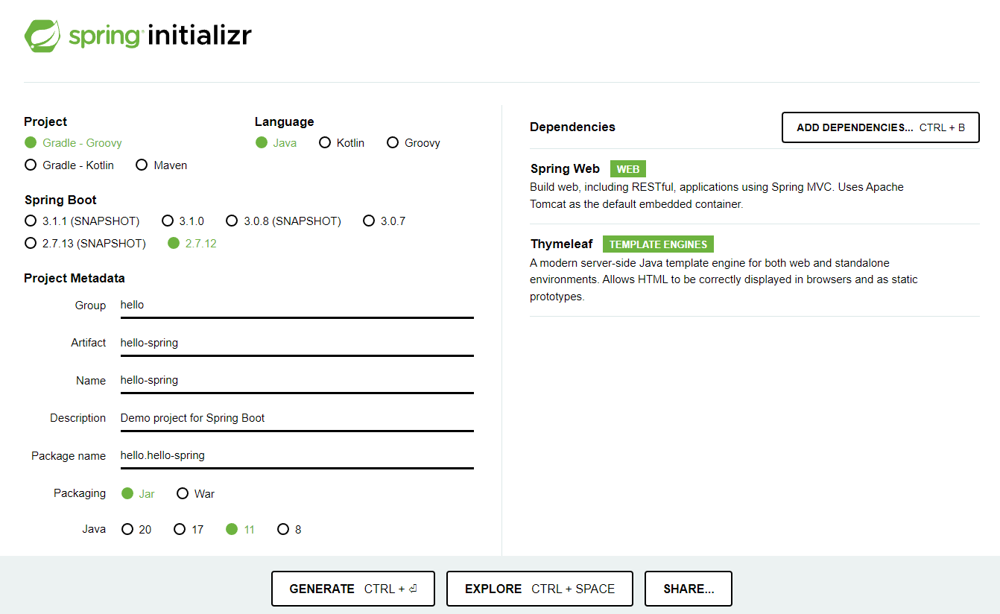

# 프로젝트 생성

## 1. 스프링 프로젝트 생성

- 사전 준비
  - Java 11 설치
  - IntelliJ 설치 (Community 버전)

- 스프링 부트 스타터 사이트로 이동, 스프링 프로젝트 생성
  - https://start.spring.io/
  - 스프링 부트를 기반으로 프로젝트를 생성해 준다.
  

- 프로젝트 선택
  - Project: Gradle Project (요즘은 Gradle을 많이 쓴다.)
  - Spring Boot: 2.7.12로 설정했다.. (3.0 이상은 Java 17이 필요하다는데 웬만하면 11 쓰라고 하길래)
  - Language: Java
  - Packaging: Jar
  - Java: 11
- Project Metadata
  - groupId: hello
  - artifactId: hello-spring (빌드되어 나올 때의 결과물, 프로젝트 명으로 보면 된다)
- **Dependencies**: Spring Web, Thymeleaf (HTML을 만들어 주는 템플릿 엔진)

- 일단 이렇게 설정하고, GENERATE를 클릭하면 파일이 다운되고, 압축을 푼다.

- [File] → [Project Structure]를 선택, `Project SDK`를 Java 11로 지정한다.

  

- [File] → [Settings]를 선택, Gradle JDK를 설정한다. (실행 속도를 더 빠르게 하기 위함)

  

  - `Build and run using`을 IntelliJ IDEA로 선택
  - `Run tests using`을 IntelliJ IDEA로 선택
  - `Gradle JVM`을 Java 11로 지정

- 프로젝트를 모두 닫고, 압축을 푼 폴더 내의 `build.gradle`을 인텔리제이로 연다. (Open as Project)

## 2. 파일 구조

- `.idea` 폴더에는 인텔리제이가 사용하는 설정파일
- `gradle` 폴더에는 gradle 관련 파일
- `src` 폴더에는 `main`, `test` 폴더가 나뉘어져 있다.
  - `main`에는 `java` 폴더 밑에 실제 패키지와 코드가 들어있다. `resources`에는 java 파일을 제외한 xml이나 properties와 같은 설정 파일, html 등이 들어간다.
  - `test`에는 `java` 폴더 밑에 테스트 코드와 관련된 소스들이 들어간다. (테스트 코드가 요즘 중요하다.)
- `build.gradle`
  - 지금은 그냥 버전 설정하고, 라이브러리를 가져오는 것 정도만 알아두면 된다.
  - `sourceCompatibility`는 필요한 Java 버전을 의미
  - `dependencies`에는 사용하는 라이브러리를 명시
  - `repositories`의 `mavenCentral()`은 라이브러리가 공개된 사이트에서 다운받으라는 것

## 3. 실행

- 하려고 했는데 오류가 발생하다 (...)

- [main] > [java] > [hello] > [hellospring] 속 java 파일의 main 클래스를 실행하려고 했는데, 나는 강사님처럼 왼쪽에 실행 버튼이 나오지 않았다..

- 우측 상단에 망치 모양 옆에 저걸 클릭해서 [Edit Configurations]를 선택

  

- [+] → [Application] → 메인 클래스 추가...하려는데 추가하려는 메인 클래스를 도저히 찾을 수가 없었다.

- 해결

  - [[intellij] spring run 아이콘 비활성화](https://sunghee2.tistory.com/m/entry/intellij-spring-run-%EC%95%84%EC%9D%B4%EC%BD%98-%EB%B9%84%ED%99%9C%EC%84%B1%ED%99%94)

  - `.idea` 폴더를 삭제하고 다시 프로젝트를 연 다음, 우측 하단에 표시되는 무언가의 로딩을 기다리고 나니 실행 버튼이 생겼다.

  - 그 뿐만이 아니라 `.gradle`, `main`, `test` 폴더의 색이 바뀌고, 코드의 색도 주황색과 회색 뿐이었는데 알록달록해졌다. (대신 Gradle 설정을 다시 해야 한다.)

    

- main 함수를 실행하면, 한 30초쯤 후에 뭔가 뜨게 된다.

- 이 부분이 중요

  

- 브라우저에 들어가 `localhost:8080`을 입력하면 에러 페이지가 뜨는데, 그러면 성공한 것이다.

  
