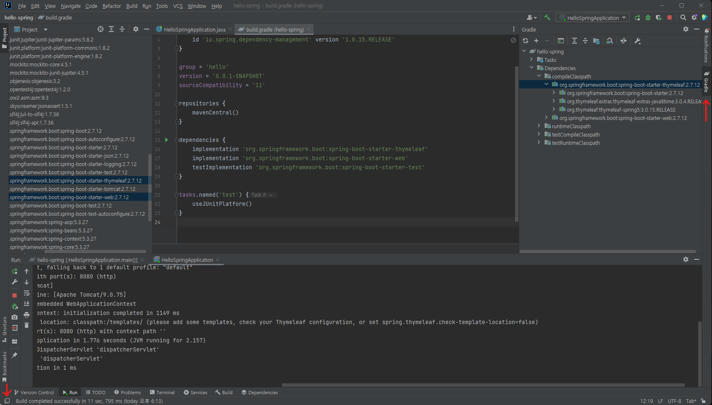

# 라이브러리 살펴보기

> Gradle은 의존 관계가 있는 라이브러리를 함께 다운로드 한다.

## 1. 의존 관계

- maven 같은 빌드 툴들은 의존 관계를 관리해 준다.

- 오른쪽의 Gradle을 누르면 창이 하나 생긴다. Gradle이 보이지 않으면, 좌측 하단의 아이콘을 한 번 클릭하면 된다.

  

  - Dependencies가 라이브러리 간의 의존 관계를 나타낸다.
  - 왼쪽에서 라이브러리를 선택한 다음 `compileClasspath`를 보면 해당 라이브러리가 필요로 하는 라이브러리를 확인할 수 있다.

## 2. 핵심 라이브러리

- **스프링 부트 라이브러리**
  - spring-boot-starter-web
    - spring-boot-starter-tomcat: 톰캣 (웹 서버)
    - spring-webmvc: 스프링 웹 MVC
  - spring-boot-starter-thymeleaf: 타임리프 템플릿 엔진 (View)
  - spring-boot-starter (공통): 스프링 부트 + 스프링 코어 + 로깅
    - spring-boot
      - spring-core
    - spring-boot-starter-logging
      - logback, slf4j

- **테스트 라이브러리**
  - spring-boot-starter-test
    - junit: 테스트 프레임워크 (요즘은 junit5를 많이 쓴다.)
    - mockito: 목 라이브러리
    - assertj: 테스트 코드를 좀 더 편하게 작성하도록 도와주는 라이브러리
    - spring-test: 스프링 통합 테스트 지원