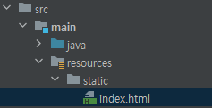
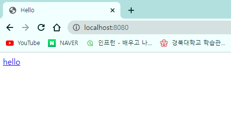
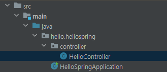
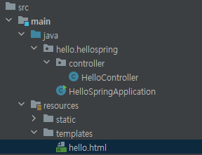
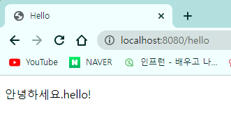
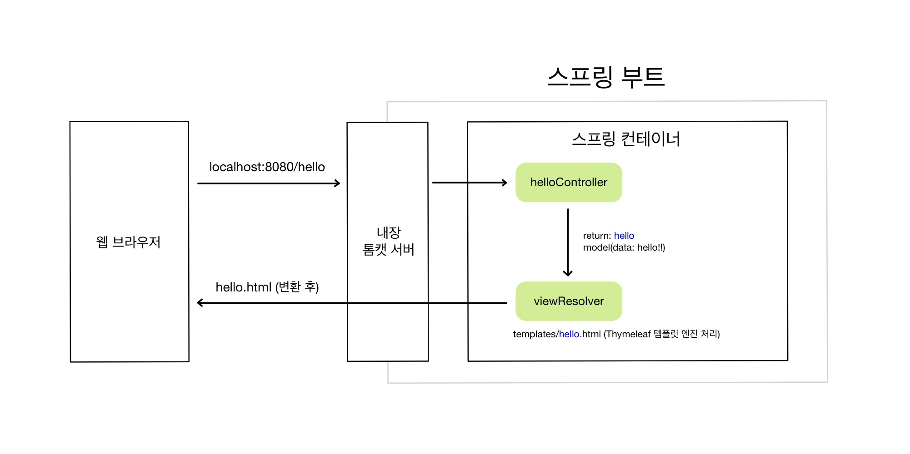

# View 환경설정

## 1. Welcom Page 만들기

- `resources/static/index.html`를 만들면, 도메인 입력 시 나타나는 첫 페이지가 된다.

  


---

- **📑 `index.html` 작성**

  ```html
  <!DOCTYPE HTML>
  <html>
  <head>
      <title>Hello</title>
      <meta http-equiv="Content-Type" content="text/html; charset=UTF-8"/>
  </head>
  
  <body>
      <a href="/hello">hello</a>
  </body>
  </html>
  ```

---


- 실행 결과

  

- 스프링 부트가 제공하는 Welcome Page 기능

  - `static/index.html`을 올려두면, Welcome Page 기능을 제공한다.
  - https://docs.spring.io/spring-boot/docs/2.7.12/reference/html/web.html#web.servlet.spring-mvc.welcome-page


## 2. thymeleaf 템플릿 엔진

- [thymeleaf 공식 사이트](https://www.thymeleaf.org/)
- [스프링 공식 튜토리얼](https://spring.io/guides/gs/serving-web-content/)
- [스프링 부트 매뉴얼](https://docs.spring.io/spring-boot/docs/2.7.12/reference/html/index.html) (2.7.12 버전)
- https://docs.spring.io/spring-boot/docs/2.7.12/reference/html/web.html#web.servlet.spring-mvc.template-engines


### (1) Controller

- 웹 애플리케이션의 첫 번째 진입점이 Controller

- `hello.hellospring` 폴더 아래, controller 패키지를 만들어 준다.

- 그리고 그 안에 `HelloController` 클래스를 생성한다.

  


---

- **📑 `HelloController.java` 작성**

  ```java
  package hello.hellospring.controller;
  
  import org.springframework.stereotype.Controller;
  import org.springframework.ui.Model;
  import org.springframework.web.bind.annotation.GetMapping;
  
  @Controller
  public class HelloController {
  
      @GetMapping("hello")    // 웹에서 /hello라고 치면 이 메소드를 호출
      public String hello(Model model) {  // MVC의 모델
          model.addAttribute("data", "hello!");
          return "hello";
      }
  }
  ```

---


- `resources/templates` 폴더 아래 `hello.html`을 생성한다.

  


---

- **📑 `hello.html` 작성**

  ```html
  <!DOCTYPE HTML>
  <html xmlns:th="http://www.thymeleaf.org">
  <head>
      <title>Hello</title>
      <meta http-equiv="Content-Type" content="text/html; charset=UTF-8">
  </head>
  
  <body>
      <!--  thymeleaf의 th  -->
      <!--  HelloController의 model에서 만든 Attribute data-hello!  -->
      <p th:text="'안녕하세요.' + ${data}">안녕하세요. 손님</p>
  </body>
  </html>
  ```

---


- 실행 결과

  

  - localhost:8080/hello를 치고 들어가거나, a 태그를 클릭한다.
  - thymeleaf 템플릿 엔진이 잘 동작하는 것을 확인할 수 있다.


### (2) 동작 환경



- 웹 브라우저에서 '/hello'를 입력하면, 스프링부트의 내장 톰켓 서버가 받아서, 스프링 컨테이너의 `HelloController`에 가게 된다.
  - @GetMapping("hello")가 GET 메소드로 받아오는 것
  - `HelloController`의 `hello` 메소드가 실행된다.
    - 모델에 속성을 추가한다. 이름은 'data', 값은 'hello!!'
    - 그리고 'hello'를 반환한다. 이는 `resources/templates/hello.html`을 렌더링하는 것이다.
- 컨트롤러에서 리턴 값으로 문자를 반환하면 뷰 리졸버가 화면을 찾아서 처리한다.
  - 스프링 부트 템플릿 엔진 기본 viewName 매핑
  - ❣️ `resources:templates/` + {ViewName} + `.html`
- `hello.html`에서, 컨트롤러에서 만든 모델의 키를 통해 값을 가져올 수 있다.
- Django return render, context랑 비슷한 느낌인 듯!


> 참고: `spring-boot-devtools` 라이브러리를 추가하면, html 파일을 컴파일만 해주면 서버를 재시작하지 않고도 View 파일 변경이 가능하다.
>
> 인텔리제이 컴파일 방법: 메뉴 build → Recompile