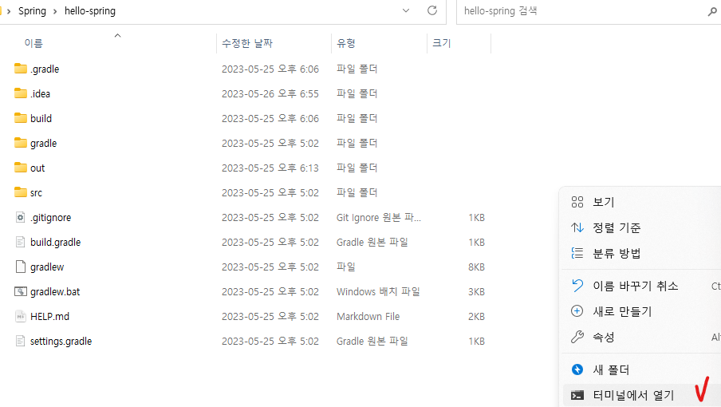
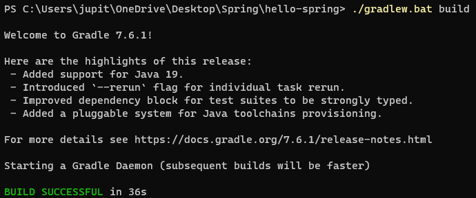
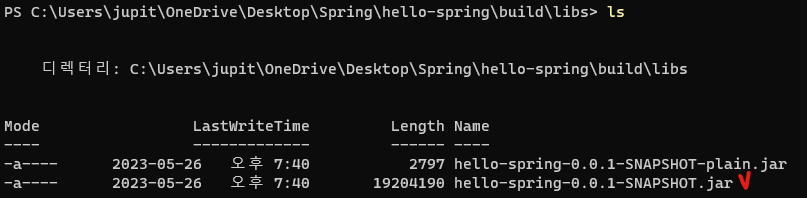
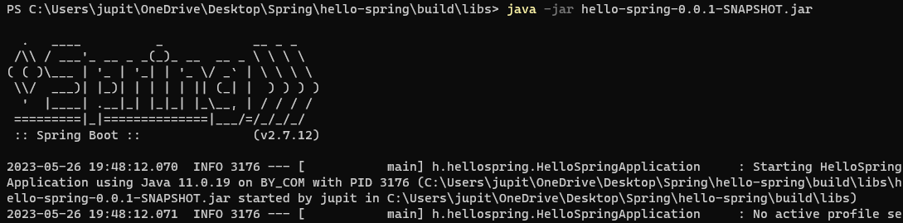
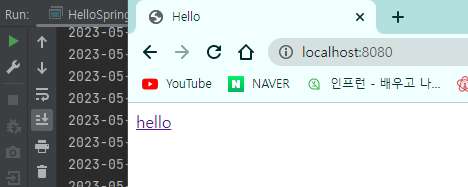

# 빌드 및 실행

## 1. 빌드 및 실행

- 서버를 실행 중이면 꼭 끈다.

- 콘솔(cmd)을 열고, 스프링 프로젝트 폴더로 이동한다.

  - 나는 경로를 몰라서 폴더를 열고 '터미널에서 열기'를 선택했다.

    

- 빌드 명령어 (윈도우): `./gradlew.bat build`

  

- `cd build/libs`

  

- `java -jar hello-spring-0.0.1-SNAPSHOT.jar`

  

- 실행 결과

  

  - 서버를 실행하지 않았음에도 페이지가 잘 뜨고 있는 모습이다.
  - 둘 모두 8080 포트를 쓰기 때문에, 둘 중 하나만 실행해야 한다.
  - 종료는 `Ctrl + C`

- 서버를 배포할 땐 이 파일을 복사해서 서버에 넣고, 이 파일만 실행시키면 된다.

- 빌드 오류가 나는 경우, `./gradlew.bat clean` 혹은 `./gradlew.bat clean build`를 하면 빌드 폴더가 없어진다.
- 그 후에 다시 명령어를 쳐보자.