# 스프링 웹 개발 기초

- 정적 컨텐츠
  - 서버에서 하는 것 없이, 파일을 그대로 웹 브라우저로 보여주는 것
- **MVC와 템플릿 엔진**
  - 가장 많이 하는 방식
  - jsp, php가 소위 템플릿 엔진. html을 그냥 보여주는 것이 아니라, 서버 프로그래밍을 통해 동적인 페이지를 보여준다.
- API
  - 안드로이드, 아이폰 클라이언트와 개발을 해야할 때, 서버는 요즘은 json 데이터 구조 포맷으로 클라이언트에게 데이터를 전달하는 방식
  - Vue.js, React를 쓸 때도 API로 데이터만 내려주면, 화면은 클라이언트가 알아서 그리는 방식에도 활용
  - 서버끼리 통신할 때도 활용


## 1. 정적 컨텐츠

### (1) 정적 HTML 생성

- 스프링 부트 정적 컨텐츠 기능
- https://docs.spring.io/spring-boot/docs/2.7.12/reference/html/web.html#web.servlet.spring-mvc.static-content


- `main/resources/static` 폴더에 저장

- 해당 폴더 아래에 `hello-static.html` 파일을 생성한다.

  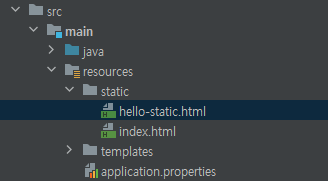


---

- **📑 `hello-static.html` 스크립트 작성**

  ```html
  <!DOCTYPE HTML>
  <html>
  <head>
      <title>static content</title>
      <meta http-equiv="Content-Type" content="text/html; charset=UTF-8" />
  </head>
  
  <body>
      정적 컨텐츠 입니다.
  </body>
  </html>
  ```

---


- 서버를 실행하고, url에 파일 이름을 그대로 입력한다.

- [localhost:8080/hello-static.html](localhost:8080/hello-static.html)

- 실행 결과

  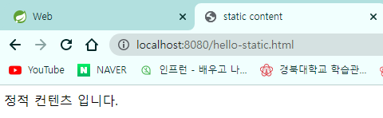


### (2) 정적 컨텐츠 원리

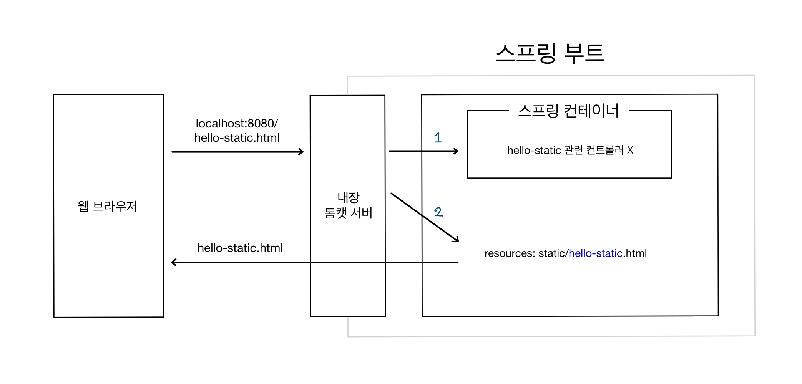

- 웹 브라우저에서 [localhost:8080/hello-static.html](localhost:8080/hello-static.html)를 치고 들어가면 내장 톰캣 서버가 요청을 받는다.
- 스프링 부트는 먼저 컨트롤러 쪽에서 `hello-static` 관련 컨트롤러가 있는지를 찾아본다.
  - 컨트롤러가 우선순위를 가진다는 의미
- 관련 컨트롤러가 없으므로, `resources`에 있는 `static/hello-static.html`을 찾는다.
- 있으므로 그 파일을 반환하여 보여주는 것


## 2. MVC와 템플릿 엔진

- MVC: Model, View, Controller
- 과거에는 뷰와 컨트롤러가 분리되어 있지 않았었다.
- 뷰는 화면을 그리는 것에 집중, 모델과 컨트롤러는 비즈니스 로직이나 내부적인 것을 처리하는 것에 집중


### (1) Controller & View 코드 작성

---

- **📑 `HelloController.java` 스크립트**

  ```java
  @Controller
  public class HelloController {
  
      // ...
  
      @GetMapping("hello-mvc")
      public String helloMVC(@RequestParam("name") String name, Model model) {
          model.addAttribute("name", name);
          return "hello-template";
      }
  }
  ```

  - URL에서 `name` 인자를 받아오면, 그걸 값으로 하는 모델을 만든다.
  - `hello-template`을 렌더링한다.


- **📑 `resources/templates/hello-template.html` 스크립트 생성**

  ```html
  <!DOCTYPE HTML>
  <html xmlns:th="http://www.thymeleaf.org">
  <head>
      <title>Hello Template</title>
      <meta http-equiv="Content-Type" content="text/html; charset=UTF-8">
  </head>
  
  <body>
      <!--  thymeleaf의 th  -->
      <!--  HelloController의 model에서 만든 Attribute name-name  -->
      <p th:text="'hello ' + ${name}">hello empty</p>
  </body>
  </html>
  ```

  - p 태그 안의 내용은 없어도 되긴 하다.
  - thymeleaf의 장점은, 서버를 실행하지 않고도 웹 브라우저에 html 파일의 절대 경로를 복사해 붙여넣으면 'hello empty'가 출력된다는 것
  - 하지만 템플릿 엔진으로 작동하는 경우에는, `th:text`의 값으로 치환된다.

---


- 주소창에 [http://localhost:8080/hello-mvc](http://localhost:8080/hello-mvc) 입력

- 실행 결과

  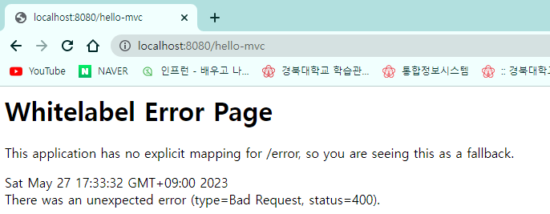


- 왜 에러가 뜨는지 로그를 살펴보자.

  ```
  MissingServletRequestParameterException: Required request parameter 'name' for method parameter type String is not present]
  ```

  - `name` 파라미터가 필요한데 입력되지 않았음을 알 수 있다.


- 컨트롤러 코드로 돌아가서, `@RequestParam("name")`에 커서를 두고 **Ctrl + P**를 하면 파라미터 정보를 볼 수 있다.

  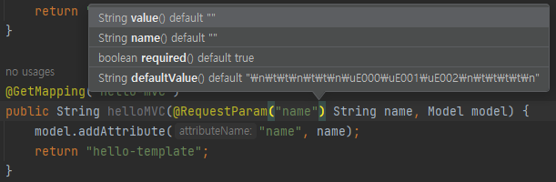

  - 보면 required 옵션이 있음이 알 수 있다.
    - default 값은 true
    - `@RequestParam(value="name", required=false)`로 하면 파라미터가 주어지지 않아도 된다.


- [localhost:8080/hello-mvc?name=SPRING!!](localhost:8080/hello-mvc?name=SPRING!!)
  - ? 뒤에 이름-값의 형태로 파라미터를 넘겨줄 수 있다.
  - name은 `@RequestParam("name")`
  - SPRING!!은 `String name`


- 실행 결과

  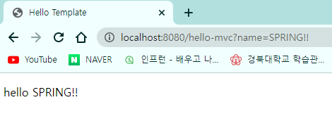


### (2) MVC, 템플릿 엔진 원리

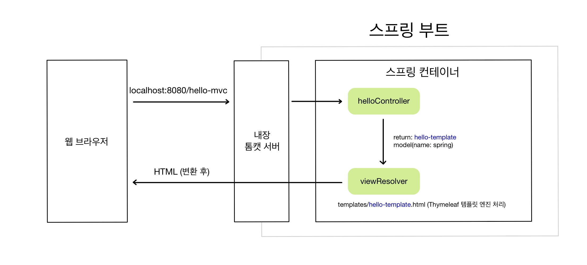

- 웹 브라우저에서 [localhost:8080/hello-mvc?name=SPRING!!](localhost:8080/hello-mvc?name=SPRING!!)를 입력하면, 스프링 부트의 내장 톰캣 서버를 거친다.
- `helloController`에 관련 메소드 `helloMVC`가 있으니 그걸 호출한다.
  - `hello-template`을 반환한다.
  - 모델에는 key(name), value(SPRING!!)이 들어간다.
  - 그걸 `viewResolver`에게 넘겨준다. (화면 관련된 일을 하는 해결사..)
- `viewResolver`는 `templates/hello-template.html`을 찾아서 Thymeleaf 템플릿 엔진에게 처리해달라고 넘긴다.
- 템플릿 엔진이 렌더링해서 변환한 HTML을 웹 브라우저에 보여주게 된다. (정적 컨텐츠는 변환 과정이 X)


## 3. API

- 정적 컨텐츠를 제외하면, MVC와 같이 view를 찾아서 template 엔진을 통해 html을 웹 브라우저에 넘겨주는 방법이 있고, API를 사용하는 방식의 2가지가 있다.


### (1) @ResponseBody - 문자열

---

- **📑 `HelloController.java` 스크립트**

  ```java
  @Controller
  public class HelloController {
      
      // ...
      
      @GetMapping("hello-string")
      @ResponseBody	// HTTP의 BODY 부분에 반환하는 값을 직접 넣어준다.
      public String helloString(@RequestParam("name") String name) {
          return "hello" + name;
      }
  }
  ```

  - `@ResponseBody`를 사용하면 뷰 리졸버(`viewResolver`)를 사용하지 않는다.
  - 대신, HTTP의 BODY에 문자 내용을 직접 반환한다. (`<body>` 태그 X)

---


- [localhost:8080/hello-string?name=SPRING!!!!!!!](localhost:8080/hello-string?name=SPRING!!!!!!!) 주소로 들어가면, HTML 파일을 만들지 않았음에도 입력한 문자열이 출력되는 것을 볼 수 있다.

- 실행 결과

  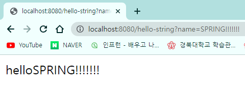


### (2) @ResponseBody - 데이터

---

- **📑 `HelloController.java` 스크립트**

- `Hello` 클래스 생성

  ```java
  static class Hello {
      private String name;
  
      public String getName() {
          return name;
      }
  
      public void setName(String name) {
          this.name = name;
      }
  }
  ```

  - Hello 클래스에서 `name` 필드를 선언하고, 우클릭 → [Generate]를 선택한다.

    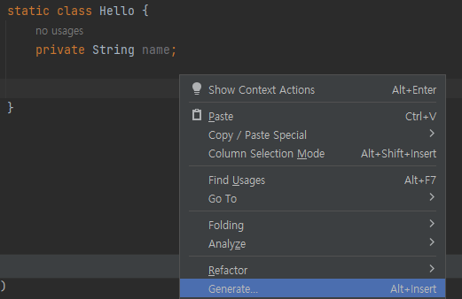

  

  - [Getter and Setter]를 선택하고, `name`을 선택해 준다.

    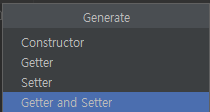

    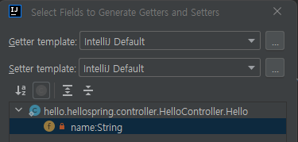

  

  - 그러면 getName()과 setName()이 자동으로 생성된 것을 확인할 수 있다.
    - [JavaBean 규약](https://dololak.tistory.com/133)
    - Hello 클래스 안의 필드는 private이고, 밖에서 쓰기 위해 public 메소드을 통해 접근해야 한다.
    - 프로퍼티 접근 방식이라고도 한다.


- `HelloApi()` 함수 생성

  ```java
  @GetMapping("hello-api")
  @ResponseBody
  public Hello helloApi(@RequestParam("name") String name) {
      Hello hello = new Hello();
      hello.setName(name);
  
      return hello;
  }
  ```

  - 괄호 열고 닫고 하지 말고, **Ctrl + Shift + Enter**를 입력하면 자동으로 완성해 준다. 웬만한 경우에서 쓸 수 있어서 편하다.


- [localhost:8080/hello-api?name=spring!!!!!!!](localhost:8080/hello-api?name=spring!!!!!!!) 주소로 들어가면 **json 형태**(key-value)의 데이터를 확인할 수 있다.

- 실행 결과

  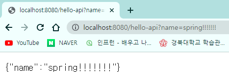


### (3) @ResponseBody 작동 원리

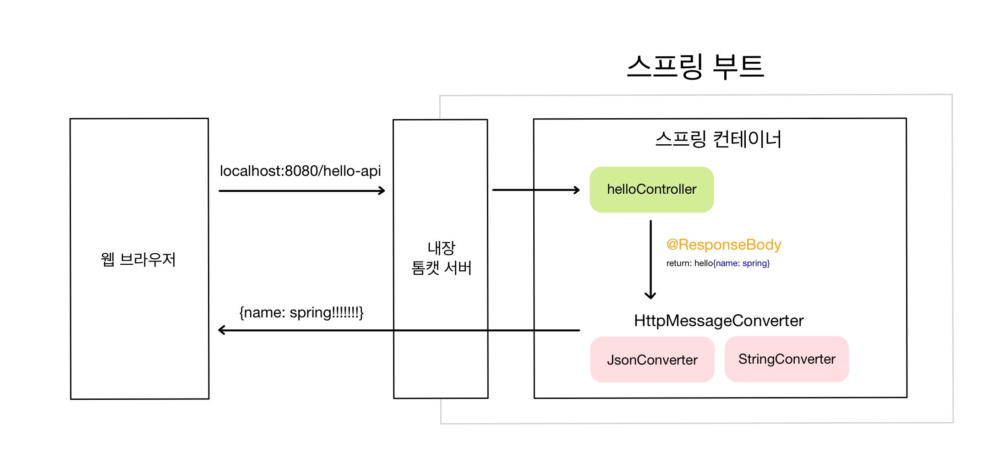

- `@ResponseBody` 사용
  - HTTP의 BODY에 문자 내용을 직접 반환
  - **`viewResolver` 대신에 `HttpMessageConverter`가 동작**❣️
  - 기본 문자 처리: `StringHttpMessageConverter`
  - **기본 객체 처리: `MappingJackson2HttpMessageConverter`** (json 방식으로 데이터를 만들어서, HTTP 응답으로 반환한다.)
  - byte 처리 등, 기타 여러 HttpMessageConverter가 기본으로 등록되어 있다.


> 참고: 클라이언트의 HTTP Accept 헤더와 서버의 컨트롤러 반환 타입 정보 둘을 조합해서 `HttpMessageConverter` 종류가 선택된다. (하지만 요즘은 xml보다 json을 쓴다.) 자세한 내용은 스프링 MVC 강의에서 설명 예정.