# 회원 관리 예제 - 백엔드 개발

## 1. 비즈니스 요구사항 정리

- 데이터: 회원 ID, 이름
- 기능: 회원 등록, 조회
- 가상 시나리오: 아직 데이터 저장소가 선정되지 않음


### (1) 일반적 웹 애플리케이션 계층 구조

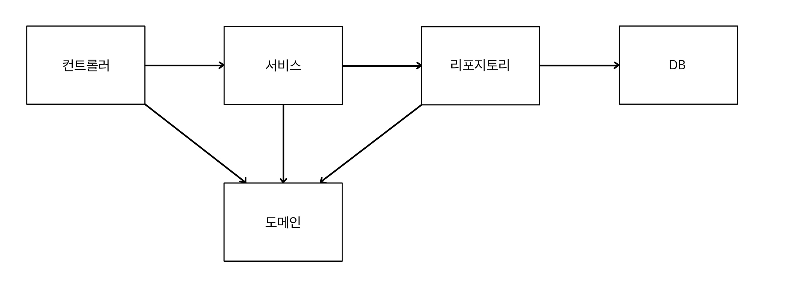

- 컨트롤러: 웹 MVC의 컨트롤러 역할
- 서비스: 비즈니스 도메인 객체를 가지고 **핵심 비즈니스 로직 구현** (ex. 회원은 중복 가입이 안 된다.)
- 리포지토리: 데이터베이스에 접근, 도메인 객체를 DB에 저장하고 관리
- 도메인: **비즈니스 도메인 객체** (ex. 회원, 주문, 쿠폰 등 주로 DB에 저장하고 관리되는 객체)


### (2) 클래스 의존 관계

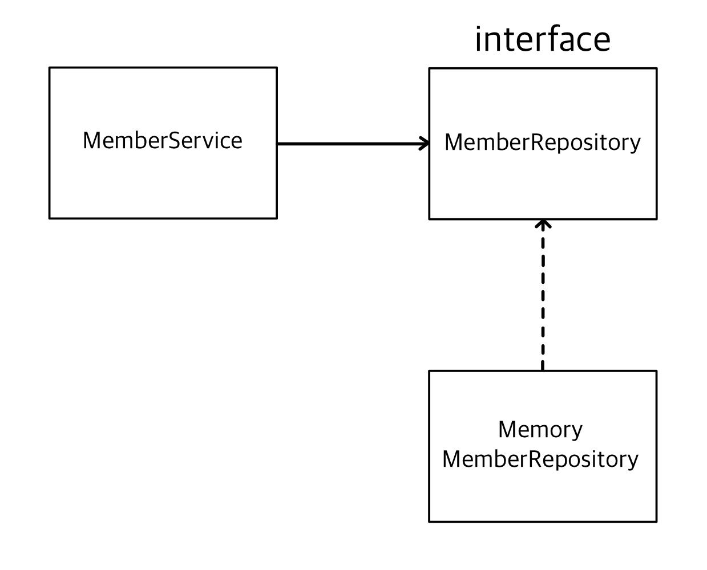

- MemberService: 회원 비즈니스 로직
- MemberRepository: 회원 저장
- 아직 데이터 저장소가 선정되지 않았다는 가상 시나리오 하에, 우선 **인터페이스**로 구현 클래스를 변경할 수 있도록 설계
- 데이터 저장소는 RDB, NoSQL 등 다양한 저장소를 고민 중인 상황으로 가정
- 개발을 진행하기 위해서, 초기 개발 단계에서는 **구현체**로 가벼운 메모리 기반의 데이터 저장소 사용
  - 추후에 데이터 저장소 결정 후, 그걸로 바꾸기 위해서 인터페이스가 필요한 것


## 2. 회원 도메인과 리포지토리 만들기

### (1) 회원 객체

- `hello.hellospring` 폴더 아래, `domain` package를 만들어 준다.

  - [자바 패키지](https://wikidocs.net/231)

- 그리고 그 안에 `Member` 클래스를 생성한다.

  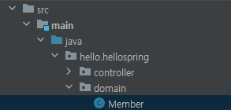


---

- **📑 `Member` 클래스 작성**

  ```java
  package hello.hellospring.domain;
  
  public class Member {
  
      private Long id;
      private String name;
  
      public Long getId() {
          return id;
      }
  
      public void setId(Long id) {
          this.id = id;
      }
  
      public String getName() {
          return name;
      }
  
      public void setName(String name) {
          this.name = name;
      }
  }
  ```

  - `id`, `name` 필드를 선언
  - 각각 Getter와 Setter를 만들어 주었다.

---


### (2) 회원 리포지토리 인터페이스

> 위에서 만든 회원 객체를 저장할 저장소

- `hello.hellospring` 폴더 아래, `repository` package를 만들어 준다.

- 그리고 그 안에 `MemberRepository` 인터페이스를 생성한다.

  - [자바 인터페이스](https://limkydev.tistory.com/197)

  - [인터페이스 특징](https://coding-factory.tistory.com/867)

    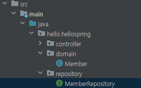


---

- **📑 `MemberRepository` 인터페이스 작성**

  ```java
  package hello.hellospring.repository;
  
  import hello.hellospring.domain.Member;
  import java.util.List;
  import java.util.Optional;
  
  public interface MemberRepository {
      Member save(Member member); // 회원 저장
      Optional<Member> findById(Long id); // 아이디로 회원 찾기
      Optional<Member> findByName(String name);   // 이름으로 회원 찾기
      List<Member> findAll(); // 저장된 모든 회원 리스트 반환
  }
  ```

  - `save()`: 인자로 들어간 회원을 저장한다.
  - `findById`(): 인자로 들어간 id로 회원을 찾는다.
    - `Optional`: null이 될 수 있는 값을 감싸는 Wrapper 클래스. ([자바 Optional](https://mangkyu.tistory.com/70))
  - `findByName()`: 인자로 들어간 이름으로 회원을 찾는다.
  - `findAll()`: 모든 회원 리스트를 반환한다.

---


### (3) 구현체 클래스

- `hello.hellospring/Repository` 패키지 안에, `MemoryMemberRepository` 클래스를 생성한다.

  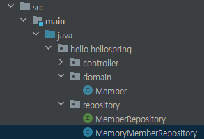


---

- **📑 `MemoryMemberRepository` 클래스 작성**

  ```java
  package hello.hellospring.repository;
  
  import hello.hellospring.domain.Member;
  import java.util.*;
  
  public class MemoryMemberRepository implements MemberRepository {
  
      private static Map<Long, Member> store = new HashMap<>();   // id-Member
      private static long sequence = 0L;  // key 값 생성
  
      @Override
      public Member save(Member member) { // member의 name은, 회원이 입력해서 넘어온 상태
          member.setId(++sequence);       // id는 시스템에서 설정
          store.put(member.getId(), member);
  
          return member;
      }
  
      @Override
      public Optional<Member> findById(Long id) {
          return Optional.ofNullable(store.get(id));
      }
  
      @Override
      public Optional<Member> findByName(String name) {
          return store.values().stream()
                  .filter(member -> member.getName().equals(name))
                  .findAny(); // store의 값들(Member) 중, name과 같은 것이 하나라도 있으면 반환
      }
  
      @Override
      public List<Member> findAll() {
          return new ArrayList<>(store.values());
      }
  }
  ```

  - `store`: id를 키, Member를 값으로 가지는 해시맵
  - `sequence`: 회원 저장 시, 이 변수를 통해 id를 설정한다.
  - `save()`: 회원의 id를 설정하여 저장하고, 저장된 Member를 반환한다.
  - `findById()`: `store`에서 해당 id 값을 가진 Member를 찾아 반환한다.
  - `findByName()`: `store`의 모든 Member 중, 해당 name 값을 가진 Member를 찾아 반환한다.
  - `findAll()`: `store`의 모든 Member를 리스트화하여 반환한다.

---


- ✨ **동시성 문제**
  - `store`과 같이 이렇게 공유되는 변수일 때는 `ConcurrentHashMap`을 사용해야 한다. (예제니까 그냥 HashMap 사용)
  - `long` 자료형도 `AtomicLong`을 사용한다.
- ✨ **HashMap.values()**: 해시맵의 값 목록을 Collection 형태로 반환
- ✨ **Stream**
  - [자바 Stream](https://futurecreator.github.io/2018/08/26/java-8-streams/)
  - Array 또는 Collection 인스턴스에 함수 여러 개를 조합하여, 원하는 결과를 필터링하거나 가공한다.
  - 이때 함수는 람다식을 이용할 수도 있다.
  - 즉, 배열과 콜렉션을 함수형으로 처리할 수 있도록 해 준다.
  - 쓰레드를 이용하여, 하나의 작업을 둘 이상의 작업으로 잘게 나눠 동시에 진행하는 병렬 처리(Multi-threading)를 간단히 할 수 있다.
- ✨ **ArrayList**
  - [자바 ArrayList](https://psychoria.tistory.com/765)
  - 일반 배열과 같이 연속된 메모리 공간 사용, 인덱스는 0부터 시작
  - 배열은 크기가 고정인 반면, ArrayList는 크기가 가변적이다.


## 3. 회원 리포지토리 테스트 케이스 작성

- 개발한 기능을 실행해 테스트할 때, 자바의 main 메소드를 통해 실행하거나, 웹 애플리케이션의 컨트롤러를 통해 실행한다.
- 이런 방법은 준비하고 실행하는데 오래 걸리고, 반복 실행하기 어려우며, 여러 테스트를 한 번에 실행하기 어렵다는 단점이 있다.
- 자바는 JUnit이라는 프레임워크로 테스트를 실행해, 이러한 문제를 해결한다.


### (1) 회원 저장 테스트

- `src/java/hello.spring` 폴더에 `repository` 패키지를 생성한다.

  - main과 같은 이름의 패키지를 생성하게 된다.

    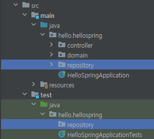


- 테스트 시 관례가 있는데, `MemoryMemeberRepository`를 테스트할 때, `MemoryMemberRepositoryTest`와 같이 뒤에 '~Test'를 붙이게 된다.
- 해당 이름의 클래스를 `repository` 안에 생성한다.


- 구조체 안의 함수를 테스트하고 싶을 땐 `@Test`를 통해, 서버를 실행하지 않고도 함수를 바로 실행할 수 있다.

  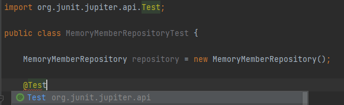


---

- **📑 `MemoryMemberRepositoryTest.java` 스크립트 작성**

- `save()` 함수 작성

  ```java
  package hello.hellospring.repository;
  
  import hello.hellospring.domain.Member;
  import org.junit.jupiter.api.Test;
  
  public class MemoryMemberRepositoryTest {
  
      MemberRepository repository = new MemoryMemberRepository();
  
      @Test
      public void save() {
          Member member = new Member();
          member.setName("spring");
  
          repository.save(member);    // 저장
  
          Member result = repository.findById(member.getId()).get();  // 저장 후 확인
          System.out.println("result = " + (result == member));
      }
  }
  ```

---


- 회원을 저장하는 함수를 테스트하도록 코드를 작성한 후 `save()` 함수를 바로 실행하면, `result = true`라고 출력된다.

  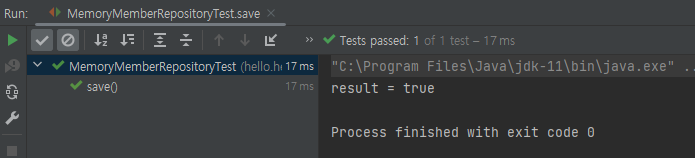


- `Assertions.assertEquals(expected, actual)`

  ```java
  // System.out.println("result = " + (result == member));
  Assertions.assertEquals(member, result);
  ```

  - `org.junit.jupiter.api.Assertions`
  - 저장한 기대하는 값은 member, 저장된 것을 꺼내온 값은 result.
  - 둘이 같은지 확인할 수 있다.
  - 같으면 녹색 불이 켜지고 아무것도 출력되지 않는 반면, 다르면 빨간 불이 들어온다.


- Assertions.assertionThat()

  ```java
  // System.out.println("result = " + (result == member));
  // Assertions.assertEquals(member, result);
  Assertions.assertThat(member).isEqualTo(result);
  ```

  - `org.assertj.core.api.Assertions`
  - 이걸 더 많이 쓴다.
  - **alt + Enter**를 눌러 `import static org.assertj.core.api.Assertions.*assertThat*;`을 하면, 앞의 Assertions를 빼도 된다.
  - 실무에서는 빌드 툴에서 빌드할 때, 오류를 통과하지 못하면 다음 단계로 못 넘어가게 막는 식으로 활용한다.


### (2) 회원 이름 찾기 테스트

---

- **📑 `MemoryMemberRepositoryTest.java` 스크립트 작성**

- `findByName()` 함수 작성

  ```java
  @Test
  public void findByName() {
      Member member1 = new Member();
      member1.setName("spring1");
      repository.save(member1);
  
      // 위에거 복사하고 shift + f6 → 변수 이름 한 번에 바꾸기
      Member member2 = new Member();
      member2.setName("spring2");
      repository.save(member2);
  
      // Optional<Member> result = repository.findByName("spring1");
      Member result = repository.findByName("spring1").get();
  
      assertThat(result).isEqualTo(member1);
  }
  ```

  - `member2` 부분 코드를 작성할 때, `member1` 코드를 가져온 후, 변수 이름을 선택한 다음 **Shift + F6**으로 변수의 이름을 한 번에 바꿀 수 있다.
  - `result`와 `member1`을 비교하면 아무 문제가 없지만, `result`와 `member2`를 비교하면 오류가 뜬다. 

---


### (3) 전체 코드

- 클래스 레벨에서 실행하면 여러 개의 테스트를 실행할 수 있고, `hello.hellospring` 레벨에서 실행할 수도 있다.


---

- **📑 `MemoryMemberRepositoryTest.java` 스크립트 작성**

- `findAll()` 함수 추가

  ```java
  @Test
  public void findAll() {
      Member member1 = new Member();
      member1.setName("spring1");
      repository.save(member1);
  
      Member member2 = new Member();
      member2.setName("spring2");
      repository.save(member2);
  
      List<Member> result = repository.findAll();
  
      assertThat(result.size()).isEqualTo(2);
  }
  ```

---


- 그런데? 막상 다 해놓고 클래스 레벨에서 실행하면 오류가 난다.

- 왼쪽의 테스트 순서를 보면 `findAll()` → `findByName()` → `save()` 순서로 실행된다.

  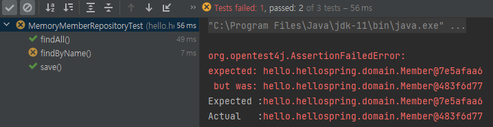


- 모든 **테스트는 순서가 보장되지 않는다.** 따라서, 순서 상관없이 메소드가 따로 동작하도록 테스트를 설계해야 한다.
- `findAll()`에서 `repository`에 'spring1', 'spring2'라는 이름을 가진 회원이 이미 등록되었고, 그때 `findByName()`에서 에러가 발생한 것
- 그래서 테스트가 끝나고 나면, **데이터를 지워 주어야 한다.**


### (4) 테스트 데이터 지우기

---

- **📑 `MemoryMemberRepository.java` 스크립트 작성**

- `clearStore()` 함수 작성

  ```java
  public void clearStore() {
      store.clear();
  }
  ```


- **📑 `MemoryMemberRepositoryTest.java` 스크립트 작성**

  ```java
  public class MemoryMemberRepositoryTest {
  
      MemoryMemberRepository repository = new MemoryMemberRepository();
  
      @AfterEach  // 메소드가 실행이 끝날 때마다 동작 (콜백 메소드)
      public void afterEach() {
          repository.clearStore();
      }
  	
      // ...
      
  }
  ```

  - `repository`를 `MemberRepository` 인터페이스에서 `MemoryMemberRepository`로 변경
  - `@AfterEach`: 한 번에 여러 테스트를 진행하면 메모리 DB에 직전 테스트의 결과가 남을 수 있다. 이러면 이전 테스트 때문에 다음 테스트가 실패할 가능성이 생긴다. `@AfterEach`를 사용하면 각 테스트가 종료될 때마다 기능을 실행한다.
  - `@AfterEach`와, `MemoryMemberRepository`의 `clearStore()` 함수를 이용하여 테스트 메소드의 실행이 끝날 때마다 데이터를 지우도록 한다.
  - 테스트는 각각 독립적으로 실행되어야 한다. 테스트 순서에 의존 관계가 있는 것은 좋은 테스트가 아니다.

---


- 로직을 검증할 수 있는 테스트 케이스를 먼저 작성한 후, 구현 클래스를 작성할 수도 있다.
- 이를 테스트 주도 개발, **TDD**라고 한다.


## 4. 회원 서비스 개발

- 리포지토리와 도메인을 활용해 실제 비즈니스 로직을 작성

- 따라서 서비스 관련 코드를 짤 때는 메소드 이름을 비즈니스 용어로 짓는다. (리포지토리는 개발 용어에 가깝게)

- `src/java/hello.spring` 폴더에 `service` 패키지를 생성한 후, `MemberService` 클래스를 생성한다.

  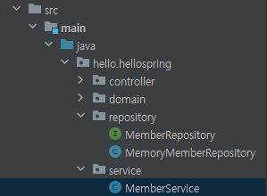


---

- **📑 `MemberService.java` 스크립트 작성**

- import

  ```java
  package hello.hellospring.service;
  
  import hello.hellospring.domain.Member;
  import hello.hellospring.repository.MemberRepository;
  import hello.hellospring.repository.MemoryMemberRepository;
  
  import java.util.List;
  import java.util.Optional;
  ```


- `MemberService` 클래스

  ```java
  public class MemberService {
  
      private final MemberRepository memberRepository = new MemoryMemberRepository();
  
      /** 회원 가입 */
      public Long join(Member member) {
          validateDuplicateMember(member);    // 중복된 이름의 회원은 가입 X
          memberRepository.save(member);
          return member.getId();
      }
  
      private void validateDuplicateMember(Member member) {
          // memberRepository.findByName(member.getName())만 써놓고 Ctrl + Alt + V를 하면 Optional 변수에 저장
          memberRepository.findByName(member.getName())
                          .ifPresent(m -> {   // null이 아닌 값이면, 해당 로직 실행
                              throw new IllegalStateException("이미 존재하는 회원입니다.");
                          });
      }
  
      /** 전체 회원 조회 */
      public List<Member> findMembers() {
          return memberRepository.findAll();
      }
  
      public Optional<Member> findOne(Long memberId) {
          return memberRepository.findById(memberId);
      }
      
  }
  ```

  - `join()` 메소드
    - 회원가입
    - `validateDuplicateMember()` 메소드를 통해 이름이 중복된 회원이 있으면 에러를 던진다.
    - 그렇지 않은 경우, 회원을 저장한다.

  - `validateDuplicateMember()` 메소드

    - 이름이 중복된 회원이 있으면 에러를 던진다.
    - 메소드를 만들 때, 드래그 후 **Ctrl + Shift + Alt + T**를 하면 해당 부분으로 메소드 추출이 가능하다.

    - `memberRepository.findByName(member.getName())`는 Optional 타입으로, **Ctrl + Alt + V**를 하면 Optional 타입의 변수에 저장하는 구문이 생긴다.

  - `findMembers()` 메소드

    - 저장된 회원들을 List 형태로 반환한다.

  - `findOne()` 메소드

    - id 값을 통해 회원을 찾아서 반환한다.

---


## 5. 회원 서비스 테스트

### (1) 테스트 클래스 생성

- `MemberService` 클래스에서 **Ctrl + Shift + T**를 하면, 빠르게 테스트를 생성할 수 있다.

  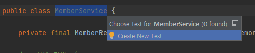

  


- 다음과 같이 `MemberServiceTest` 클래스가 생성된 것을 확인할 수 있다.

  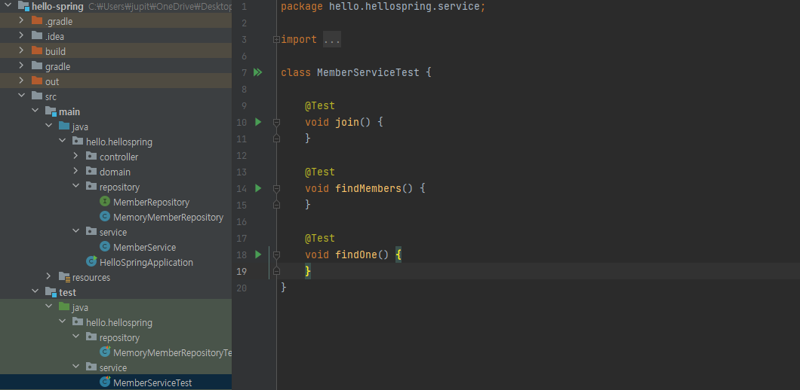


### (2) 테스트 코드 작성

- 테스트에서 함수 이름을 한글로 적어도 괜찮다. (직관적이고, 빌드에 포함되지 않아서 실제로도 많이 한다고..)
- 테스트 코드는 주로 **given - when - then** 문법으로 작성한다.
  - given: 상황과 데이터가 주어지고,
  - when: 이걸 실행했을 때
  - then: 결과가 무엇이 나와야 한다.


---

- **📑 `MemberServiceTest.java` 스크립트 작성**

- import

  ```java
  package hello.hellospring.service;
  
  import hello.hellospring.domain.Member;
  import hello.hellospring.repository.MemoryMemberRepository;
  import org.assertj.core.api.Assertions;
  import org.junit.jupiter.api.Test;
  
  import static org.assertj.core.api.Assertions.*;
  import static org.junit.jupiter.api.Assertions.*;
  ```


- 필드 변수

  ```java
  MemberService memberService = new MemberService();
  MemoryMemberRepository memberRepository = new MemoryMemberRepository(); // 테스트 데이터 클리어를 위해 가져옴.
  ```


- `afterEach()` 함수 작성

  ```java
  @AfterEach  // 메소드가 실행이 끝날 때마다 동작 (콜백 메소드)
  public void afterEach() {
      memberRepository.clearStore();
  }
  ```

  - 회원가입의 `member` 이름을 "spring"으로, 중복 회원 예외의 `member1`과 `member2`의 이름도 "spring"으로 했을 때, 오류가 발생하지 않는다.
  - **Shift + F10**으로, 이전에 실행한 걸 그대로 실행할 수 있다.


- `회원가입()` 혹은 `join()` 함수 작성

  ```java
  @Test
      void 회원가입() {
          // given
          Member member = new Member();
          member.setName("hello");
  
          // when
          Long saveId = memberService.join(member);
  
          // then
          Member findMember = memberService.findOne(saveId).get();
          assertThat(member.getName()).isEqualTo(findMember.getName());
      }
  ```


- 중복 회원이 가입할 때, 예외 처리하는 부분을 테스트하는 함수도 필요하다.

- `중복_회원_예외()` 함수 작성 ①

  ```java
  @Test
      public void 중복_회원_예외() {
          // given
          Member member1 = new Member();
          member1.setName("spring");
  
          Member member2 = new Member();
          member2.setName("spring");
  
          // when
          memberService.join(member1);
          try {
              memberService.join(member2);
              fail("예외가 발생해야 합니다.");  // 이름이 같으므로, 예외가 필연적으로 발생. 발생하지 않으면 실패.
          } catch (IllegalStateException e) {
              assertThat(e.getMessage()).isEqualTo("이미 존재하는 회원입니다."); // 다른 메시지를 넣으면 실패
          }
      }
  ```

  - 이름이 같은 두 Member 객체가 있을 때,
  - `member1`이 join하고 `member2`가 join할 때 exception을 체크한다.
    - 만약 try에서 catch로 넘어간다면 실패
    - catch로 잡은 에러 메시지가 MemberService에서 던진 에러의 내용과 같으면 테스트 성공
  - 하지만 더 좋은 구문이 있다.


- `중복_회원_예외()` 함수 작성 ②

  ```java
  @Test
  public void 중복_회원_예외() {
      // given
      Member member1 = new Member();
      member1.setName("spring");
  
      Member member2 = new Member();
      member2.setName("spring");
  
      // when
      memberService.join(member1);
      IllegalStateException e = assertThrows(IllegalStateException.class, () -> memberService.join(member2));// member2가 회원가입할 때 예외가 터져야 함.
      assertThat(e.getMessage()).isEqualTo("이미 존재하는 회원입니다."); // 에러 메시지 내용도 검증
  }
  ```

  - `assertThrow()`를 활용하여, 발생할 오류 종류와 람다식을 적는다.
    - 만약 NullPointerException을 넣으면, 테스트 실패
  - 반환되는 오류 메시지를 저장(**Ctrl + Alt + R**)하고, `assertThat`을 통해 메시지의 내용을 한 번 더 검증한다.

---


### (3) `MemberRepository` 생성자

- 현재 `MemberService`의 테스트를 위해 다음과 같이 `MemberService` 타입의 인스턴스를 new 키워드로 만들어 둔 상태이다.

  ```java
  // MemberServiceTest.java
  MemberService memberService = new MemberService();
  MemoryMemberRepository memberRepository = new MemoryMemberRepository();
  ```


- 그 `MemberService` 클래스에서는 저장소를 new 키워드로 만들어 두었다.

  ```java
  // MemberService.java
  private final MemberRepository memberRepository = new MemoryMemberRepository();
  ```


- 즉, `MemberServiceTest.java`와 `MemberService.java`의 `memberRepository`는 다른 인스턴스이다.
- 두 개를 쓸 이유가 없을 뿐더러, static이 아닌 타입으로 했을 때 문제가 생길 수도 있고, 다른 객체를 사용하면 내용물이 달라질 수 있기 때문에 다음과 같이 같은 인스턴스를 사용할 수 있도록, **생성자를 사용**하는 것이 좋다.


---

- **📑 `MemberService.java` 스크립트 작성**

  ```java
  // private final MemberRepository memberRepository = new MemoryMemberRepository();
  
  private final MemberRepository memberRepository;
  
  // 생성자 - 외부에서 MemberRepository를 만들도록 설정
  public MemberService(MemberRepository memberRepository) {
      this.memberRepository = memberRepository;
  }
  ```

  - `memberRepository`를 new 키워드로 생성하는 것이 아니라, 외부에서 넣어주도록 바꿔준 것


- **📑 `MemberServiceTest.java` 스크립트 작성**

  ```java
  // MemberService memberService = new MemberService();
  // MemoryMemberRepository memberRepository = new MemoryMemberRepository();
  
  MemberService memberService;
  MemoryMemberRepository memberRepository; // 테스트 데이터 클리어를 위해 가져옴.
  
  @BeforeEach // 각 테스트 실행 전에 동작
  public void beforeEach() {
      memberRepository = new MemoryMemberRepository();
      memberService = new MemberService(memberRepository);	// 생성자를 통해 생성하므로, 같은 MemoryMemberRepository를 사용
  }
  ```

  - 테스트가 서로 영향이 없도록 항상 새로운 객체를 생성하고, 의존 관계도 새로 맺어준다.
  - 이를 **Dependency Injection(DI)**이라고 한다.

---


### (4) 전체 코드

- `MemberService.java`

  ```java
  package hello.hellospring.service;
  
  import hello.hellospring.domain.Member;
  import hello.hellospring.repository.MemberRepository;
  import hello.hellospring.repository.MemoryMemberRepository;
  
  import java.util.List;
  import java.util.Optional;
  
  public class MemberService {
  
      // private final MemberRepository memberRepository = new MemoryMemberRepository();
      private final MemberRepository memberRepository;
  
      // 생성자 - 외부에서 MemberRepository를 만들도록 설정
      public MemberService(MemberRepository memberRepository) {
          this.memberRepository = memberRepository;
      }
  
      /** 회원 가입 */
      public Long join(Member member) {
          validateDuplicateMember(member);    // 중복된 이름의 회원은 가입 X
          memberRepository.save(member);
          return member.getId();
      }
  
      private void validateDuplicateMember(Member member) {
          // 드래그 후 Ctrl + Shift + Alt + T로 메소드 추출
          // memberRepository.findByName(member.getName())만 써놓고 Ctrl + Alt + V를 하면 Optional 변수에 저장
          memberRepository.findByName(member.getName())
                          .ifPresent(m -> {   // null이 아닌 값이면, 해당 로직 실행
                              throw new IllegalStateException("이미 존재하는 회원입니다.");
                          });
      }
  
      /** 전체 회원 조회 */
      public List<Member> findMembers() {
          return memberRepository.findAll();
      }
  
      public Optional<Member> findOne(Long memberId) {
          return memberRepository.findById(memberId);
      }
  
  }
  ```


- `MemberServiceTest.java`

  ```java
  package hello.hellospring.service;
  
  import hello.hellospring.domain.Member;
  import hello.hellospring.repository.MemoryMemberRepository;
  import org.assertj.core.api.Assertions;
  import org.junit.jupiter.api.AfterEach;
  import org.junit.jupiter.api.BeforeEach;
  import org.junit.jupiter.api.Test;
  
  import static org.assertj.core.api.Assertions.*;
  import static org.junit.jupiter.api.Assertions.*;
  
  
  class MemberServiceTest {
  
      MemberService memberService;
      MemoryMemberRepository memberRepository; // 테스트 데이터 클리어를 위해 가져옴.
  
      @BeforeEach // 각 테스트 실행 전에 동작
      public void beforeEach() {
          memberRepository = new MemoryMemberRepository();
          memberService = new MemberService(memberRepository);    // 생성자를 통해 생성하므로, 같은 MemoryMemberRepository를 사용
      }
  
      @AfterEach  // 메소드가 실행이 끝날 때마다 동작 (콜백 메소드)
      public void afterEach() {
          memberRepository.clearStore();
      }
  
      @Test
      void 회원가입() {
          // given
          Member member = new Member();
          member.setName("spring");
  
          // when
          Long saveId = memberService.join(member);
  
          // then
          Member findMember = memberService.findOne(saveId).get();
          assertThat(member.getName()).isEqualTo(findMember.getName());
          // Assertions.assertThat(member.getName()).isEqualTo(findMember.getName());    // 작성 후, Alt + Enter로 static import
      }
  
      // join 시 중복 회원 검사를 위해, 테스트에서는 예외를 터뜨리는 것이 더 중요하다.
      @Test
      public void 중복_회원_예외() {
          // given
          Member member1 = new Member();
          member1.setName("spring");
  
          Member member2 = new Member();
          member2.setName("spring");
  
          // when
          memberService.join(member1);
          IllegalStateException e = assertThrows(IllegalStateException.class, () -> memberService.join(member2));// member2가 회원가입할 때 예외가 터져야 함.
          assertThat(e.getMessage()).isEqualTo("이미 존재하는 회원입니다."); // 에러 메시지 내용도 검증
  
  //        try {
  //            memberService.join(member2);
  //            fail("예외가 발생해야 합니다.");  // 이름이 같으므로, 예외가 필연적으로 발생. 발생하지 않으면 실패.
  //        } catch (IllegalStateException e) {
  //            assertThat(e.getMessage()).isEqualTo("이미 존재하는 회원입니다."); // 다른 메시지를 넣으면 실패
  //        }
      }
  
      @Test
      void findMembers() {
      }
  
      @Test
      void findOne() {
      }
  
  }
  ```

  
