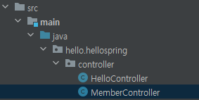

# 스프링 빈과 의존 관계

## 1. 스프링 빈을 등록하고, 의존 관계 설정하기

> 회원 컨트롤러가 회원 서비스와 회원 리포지토리를 사용할 수 있게, 의존 관계를 준비

- 컨트롤러와 뷰 템플릿을 이용해, 회원가입을 하고 그 결과를 HTML로 보여주기 위한 준비
- 컨트롤러를 만들어서, 서비스를 이용해 회원가입하고, 데이터를 조회할 수 있도록 해야 한다.
- 이와 같은 관계에서, 컨트롤러가 서비스를 의존한다고 한다.


### (1) `MemberController` 생성

- `src/java/hello.spring/controller` 폴더에 `MemberController` 클래스를 생성한다.

  


- `@Controller` 어노테이션이 있으면, 스프링 컨테이너에 이 `MemberController`객체를 등록해서 가지고 있다. 이를 **스프링 컨테이너에서 스프링 빈이 관리된다**고 표현한다.

  

  - 여기의 `helloController`도 하나의 빈 (초록색 콩..)


- `MemberController`는 `MemberService`를 받아와 써야 하기 때문에, `new` 키워드로 객체를 생성할 수 있다.
- 하지만, 스프링이 관리하게 되면, 다 스프링 컨테이너에 등록하게 하고, 그곳에서 받아와 사용하도록 해야 한다.
- `MemberService`는 회원 등록 및 조회의 간단한 기능이기 때문에, 이곳저곳에서 `new` 키워드로 만들 필요가 없다.


- 스프링에 등록

  ```java
  @Controller
  public class MemberController {
  
      private final MemberService memberService;
  
      @Autowired
      public MemberController(MemberService memberService) {
          this.memberService = memberService;
      }
      
  }
  ```

  - `MemberController`의 생성자를 만들고, 앞에 `@Autowired` 어노테이션을 붙인다.
  - 스프링에 컨트롤러가 등록되면 생성자가 호출이 될 것이고, 그때 `@Autowired`가 있으면 스프링이 컨테이너에 있는 `MemberService`를 가져와 연결해 준다.


- 실행하기
  - 실행하려 하는데 Controller는 또 실행이 안 된다..
  
  - 근데 그냥 애플리케이션 자체를 실행하니 실행이 된다.
  
    
  
  - 유료 버전에서는 밑줄 친 부분에 오류 표시가 뜬다.
  
    
  
  - 아무튼 실행하면 `hello.hellospring.service.MemberService` 빈을 찾지 못했다고 메시지가 뜬다.
  
    


- `@Autowired`는 스프링 컨테이너에서 `MemberService`를 가져오는 것인데, 컨테이너에 `MemberService`가 스프링 빈으로 등록되지 않았다.
- `MemberController`는 `@Controller`가 있어 스프링 빈으로 자동 등록되었다.
- `MemberService`는 어노테이션도 없는 순수한 자바 클래스이기 때문에, 등록되지 않았던 것이다.


### (2) `MemberService` 스프링 빈 등록

- `MemberService` 클래스로 가서, 클래스 앞에 `@Service` 어노테이션을 붙여 준다.

  ```java
  package hello.hellospring.service;
  
  import ...
  
  @Service
  public class MemberService {
      private final MemberRepository memberRepository;
      // ...
  }
  ```


- 이렇게 하면, 스프링 컨테이너에 `MemberService`를 스프링 빈으로 등록할 수 있다.
- 그리고 `MemberRepository` 인터페이스의 구현체인 `MemoryMemberRepository`도 등록을 해 주어야 한다.


### (3) `MemoryMemberRepository` 스프링 빈 등록

- `MemoryMemberRepository` 클래스로 가서, 클래스 앞에 `@Repository` 어노테이션을 붙여 준다.

  ```java
  package hello.hellospring.repository;
  
  import ...
  
  @Repository
  public class MemoryMemberRepository implements MemberRepository {
      // ...
  }
  ```


- `Controller`, `Service`, `Repository`로 개발하는 것이 정형화된 패턴이다.
- 컨트롤러를 통해 외부 요청을 받고, 서비스에서 비즈니스 로직을 만들고, 리포지토리에서 데이터를 관리하는 것