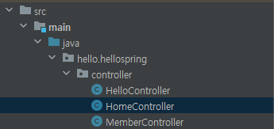
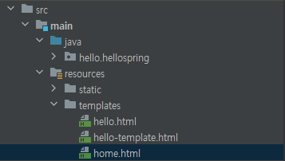
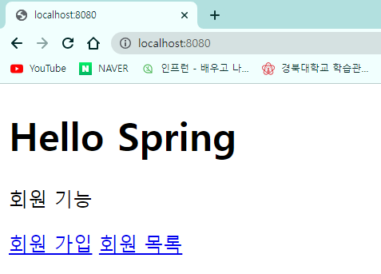

# 회원 관리 예제 - 웹 MVC 개발

## 1. 회원 웹 기능 - 홈 화면 추가

### (1) 홈 컨트롤러 추가

- `hello.spring/controller` 폴더에 `HomeController` 클래스를 생성한다.

  


- **📑 HomeController.java**

  ```java
  @Controller
  public class HomeController {
  
      @GetMapping("/")
      public String home() {
          return "home";
      }
  
  }
  ```

  - **localhost:8080/**에 접속하면 호출된다.
  - **home.html**이 반환된다.


### (2) 회원 관리용 홈

- `resources/templates` 폴더에 `home.html` 파일을 생성한다.

  


- **📑 home.html**

  ```html
  <!DOCTYPE HTML>
  <html xmlns:th="http://www.thymeleaf.org">
  <body>
      <div class="container">
          <div>
              <h1>Hello Spring</h1>
              <p>회원 기능</p>
              <p>
                  <a href="/members/new">회원 가입</a>
                  <a href="/members">회원 목록</a>
              </p>
          </div>
      </div> <!-- /container -->
  </body>
  </html>
  ```


- 실행 후 `localhost:8080`으로 접속하면 다음과 같은 화면이 뜬다.

  


- static 폴더에 `index.html`을 만들었지만 위와 같은 화면이 뜨는 이유는, 정적 파일보다 **컨트롤러가 우선순위가 높기 때문**이다.


## 2. 회원 웹 기능 - 등록

## 3. 회원 웹 기능 - 조회