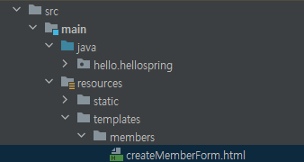
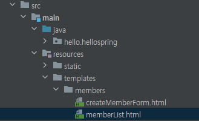
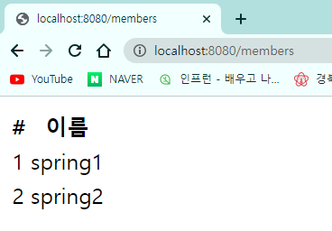

# 회원 관리 예제 - 웹 MVC 개발

## 1. 회원 웹 기능 - 홈 화면 추가

### (1) 홈 컨트롤러 추가

- `hello.spring/controller` 폴더에 `HomeController` 클래스를 생성한다.

  


+++

- **📑 HomeController.java**

  ```java
  @Controller
  public class HomeController {
  
      @GetMapping("/")
      public String home() {
          return "home";
      }
  
  }
  ```

  - **localhost:8080/**에 접속하면 호출된다.
  - **home.html**이 반환된다.

+++


### (2) 회원 관리용 홈

- `resources/templates` 폴더에 `home.html` 파일을 생성한다.

  


+++

- **📑 home.html**

  ```html
  <!DOCTYPE HTML>
  <html xmlns:th="http://www.thymeleaf.org">
  <body>
      <div class="container">
          <div>
              <h1>Hello Spring</h1>
              <p>회원 기능</p>
              <p>
                  <a href="/members/new">회원 가입</a>
                  <a href="/members">회원 목록</a>
              </p>
          </div>
      </div> <!-- /container -->
  </body>
  </html>
  ```

+++


- 실행 후 `localhost:8080`으로 접속하면 다음과 같은 화면이 뜬다.

  


- static 폴더에 `index.html`을 만들었지만 위와 같은 화면이 뜨는 이유는, 정적 파일보다 **컨트롤러가 우선순위가 높기 때문**이다.


## 2. 회원 웹 기능 - 등록

### (1) 회원 등록 폼 컨트롤러 (`MemberController`)

+++

- **📑 MemberController.java**

  ```java
  @Controller
  public class MemberController {
  
      private final MemberService memberService;
  
      @Autowired
      public MemberController(MemberService memberService) {
          this.memberService = memberService;
      }
  
      @GetMapping("/members/new")
      public String createForm() {
          return "members/createMemberForm";
      }
  
  }
  ```

  - `@GetMapping`으로 "/members/new"로 이동하면, "members/createMemberForm" 템플릿이 반환된다.
  - 이 템플릿은 `main/java/src/resources/templates`에 `members` 폴더를 만든 후에 작성한다.

+++


- `main/java/src/resources/templates`에 `members` 폴더를 생성한 후, `createMemberForm.html` 파일을 생성한다.

  


### (2) 회원 등록 폼 HTML

+++

- **📑 createMemberForm.html**

  ```html
  <!DOCTYPE HTML>
  <html xmlns:th="http://www.thymeleaf.org">
  <body>
      <div class="container">
          <form action="/members/new" method="post">
              <div class="form-group">
                  <label for="name">이름</label>
                  <input type="text" id="name" name="name" placeholder="이름을 입력하세요">
              </div>
              <button type="submit">등록</button>
          </form>
      </div> <!-- /container -->
  </body>
  </html>
  ```

---


- 실행 후 홈 페이지에서 `회원 가입`을 클릭하거나 `localhost:8080/members/new`로 접속하면 다음과 같은 폼을 확인할 수 있다.

  


- `<input>` 태그에 "spring"이라는 값을 넣으면, key="name", value="spring"으로 서버에 들어간다.
- 현재는 등록해도 오류 페이지가 뜬다.


### (3) 회원 등록 컨트롤러 (`MemberController`)

- `hello.spring/controller` 폴더에 `MemberForm` 클래스를 생성한다.

  


+++

- **📑 MemberForm.java**

  ```java
  public class MemberForm {
      private String name;
  
      public String getName() {
          return name;
      }
  
      public void setName(String name) {
          this.name = name;
      }
      
  }
  ```

  - 웹 등록 화면에서 **데이터를 전달 받을 폼 객체**
  - 폼에서 입력한 이름(name="name")이 `name`과 매칭되며 값이 들어오도록 할 것이다.


- **📑 MemberController.java**

  ```java
  @Controller
  public class MemberController {
  
      private final MemberService memberService;
  
      @Autowired
      public MemberController(MemberService memberService) {
          this.memberService = memberService;
      }
  
      @GetMapping("/members/new")
      public String createForm() {
          return "members/createMemberForm";
      }
  
      @PostMapping("/members/new")
      public String create(MemberForm form) {
          Member member = new Member();
          member.setName(form.getName()); // form에서 입력받은 이름 설정
  
          memberService.join(member);     // 해당 이름으로 회원 가입
          return "redirect:/";            // 홈 화면으로 리다이렉트
      }
  
  }
  ```

  - 회원 **컨트롤러에서 회원을 실제 등록**하는 기능
  - `<form action="/members/new" method="post">`의 action 속성과 같은 부분으로 `@PostMapping`을 해주면, 폼을 작성했을 때 컨트롤러의 `create()`가 실행된다.
  - 그러면 폼에서 작성한 이름으로 회원 이름이 설정되고 회원 가입이 된다.
  - 그 후 홈 화면으로 리다이렉트 된다.

+++


- 주소창에 직접 `/members/new`를 입력하는 것은 **GET** 방식 → 컨트롤러의 `createForm()`과 매핑
  - `createMemberForm.html`을 반환하여, 회원 가입 폼이 있는 페이지를 보여 준다.
  - **GET** 방식은 주로 데이터를 조회할 때 사용
- `<form>` 태그
  - `<input>` 태그: `name` 속성이 중요하다. 서버로 넘어올 때 `name` 속성에 지정한 값이 **key**가 된다.
  - 그래서 해당 입력 필드에 값을 넣고 제출하면,
  - `/members/new` 주소로 **POST** 방식으로 넘어간다. → 컨트롤러의 `create()`와 매핑
  - **POST** 방식은 폼 같은 곳에 데이터를 넣어 서버로 보낼 때 사용


## 3. 회원 웹 기능 - 조회

### (1) `MemberController` 수정

+++

- **📑 MemberController.java**

  ```java
  package hello.hellospring.controller;
  
  import hello.hellospring.domain.Member;
  import hello.hellospring.service.MemberService;
  import org.springframework.beans.factory.annotation.Autowired;
  import org.springframework.stereotype.Controller;
  import org.springframework.ui.Model;
  import org.springframework.web.bind.annotation.GetMapping;
  import org.springframework.web.bind.annotation.PostMapping;
  
  import java.util.List;
  
  @Controller
  public class MemberController {
  
      private final MemberService memberService;
  
      @Autowired
      public MemberController(MemberService memberService) {
          this.memberService = memberService;
      }
  
      @GetMapping("/members/new")
      public String createForm() {
          return "members/createMemberForm";
      }
  
      @PostMapping("/members/new")
      public String create(MemberForm form) {
          Member member = new Member();
          member.setName(form.getName()); // form에서 입력받은 이름 설정
  
          memberService.join(member);     // 해당 이름으로 회원 가입
          return "redirect:/";            // 홈 화면으로 리다이렉트
      }
  
      @GetMapping("/members")
      public String list(Model model) {
          List<Member> members = memberService.findMembers(); // Ctrl + Alt + V
          model.addAttribute("members", members);
  
          return "members/memberList";
      }
  
  }
  ```

---


### (2) 회원 조회 페이지

- `main/java/src/resources/templates/members` 폴더에 `memberList.html` 파일을 생성한다.

  


+++

- **📑 memberList.html**

  ```html
  <!DOCTYPE HTML>
  <html xmlns:th="http://www.thymeleaf.org">
  <body>
      <div class="container">
          <div>
              <table>
                  <thead>
                  <tr>
                      <th>#</th>
                      <th>이름</th>
                  </tr>
                  </thead>
                  <tbody>
                  <tr th:each="member : ${members}">
                      <td th:text="${member.id}"></td>
                      <td th:text="${member.name}"></td>
                  </tr>
                  </tbody>
              </table>
          </div>
      </div>
  </body>
  </html>
  ```

  - 템플릿 언어가 `${members}`를 통해 `members`를 읽는다.

  - `${ ... }`를 통해, 모델 안의 속성을 읽을 수 있다.

  - `MemberController`의 `list()`에서 모델에 **"members"** 속성을 추가하였고, 이는 **리스트 형태**의 값이다.

  - `th:each`로 리스트 속 요소를 루프를 돌면서 순회한다.

    ```java
    // MemberController.java
    @GetMapping("/members")
    public String list(Model model) {
        List<Member> members = memberService.findMembers(); // Ctrl + Alt + V
        model.addAttribute("members", members);
    
        return "members/memberList";
    }
    ```

  - 이때 `${member.id}`와 `${member.name}`은 `Member` 도메인에서 getter를 통해 값에 접근하는 것이다. (Java Property 방식의 접근)

+++


- 실행 후 "spring1", "spring2"라는 이름의 회원을 등록한 후, 홈 페이지에서 `회원 목록`을 클릭하거나 `localhost:8080/members`로 접속한다.

  


- 해당 페이지의 소스를 보면 다음과 같이 되어 있다.

  ```html
  
  <!DOCTYPE HTML>
  <html>
  <body>
      <div class="container">
          <div>
              <table>
                  <thead>
                  <tr>
                      <th>#</th>
                      <th>이름</th>
                  </tr>
                  </thead>
                  <tbody>
                  <tr>
                      <td>1</td>
                      <td>spring1</td>
                  </tr>
                  <tr>
                      <td>2</td>
                      <td>spring2</td>
                  </tr>
                  </tbody>
              </table>
          </div>
      </div>
  </body>
  </html>
  ```


- 하지만 위 정보는 메모리에 저장되어 있기 때문에, 서버를 종료하면 데이터가 사라진다.
- 따라서 DB에 저장하거나, 파일로 저장해야 한다.