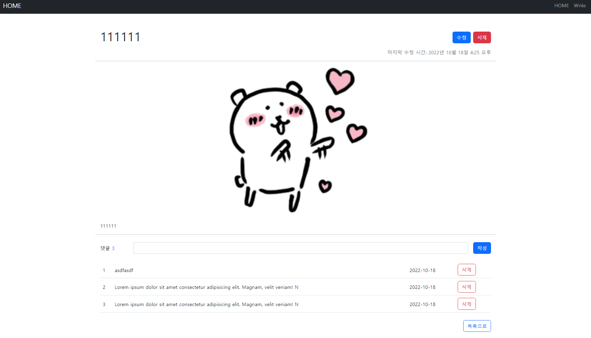

## 실습 주제

장고 14 - Django Comments

## 실습 목표

게시글과 댓글이 1 : N 관계로 매핑 된 게시글에 댓글을 작성할 수 있는 서비스를 개발합니다.

## 배운 점

- ImageField와 ProcessedImage는 각각 한 번씩 파일을 선택해야 한다.
- ImageField의 이미지를 원본으로 썸네일 이미지를 제작할 수도 있다. → ImageSpec

## 스크린샷

## 요구사항

### 모델 Model

---

- 모델 이름 : Article

  | 필드 이름  |     역할      |   필드    |                             속성                             |
  | :--------: | :-----------: | :-------: | :----------------------------------------------------------: |
  |   title    |    글 제목    |   Char    |                        max_length=80                         |
  |  content   |    글 내용    |   Text    |                                                              |
  | created_at | 글 생성 시간  | DateTime  |                      auto_now_add=True                       |
  | updated_at | 글 수정 시간  | DateTime  |                        auto_now=True                         |
  |   image    |   글 이미지   |   Image   |               blank=True, upload_to='images/'                |
  | thumbnail  | 썸네일 이미지 | ImageSpec | source='image', processors=[Thumbnail(200, 200)], format='JPEG', options={'quality': 90} |

- 모델 이름 : Comment

  | 필드 이름  |      역할      |    필드    |           속성           |
  | :--------: | :------------: | :--------: | :----------------------: |
  |  article   |  참조 게시글   | ForeignKey | on_delete=models.CASCADE |
  |  content   |   댓글 내용    |    Char    |      max_length=80       |
  | created_at | 댓글 생성 시간 |  DateTime  |    auto_now_add=True     |

### 기능 View

---

**게시판 articles**

- 게시글 목록 조회
  - `GET` http://127.0.0.1:8000/articles/
- 게시글 정보 조회
  - `GET` http://127.0.0.1:8000/articles/\<int:article_pk>/
- 게시글 생성
  - `POST` http://127.0.0.1:8000/articles/create/
  - 사용자가 글 이미지 `image`를 업로드할 수 있어야 합니다.
- 게시글 수정
  - `POST` http://127.0.0.1:8000/articles/\<int:article_pk>/update/
- 게시글 삭제
  - `POST` http://127.0.0.1:8000/articles/\<int:article_pk>/delete/

**댓글 comments**

- 게시글에 작성된 댓글 목록 조회
  - `GET` http://127.0.0.1:8000/articles/\<int:article_pk>/
  - 해당 게시글(article_pk)의 댓글 목록 조회
- 댓글 생성
  - `POST` http://127.0.0.1:8000/articles/\<int:article_pk>/comments/
- 댓글 삭제 **(교재 참고)**
  - `POST` http://127.0.0.1:8000/articles/\<int:article_pk>/comments/\<int:comment_pk>/delete/

\+ 추가 기능

- 글에 이미지를 넣으면, 썸네일 이미지를 자동으로 생성
- django-widget-tweaks으로, 댓글을 입력하는 ModelForm을 커스터마이징

### 화면 Template

---

- 게시글 목록 페이지
  - `GET` http://127.0.0.1:8000/articles/
- 게시글 정보 페이지
  - `GET` http://127.0.0.1:8000/articles/\<int:article_pk>/
  - 댓글 작성 폼
  - 총 댓글 개수 출력 **(교재 참고)**
  - 댓글 목록
    - 댓글 내용
    - 댓글 삭제 버튼 **(교재 참고)**
- 게시글 작성 페이지
  - `GET` http://127.0.0.1:8000/articles/create/
  - 게시글 작성 폼

## 사용 기술

- 언어: HTML, CSS, JavaScript, Python
- 라이브러리: django-bootstrap5, django-widget-tweaks, imagekit
- 프레임워크: Django
