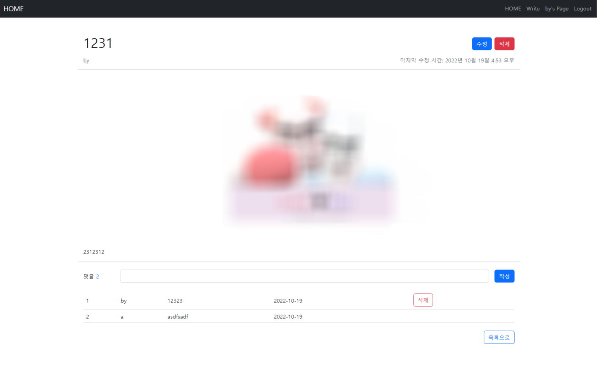

## 실습 주제

장고 15 - Django User-Articles & User-Comments

## 실습 목표

- ModelForm을 활용한 CRUD 기능 구현
- Django Model 1 : N 관계에 대해 이해하고, 코드 상에서 두 모델 매핑
- Django Auth를 활용한 회원 관리 기능 개발에 대한 흐름 파악 및 개발
- 로그인 상태에 따라 컴포넌트 출력 및 기능 제한

## 배운 점

- 모델폼을 보여주는 페이지에 접속했을 때, 아무것도 입력하지 않았는데 에러 메시지가 뜬다면, 해당 페이지에 접속할 때의 method가 GET인지 POST인지 잘 확인해보자.

## 스크린샷

## 요구사항

### 모델 Model

---

- 모델 이름 : User

  Django AbstractUser 모델 상속

- 모델 이름 : Article

  | 필드 이름  |     역할      |    필드    |                             속성                             |
  | :--------: | :-----------: | :--------: | :----------------------------------------------------------: |
  |    user    |   글 작성자   | ForeignKey |                   on_delete=models.CASCADE                   |
  |   title    |    글 제목    |    Char    |                        max_length=80                         |
  |  content   |    글 내용    |    Text    |                                                              |
  | created_at | 글 생성 시간  |  DateTime  |                      auto_now_add=True                       |
  | updated_at | 글 수정 시간  |  DateTime  |                        auto_now=True                         |
  |   image    |   글 이미지   |   Image    |               blank=True, upload_to='images/'                |
  | thumbnail  | 썸네일 이미지 | ImageSpec  | source='image', processors=[Thumbnail(200, 200)], format='JPEG', options={'quality': 90} |

- 모델 이름 : Comment

  | 필드 이름  |      역할      |    필드    |           속성           |
  | :--------: | :------------: | :--------: | :----------------------: |
  |  article   |  참조 게시글   | ForeignKey | on_delete=models.CASCADE |
  |  content   |   댓글 내용    |    Char    |      max_length=80       |
  | created_at | 댓글 생성 시간 |  DateTime  |    auto_now_add=True     |

### 폼 Form

---

- 로그인
  - Django 내장 로그인 폼 **AuthenticationForm** 활용

### 기능 View

---

**게시판 articles**

- 게시글 목록 조회
  - `GET` http://127.0.0.1:8000/articles/
- 게시글 정보 조회
  - `GET` http://127.0.0.1:8000/articles/\<int:article_pk>/
- 게시글 생성
  - `POST` http://127.0.0.1:8000/articles/create/
  - 로그인한 사용자만 데이터를 생성할 수 있습니다.
- 게시글 수정
  - `POST` http://127.0.0.1:8000/articles/\<int:article_pk>/update/
- 게시글 삭제
  - `POST` http://127.0.0.1:8000/articles/\<int:article_pk>/delete/

**회원 관리 accounts**

- 회원 가입은 python [manage.py](http://manage.py) createsuperuser 명령어로 대체

- 로그인
  - `GET` http://127.0.0.1:8000/accounts/login/
- 로그아웃
  - `POST` http://127.0.0.1:8000/accounts/logout/
  - 사용자 로그아웃
- 회원 정보 조회
  - `GET` http://127.0.0.1:8000/accounts/[int:user_pk](int:user_pk)/
  - 회원이 작성한 글 목록 출력

**댓글 comments**

- 게시글에 작성된 댓글 목록 조회
  - `GET` http://127.0.0.1:8000/articles/\<int:article_pk>/
  - 해당 게시글(article_pk)의 댓글 목록 조회
- 댓글 생성
  - `POST` http://127.0.0.1:8000/articles/\<int:article_pk>/comments/
- 댓글 삭제 **(교재 참고)**
  - `POST` http://127.0.0.1:8000/articles/\<int:article_pk>/comments/\<int:comment_pk>/delete/

\+ 추가 기능

- 글에 이미지를 넣으면, 썸네일 이미지를 자동으로 생성
- django-widget-tweaks으로, 댓글을 입력하는 ModelForm을 커스터마이징

### 화면 Template

---

- 게시글 목록 페이지
  - `GET` http://127.0.0.1:8000/articles/
- 게시글 정보 페이지
  - `GET` http://127.0.0.1:8000/articles/\<int:article_pk>/
  - 해당 게시글 정보 출력
    - 게시글 작성자(username) 클릭 시 해당 회원 조회 페이지로 이동
  - 댓글 작성 폼
  - 총 댓글 개수 출력 **(교재 참고)**
  - 댓글 목록
    - 댓글 내용
    - 댓글 삭제 버튼 **(교재 참고)**
- 게시글 작성 페이지
  - `GET` http://127.0.0.1:8000/articles/create/
  - 로그인 한 사용자만 글 작성 페이지로 진입할 수 있습니다.  
  - 게시글 작성 폼
- 로그인 페이지
  - `GET` http://127.0.0.1:8000/accounts/login/
  - 로그인 폼
  - 회원가입 페이지 이동 버튼
- 회원 조회 페이지 (프로필 페이지)
  - `GET` http://127.0.0.1:8000/accounts/\<int:user_pk>/
  - 회원이 작성한 게시글 목록 출력

## 사용 기술

- 언어: HTML, CSS, JavaScript, Python
- 라이브러리: django-bootstrap5, django-widget-tweaks, imagekit
- 프레임워크: Django
