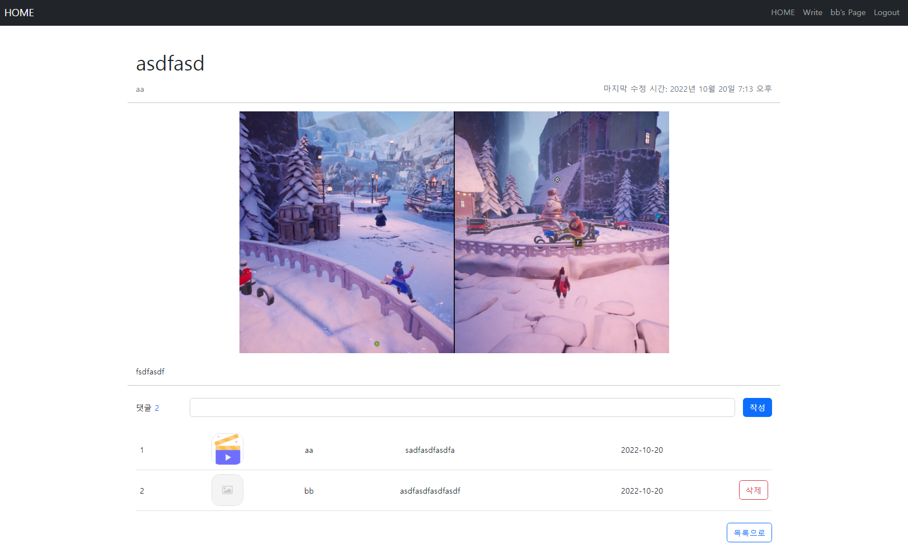
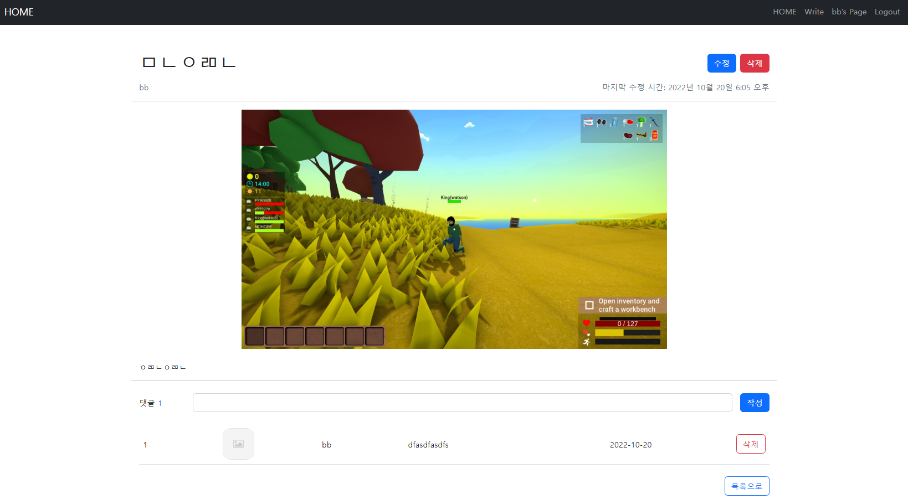
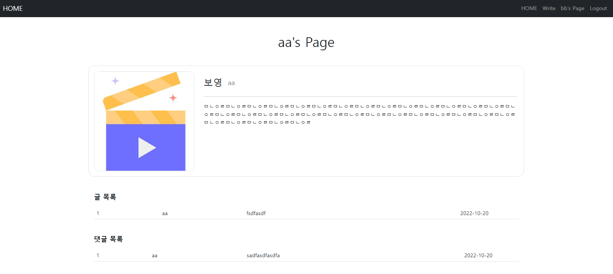
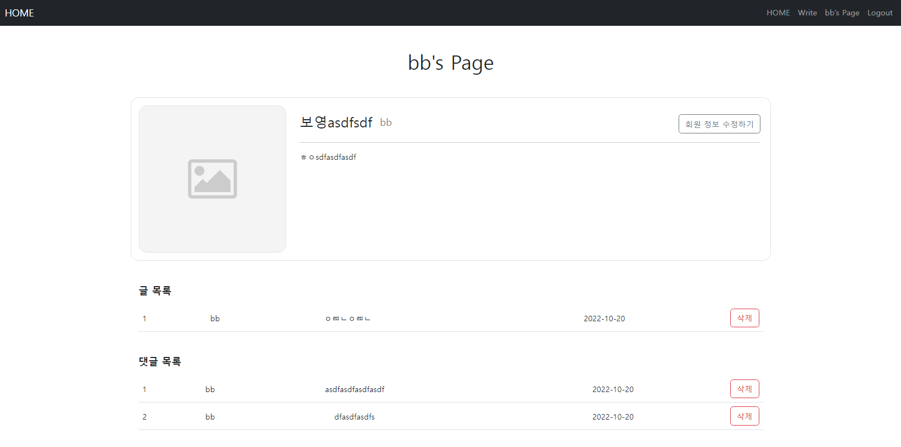

## 실습 주제

장고 16 - Django

## 실습 목표

- ModelForm을 활용한 CRUD 기능 구현
- Django Model 1 : N 관계를 매핑하고, View에서 서로 참조해서 사용하기
  - 유저 : 게시글 = 1 : N
  - 유저 : 댓글 = 1 : N
  - 게시글 : 댓글 = 1 : N
- Django Auth를 활용한 회원 관리 기능 개발에 대한 흐름 파악 및 개발
- 로그인 상태에 따라 컴포넌트 출력 및 기능 제한
- Django Media 활용 동적파일 다루기

## ❗배운 점

- User - Profile은 1:1 관계이다.

## ❓궁금한 점

- 회원 정보 페이지에서 글 또는 댓글 삭제 시, articles:detail 페이지로 넘어간다. 그대로 머무르게 할 수는 없을까?
- articles:detail 페이지에서 댓글을 작성한 후 뒤로 가기를 하면, 이전 페이지로 넘어가지지 않고 댓글 작성 전으로 돌아간다. (= input에 값이 채워지며 해당 페이지에 머무름) 이전 페이지로 돌아갈 방법은?
- 네이버 블로그 스마트 에디터처럼, 사진 여러 개를 글 중간중간 원하는 위치에 넣을 수 있는 방법은?
- 프로필 이미지를 선택하면 해당 이미지를 미리보기 할 수 있는 방법은? 더 나아가 그 사진을 편집하는 방법은?

## 🖼️스크린샷

- bb로 로그인

  

  

  

  

## 🔔요구사항

### 모델 Model

---

- 모델 이름 : User

  Django AbstractUser 모델 상속

- 모델 이름: Profile

  User와 1:1 관계

  | 필드 이름 |      역할      |      필드      |                             속성                             |
  | :-------: | :------------: | :------------: | :----------------------------------------------------------: |
  |   user    |     사용자     |  **OneToOne**  |                   on_delete=models.CASCADE                   |
  | nickname  | 사용자 닉네임  |      Char      |                        max_length=20                         |
  |   intro   | 사용자 소개 글 |      Text      |                          blank=True                          |
  |   image   | 프로필 이미지  | ProcessedImage | blank = True, upload_to = 'profile/', processors = [Thumbnail(300, 300)], format = 'JPEG', options = {'quality': 90} |

- 모델 이름 : Article

  | 필드 이름  |     역할      |    필드    |                             속성                             |
  | :--------: | :-----------: | :--------: | :----------------------------------------------------------: |
  |    user    |   글 작성자   | ForeignKey |                   on_delete=models.CASCADE                   |
  |   title    |    글 제목    |    Char    |                        max_length=80                         |
  |  content   |    글 내용    |    Text    |                                                              |
  | created_at | 글 생성 시간  |  DateTime  |                      auto_now_add=True                       |
  | updated_at | 글 수정 시간  |  DateTime  |                        auto_now=True                         |
  |   image    |   글 이미지   |   Image    |               blank=True, upload_to='images/'                |
  | thumbnail  | 썸네일 이미지 | ImageSpec  | source='image', processors=[Thumbnail(200, 200)], format='JPEG', options={'quality': 90} |

- 모델 이름 : Comment

  | 필드 이름  |      역할      |    필드    |           속성           |
  | :--------: | :------------: | :--------: | :----------------------: |
  |  article   |  참조 게시글   | ForeignKey | on_delete=models.CASCADE |
  |  content   |   댓글 내용    |    Char    |      max_length=80       |
  | created_at | 댓글 생성 시간 |  DateTime  |    auto_now_add=True     |

### 폼 Form

---

- 로그인
  - Django 내장 로그인 폼 **AuthenticationForm** 활용
- **프로필**
  - Django ModelForm 활용

### 기능 View

---

**게시판 articles**

- 게시글 목록 조회
  - `GET` http://127.0.0.1:8000/articles/
- 게시글 정보 조회
  - `GET` http://127.0.0.1:8000/articles/\<int:article_pk>/
  - 해당 게시글(int:article_pk)의 댓글 목록 조회
- 게시글 생성
  - `POST` http://127.0.0.1:8000/articles/create/
  - 로그인한 사용자만 데이터를 생성할 수 있습니다.
- 게시글 수정
  - `POST` http://127.0.0.1:8000/articles/\<int:article_pk>/update/
  - 데이터를 생성한 사용자만 수정할 수 있습니다.
- 게시글 삭제
  - `POST` http://127.0.0.1:8000/articles/\<int:article_pk>/delete/
  - 데이터를 생성한 사용자만 삭제할 수 있습니다.

**회원 관리 accounts**

- 회원가입
  - `POST` http://127.0.0.1:8000/accounts/signout/
- 로그인
  - `GET` http://127.0.0.1:8000/accounts/login/
- 로그아웃
  - `POST` http://127.0.0.1:8000/accounts/logout/
  - 사용자 로그아웃
- 회원 정보 조회
  - `GET` http://127.0.0.1:8000/accounts/\<int:user_pk>/
  - 회원이 작성한 글 목록을 출력합니다.
  - 회원이 작성한 댓글 목록을 출력합니다.
  - 회원의 프로필을 출력합니다.
- **회원 프로필 입력**
  - `POST` http://127.0.0.1:8000/accounts/profile/
  - 현재 로그인한 사용자의 프로필 정보를 입력합니다.

**댓글 comments**

- 게시글에 작성된 댓글 목록 조회
  - `GET` http://127.0.0.1:8000/articles/\<int:article_pk>/
  - 해당 게시글(article_pk)의 댓글 목록 조회
- 댓글 생성
  - `POST` http://127.0.0.1:8000/articles/\<int:article_pk>/comments/
- 댓글 삭제 **(교재 참고)**
  - `POST` http://127.0.0.1:8000/articles/\<int:article_pk>/comments/\<int:comment_pk>/delete/

\+ 추가 기능

- 사용자는 프로필 입력을 통해, 닉네임과 자기 소개글, 프로필 이미지를 설정할 수 있다.
- 댓글에 사용자의 프로필 이미지가 표시된다. (게시글에도 추가할 예정)
- 글이 3줄이상 넘어갈 경우 ...으로 생략한다.

### 화면 Template

---

- 게시글 목록 페이지
  - `GET` http://127.0.0.1:8000/articles/
- 게시글 정보 페이지
  - `GET` http://127.0.0.1:8000/articles/\<int:article_pk>/
  - 해당 게시글 정보 출력
    - 게시글 작성자(username) 클릭 시 해당 회원 조회 페이지로 이동
  - 댓글 작성 폼
    - 로그인한 사용자에게만 보여야 합니다.
  - 총 댓글 개수 출력 **(교재 참고)**
  - 댓글 목록
    - 댓글 내용
    - 댓글 삭제 버튼 **(교재 참고)**
      - 댓글을 작성한 사용자에게만 보여야 합니다.
- 게시글 작성 페이지
  - `GET` http://127.0.0.1:8000/articles/create/
  - 로그인 한 사용자만 글 작성 페이지로 진입할 수 있습니다.  
  - 게시글 작성 폼
- 로그인 페이지
  - `GET` http://127.0.0.1:8000/accounts/login/
  - 로그인 폼
  - 회원가입 페이지 이동 버튼
- 회원가입 페이지
  - `GET` http://127.0.0.1:8000/accounts/signup/
  - 회원가입 폼
  - 로그인 페이지 이동 버튼
- 회원 조회 페이지 (프로필 페이지)
  - `GET` http://127.0.0.1:8000/accounts/\<int:user_pk>/
  - 회원이 작성한 게시글 목록 출력

## 🛠️사용 기술

- 언어: HTML, CSS, JavaScript, Python
- 라이브러리: django-bootstrap5, django-widget-tweaks, imagekit
- 프레임워크: Django

## 참고

- CSS로 글자 자르기 - 한 줄, 여러 줄
  - https://webdir.tistory.com/483
- Django 프로필 페이지
  - https://ldgeao99.tistory.com/118
  - https://tothefullest08.github.io/django/2019/06/20/Django25_relations4_OneToOne_Profile/
  - https://han-py.tistory.com/146

