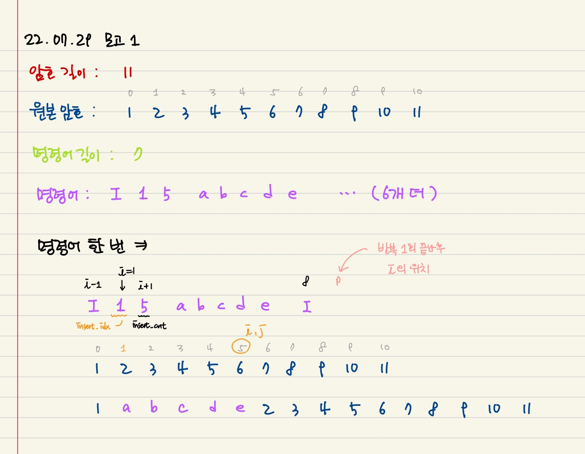

## 후기

- 딕셔너리를 써야 하는데 쓰기 위해서는 먼저 input을 리스트에 받아서 저장하고 리스트를 순회하면서 다시 딕셔너리에 넣는 작업이 맞는 건지 모르겠다..

  - 특히 0번 3번 문제가 그랬던 것 같다. 파이썬은 scanf 같이 문자 하나만 받아오는 건 없는걸까?


- 5번 카드 문제

  - 이 문제는 입력만 잘 받아오면 쉬운 문제인 것 같다.

    ```python
    card_nums = list(map(int, input().replace('-', '')))
    ```

  - 하이픈이 들어오면 없애버리고, 숫자들 각각을 리스트에 넣어서 처리했다.


- 6번 암호문 문제

  - 입력도 많고, 명령어도 개행 없이 들어오고, 출력도 단계별로 확인하느라 좀 까다로웠던 것 같다.
  - 명령어는 공백 기준으로 나누어 한 리스트에 다 넣었다.

  

  - 접근 방법

    

    - 암호랑 명령어는 너무 길어서 구분만 가능하게 커스텀했다.
    - 명령어의 기준이 문자 `'I'`니까, 반복문으로 `command`를 순회하면서 `I`가 있는지 검사한다.
      - 현재: `i`번째 인덱스의 값 → 원래 암호문에서 삽입할 위치 인덱스(`insert_idx`)이기도 하다.
      - 명령어 시작: `i - 1`번째 인덱스
      - 삽입할 암호의 개수(`insert_cnt`): `i + 1`번째 인덱스의 값
    - 반복문을 돌면서(`i`와 `insert_idx`를 증가시키면서), `code`에 `command` 안에 있는 새 암호들을 차례로 넣어준다.
    - 반복문을 다 돌면, i는 다음 명령어가 시작하는(`I`가 존재하는) 인덱스의 바로 뒤에 위치하게 된다.
    - 위 과정을, `i`가 `command`를 다 순회할 때까지 반복한다.

  

  - 코드

    ```python
    # 총 10개의 테스트 케이스
    for test_case in range(1, 11):
        # 입력 1. 원본 암호문의 길이
        N = int(input())
        # 입력 2. 원본 암호문
        code = list(input().split())
        # 입력 3. 명령어의 개수
        M = int(input())
        # 입력 4. 명령어
        command = input().split()
    
        i = 1
        while i < len(command):
            if command[i - 1] == 'I':
                insert_idx = int(command[i])
                insert_cnt = int(command[i + 1])
                i += 2
    
            for j in range(insert_cnt):
                code.insert(insert_idx, command[i])
                i += 1
                insert_idx += 1
    
            i += 1
    
        print(f'#{test_case}', end=' ')
        for k in range(10):
            print(code[k], end=' ')
        print()
    ```

    