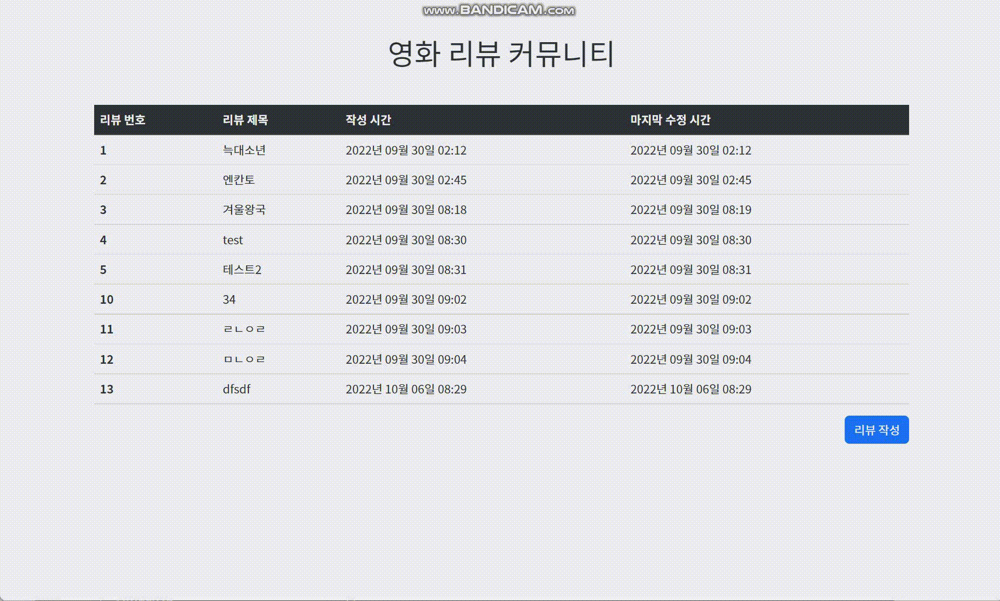

## 프로젝트 소개

- 주간 페어 프로그래밍 1 - 영화 리뷰 커뮤니티 CRUD 

- 프로젝트 기간
  - 2022.09.30
- 사용 기술
  - 언어: HTML, CSS, JavaScript, Python
  - 라이브러리: X
  - 프레임워크: Django

## 스크린샷

## 프로젝트 목적

두 사람이 팀을 이뤄서 영화 리뷰 커뮤니티 서비스의 CRUD 기능과 페이지를 구현합니다.

## 프로젝트 설명

### 모델 Model

---

- 모델 이름 : Review

- 모델 필드

  | 이름       | 역할           | 필드     | 속성              |
  | ---------- | -------------- | -------- | ----------------- |
  | title      | 리뷰 제목      | Char     | max_length=80     |
  | content    | 리뷰 내용      | Text     |                   |
  | created_at | 리뷰 생성 시간 | DateTime | auto_now_add=True |
  | updated_at | 리뷰 수정 시간 | DateTime | auto_now = True   |

### 기능 View

---

- 리뷰 목록 보기

- 리뷰 내용 보기
- 리뷰 작성 하기
- 리뷰 수정하기
- 리뷰 삭제하기

### 화면 Template

---

- 리뷰 목록 페이지 index

  - 리뷰 ID / 리뷰 제목 / 리뷰 작성 시간
    - 리뷰 제목 클릭 시 해당 리뷰의 detail 페이지로 이동

  - 작성 버튼
    - 버튼 클릭 시 new 페이지로 이동

- 리뷰 보기 페이지 detail
  - 리뷰 제목 / 리뷰 내용 / 리뷰 작성 시간
  - 수정 버튼
    - 버튼 클릭 시 edit 페이지로 이동
  - 삭제 버튼
    - 버튼 클릭 시 리뷰 삭제 delete
- 리뷰 작성 페이지 new
  - 리뷰 제목 / 리뷰 내용
  - 생성 버튼
    - 버튼 클릭 시 새로운 리뷰 생성 create
- 리뷰 수정 페이지 edit
  - 작성 폼에 원본 리뷰의 제목 과 내용이 작성된 상태.
  - 수정 버튼
    - 버튼 클릭 시 해당 리뷰 데이터 수정 update

## 역할 (개발 내용)

- 최보영: Create, Read
- 임선주: Update, Delete
- 공통: 페이지 디자인

## 배운 점

- Github Desktop 사용법
- input autofocus 속성
- Javascript에서 DTL 태그 사용하는 방법
- input 이벤트 변화에 따른 버튼 비활성화 방법
- onclick 속성에 함수 등록하는 방법
- 디버깅 방법