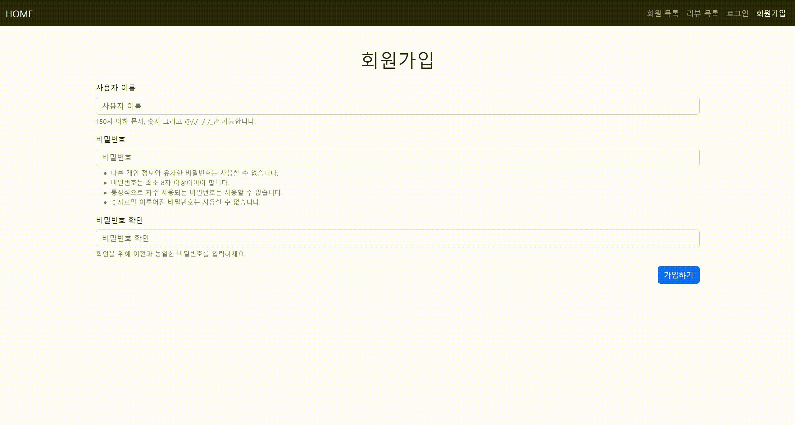

## 프로젝트 소개

- 주간 페어 프로그래밍 3 - 영화 리뷰 커뮤니티 CRUD & Auth
- 프로젝트 기간
  - 2022.10.14
- 사용 기술
  - 언어: HTML, CSS, JavaScript, Python
  - 프레임워크: Django

## 스크린샷

## 프로젝트 목적

페어 프로그래밍을 통한 영화 리뷰 커뮤니티 서비스를 개발합니다. 아래 조건을 만족해야합니다.

- **CRUD** 구현
- **Staticfiles** 활용 정적 파일(이미지, CSS, JS) 다루기
- Django **Auth** 활용 회원 관리(회원가입 / 회원 조회 / 로그인 / 로그아웃)

## 프로젝트 설명

- 회원 관리
  - `index`: 서비스에 가입한 회원 목록을 보여준다.
  - `signup`
    - 회원가입을 진행한다.
    - 회원가입이 끝나면, 이전 위치로 돌아간다.
  - `login`
    - 로그인을 진행한다.
    - 로그인이 끝나면, 이전 위치로 돌아간다.
  - `logout`
    - 로그아웃을 진행한다.
    - 로그아웃이 끝나면, 이전 위치로 돌아간다.
  - `detail`
    - 회원 정보를 보여준다.
    - 이때, 로그인 한 유저와 수정할 대상이 되는 유저가 같을 시에만 수정할 수 있다.
  - `update`
    - 회원 정보를 수정한다.
    - 이때, 로그인 한 유저와 수정할 대상이 되는 유저가 같을 시에만 수정할 수 있다.
- 영화 리뷰 관리
  - `index`
    - 사람들이 작성한 리뷰 목록을 보여준다.
    - 한 페이지에 글이 3개만 보이도록 한다.
  - `create`
    - 영화 리뷰를 작성한다. 이때, 로그인 한 유저의 정보를 자동으로 DB에 함께 저장한다.
    - 로그인 한 유저만 글을 작성할 수 있다.
  - `detail`
    - 영화 리뷰의 제목 + 내용 + 영화 제목 + 별점 + 작성자 이름 + 마지막 수정 시간을 보여준다.
    - 해당 글을 작성한 유저만 글을 수정 및 삭제할 수 있다.
  - `update`
    - 영화 리뷰 정보 페이지에서 수정을 진행할 수 있다.
    - 해당 글을 작성한 유저만 글을 수정할 수 있다.
  - `delete`
    - 영화 리뷰 정보 페이지에서 삭제를 진행할 수 있다.
    - 해당 글을 작성한 유저만 글을 삭제할 수 있다.

## 역할 (개발 내용)

- 김유영: 회원 목록 조회, 회원 정보 조회, 리뷰 조회, 페이지네이션
- 손세철: 회원가입, 회원 정보 수정, 리뷰 수정, 리뷰 삭제
- 최보영: 로그인, 로그아웃, 리뷰 작성, 페이지 디자인

## 배운 점

- Django Model에서 Foreign Key를 활용하는 방법
- branch 관리하는 법
- 페이지네이션 기능을 구현하는 방법
- ModelForm에서 별점 기능을 구현하는 방법 등

## 문제 해결

### 문제 상황

- Review 모델에 user를 Foreign Key로 주었는데, 글을 작성할 때 원하지 않은 필드가 계속 노출되는 이슈가 있었다.

### 해결

- forms에 exclude 대신 `fields`를 사용하여, 필요한 것만 가져올 수 있었다.
- 또, 글 정보 페이지에서 작성자 이름을 보여줄 때, Foreign Key로 준 user를 출력하면 이름이 바로 출력되는 것을 볼 수 있었다.
